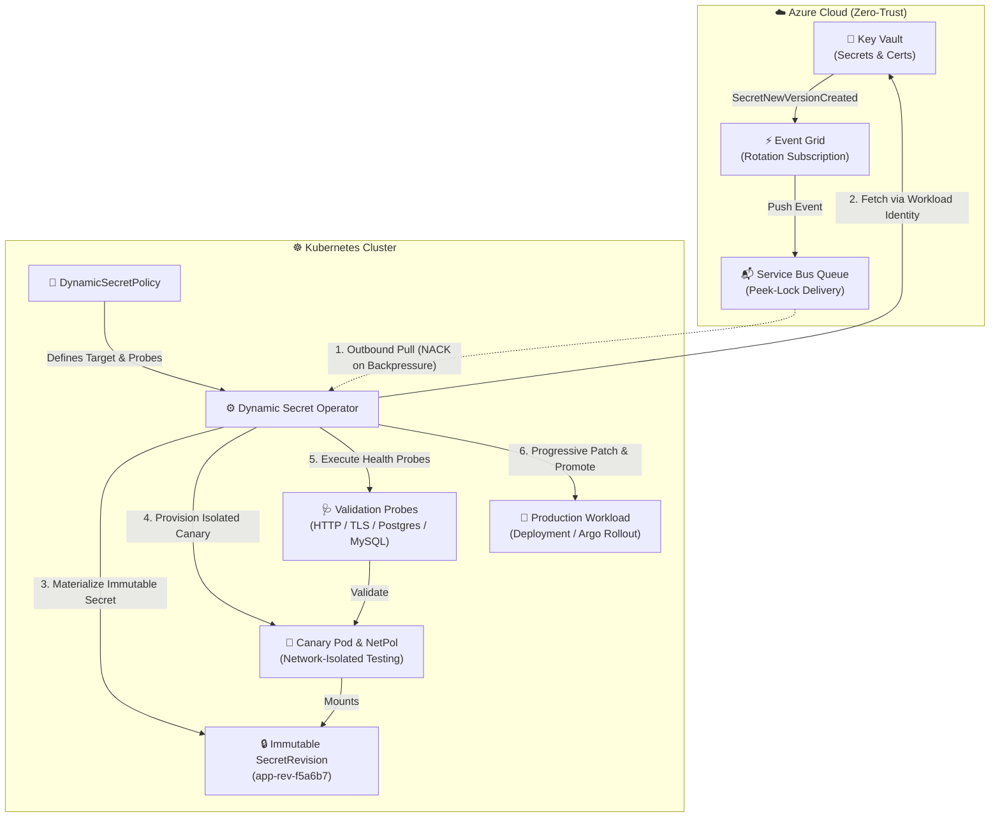

<div align="center">

# 🔐 Dynamic Secret Operator (DSO)

**Zero-Downtime, Progressive Secret & Certificate Rotations for Enterprise Kubernetes**

[](https://github.com/quantumsys-dev/dynamic-secret-operator/actions)
[](https://go.dev/)
[](https://kubernetes.io)
[](LICENSE)
[](https://chainguard.dev)
[](https://sigstore.dev)
[](https://kubernetes.io/docs/concepts/security/pod-security-standards/)

</div>

---

## 📖 Executive Summary

**Dynamic Secret Operator (DSO)** is a production-grade Kubernetes operator engineered to eliminate `CrashLoopBackOff` outages during credential rotations. 

Traditional secret management tools mutate secrets *in-place*, instantly crashing downstream pods if a rotated database credential, API key, or TLS certificate is malformed, not yet active, or fails handshakes. DSO solves this by adopting **ADR-002: Immutable Revisions**. 

Backed by an **Event-Driven Azure Service Bus Peek-Lock** architecture and **Zero-Trust Workload Identity**, DSO catches upstream rotation events, materializes cryptographically-hashed *immutable* secrets, provisions isolated canary workloads, executes synthetic health validation probes, and seamlessly promotes your production deployments with absolute zero-downtime.

## 🏗️ Architecture at a Glance

DSO shifts secret rotation from a risky "push and pray" operation to a safe, event-driven Progressive Delivery pipeline.



## ✨ Key Features & Enterprise Capabilities

*   **🛡️ Immutable Revisions (ADR-002):** Eliminates in-place mutation drift. Rotations generate unique, immutable SecretRevisions (`<workload>-rev-<sha256>`). Production pods are entirely shielded from bad credentials until the new revision passes all canary tests.
*   **🩺 Comprehensive Validation Probes:** Ship with confidence using built-in synthetic probes for **PostgreSQL**, **MySQL** (executing `SELECT 1`), **HTTP/S**, and **TLS** (validating certificate expiration and SHA-256 thumbprint matching).
*   **📜 Native `kubernetes.io/tls` Auto-Parsing:** No more manual scripting. DSO automatically intercepts Key Vault Certificate payloads (PEM/PKCS#12), splits them into `tls.crt` and `tls.key`, and creates native `kubernetes.io/tls` Secrets ready for immediate consumption by Nginx Ingress, Istio, or Gateway API.
*   **🐙 GitOps & Argo CD Harmony:** In-cluster mutations typically cause infinite reconciliation loops with Argo CD's Self-Heal. DSO automatically calculates and injects safe `ignoreDifferences` JSON Pointers into parent Argo CD `Application` resources, utilizing `RetryOnConflict` to avoid 409 Conflict storms during concurrent updates.
*   **♻️ Enterprise Resiliency & Etcd GC:** 
    *   **Circuit Breakers:** Tracks consecutive failures and halts reconciliation to prevent cascading cluster damage. Supports automatic drift-recovery the moment an upstream admin fixes the secret in Key Vault.
    *   **Sliding Window GC:** Automatically garbage-collects orphaned SecretRevisions in `etcd`, keeping only the `Current` and `Desired` revisions to prevent API server bloat.
    *   **Backpressure Handling:** Leverages Azure Service Bus Peek-Lock with explicit timeout context NACKs to ensure rotation events are safely preserved during cluster CPU/Queue saturation.
*   **🚥 Native Rollout Compatibility:** Works natively with standard Kubernetes `Deployment`, `StatefulSet`, and `DaemonSet` resources, as well as native support for **Argo Rollouts (Blue/Green)** for advanced traffic shifting.

## 🚀 Quickstart Guide

### 1. Installation

Install DSO via Helm. DSO requires zero inbound ingress, communicating entirely via outbound Workload Identity.

```bash
helm repo add quantumsys-dev https://charts.quantumsys.dev
helm install dso quantumsys-dev/dynamic-secret-operator \
  --namespace dso-system \
  --create-namespace \
  --set azure.workloadIdentity.clientId="<MANAGED_IDENTITY_CLIENT_ID>"
```

### 2. Explore the Examples (`kind` Ready)

We provide comprehensive, end-to-end examples utilizing a local `kind` cluster. Check out the `examples/` directory to see DSO in action:

*   **[Argo Rollouts Blue/Green (`examples/argo-rollouts-blue-green`)](examples/argo-rollouts-blue-green/):** Observe DSO updating a Rollout spec to trigger an isolated Green replica set, executing validation probes, and seamlessly cutting over Blue/Green traffic.
*   **[Native TLS Certificate Rotation (`examples/tls-certificate-rotation`)](examples/tls-certificate-rotation/):** Watch DSO pull a raw PEM certificate, split it into `tls.crt`/`tls.key`, execute cryptographic TLS handshake probes, and rotate an Nginx Gateway without dropping connections.
*   **[Nginx Color Canary (`examples/nginx-color-rotation`)](examples/nginx-color-rotation/):** A visual demonstration of Immutable SecretRevisions, canary transitions, and automatic Argo CD GitOps drift auto-patching.

To run any example locally:
```bash
cd examples/tls-certificate-rotation
./setup-kind.sh
```

## 📖 CRD API Reference Summary

The `DynamicSecretPolicy` CRD is your declarative interface for secret management.

```yaml
apiVersion: dso.quantumsys.dev/v1alpha1
kind: DynamicSecretPolicy
metadata:
  name: payment-db-policy
  namespace: production
spec:
  # 1. External Vault Identity
  vaultRef:
    keyVaultURI: "https://my-prod-vault.vault.azure.net"
    objectName: "payment-db-credentials"
    objectType: "Secret" # Options: Secret, Certificate, Key

  # 2. Target Workload to Promote
  workloadSelector:
    kind: "Deployment" # Options: Deployment, StatefulSet, DaemonSet, Rollout
    name: "payment-service"

  # 3. Explicit Injection Boundaries (Optional)
  targetRef:
    volumeName: "db-secret-volume"

  # 4. Synthetic Validation Probes
  validationProbes:
    - type: "PostgreSQL"
      endpoint: "postgres.production.svc.cluster.local:5432"
      queryTimeout: 5

  # 5. Circuit Breaker Configuration
  rollbackConfig:
    autoRollback: true
    circuitBreakerThreshold: 3
```
*For the complete specification, default behaviors, and Kyverno Policy-as-Code examples, view the [Full API Reference](docs/api-reference.md).*

## 🗺️ Future Roadmap: Multi-Cloud Expansion

DSO's core rotation engine—the state machine, immutable revisions, canary provisioner, and probe executor—is entirely provider-agnostic. 

While the current V1 release is heavily optimized for **Azure (Key Vault + Service Bus + Workload Identity)**, the architecture is designed for modular extensibility. Our upcoming roadmap includes native provider plugins for:
*   ☁️ **AWS Secrets Manager & SQS** (via IRSA)
*   ☁️ **Google Secret Manager & Pub/Sub** (via Workload Identity Federation)
*   🏰 **HashiCorp Vault & RabbitMQ / Kafka**

We actively welcome community contributions, PRs, and provider plugin development to help make DSO the universal standard for progressive secret delivery across all major cloud providers.

---

<div align="center">
  <b>Built with 🩵 by the QuantumSys Architecture Team.</b><br>
  For troubleshooting, runbooks, and DLQ management, refer to the <a href="docs/troubleshooting.md">Troubleshooting Guide</a>.<br>
  To report vulnerabilities, please read our <a href="SECURITY.md">Security Policy</a>.
</div>
