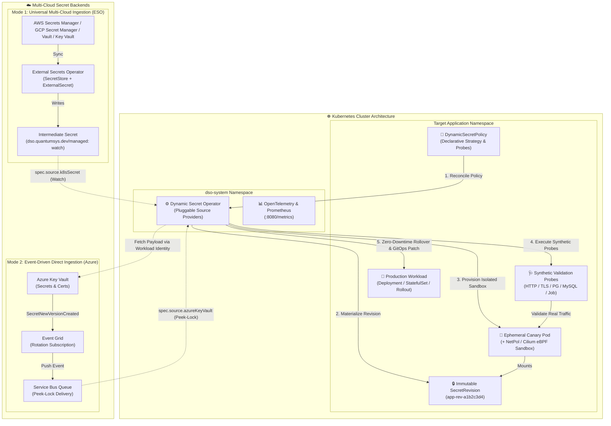

<div align="center">

# 🔐 Dynamic Secret Operator (DSO)

**Zero-Downtime, Progressive Secret & Certificate Rotations for Enterprise Kubernetes**

[](https://github.com/quantumsys-dev/dynamic-secret-operator/actions)
[](https://slsa.dev)
[](https://go.dev/)
[](https://kubernetes.io)
[](LICENSE)
[](https://chainguard.dev)
[](https://sigstore.dev)
[](https://kubernetes.io/docs/concepts/security/pod-security-standards/)

</div>

---

## 📖 Executive Summary

**Dynamic Secret Operator (DSO)** is a production-grade Kubernetes operator engineered to eliminate `CrashLoopBackOff` outages during credential rotations across multi-cloud environments. 

Traditional secret management tools mutate secrets *in-place*, instantly crashing downstream pods if a rotated database credential, API key, or TLS certificate is malformed, not yet active, or fails handshakes. DSO solves this by adopting **ADR-002: Immutable Revisions**. 

Featuring an **extensible, provider-agnostic source abstraction layer**, DSO supports:
- **Event-Driven Azure Key Vault Ingestion** via Service Bus Peek-Lock & Zero-Trust Workload Identity.
- **Universal Multi-Cloud Synergy with External Secrets Operator (ESO)** for AWS Secrets Manager, Google Cloud Secret Manager, HashiCorp Vault, and Akeyless.
- **eBPF Canary Isolation with CiliumNetworkPolicy** and Hubble packet telemetry.
- **Supply Chain Security** with SLSA Level 3 build provenance, keyless Cosign OIDC signing, and SPDX SBOMs.

## 🏗️ Architecture at a Glance

DSO shifts secret rotation from a risky "push and pray" operation to a safe, event-driven Progressive Delivery pipeline.



---

## ✨ Key Enterprise Capabilities

| Feature | Description |
| :--- | :--- |
| **Pluggable Provider Architecture** | Extensible source backend abstraction (`source.Provider`) supporting native **Azure Key Vault**, **External Secrets Operator (ESO)** intermediate watch, and roadmap for **AWS Secrets Manager**, **GCP Secret Manager**, and **HashiCorp Vault**. |
| **Zero-Trust Passwordless Auth** | Integrates exclusively with **Azure Workload Identity** using projected federated tokens. No static credentials, client secrets, or long-lived keys. |
| **Immutable SecretRevisions** | Materializes cryptographically hashed, immutable Kubernetes Secrets (`<workload>-rev-<sha256>`), preventing in-place race conditions. |
| **Progressive Canary Validation** | Spins up isolated canary workloads with strict `NetworkPolicy` or eBPF `CiliumNetworkPolicy` ingress rules and executes synthetic validation probes before touching production. |
| **eBPF & Hubble Observability** | Optional native generation of `cilium.io/v2.CiliumNetworkPolicy` for granular L3/L4/L7 egress sandboxing and real-time Hubble packet telemetry. |
| **Comprehensive Probe Engine** | Built-in probes for **HTTP**, **TLS** (certificate expiration and thumbprint matching), **PostgreSQL**, and **MySQL** (`SELECT 1`). |
| **Extensible Job-Based Probes** | "Bring Your Own Container" (`type: Job`) lets users supply a standard `batch/v1.JobTemplateSpec` (e.g., `redis:alpine`, `kafka-consumer`, custom scripts). The operator creates the Job ephemerally in the target namespace, automatically injects `DSO_REVISION_SECRET_NAME` into container environments, monitors completion, captures failure logs into CRD Conditions, and auto-cleans up — with zero driver bloat in the operator binary. |
| **Anti-Leakage Error Sanitization** | Intercepts all database and transport errors, stripping passwords, tokens, and raw DSNs before emitting logs or OpenTelemetry spans. |
| **Scoped Secret Ingestion** | Restricts controller-runtime caches to operator-managed secrets (`dso.quantumsys.dev/managed`), isolating cluster secrets and minimizing memory exposure. |
| **Circuit Breaker & Backoff** | Exponential backoff and threshold-based circuit breaker halts retry storms and preserves intact production workloads on bad credential updates. |
| **Supply Chain Security & SLSA L3** | Built on zero-CVE **Chainguard Static Distroless**, cryptographically signed keylessly via **Sigstore / Cosign OIDC**, with attached **SPDX SBOMs** and verifiable **SLSA Level 3 Build Provenance**. |

*   **🛡️ Immutable Revisions (ADR-002):** Eliminates in-place mutation drift. Rotations generate unique, immutable SecretRevisions (`<workload>-rev-<sha256>`). Production pods are entirely shielded from bad credentials until the new revision passes all canary tests.
*   **🩺 Comprehensive Validation Probes:** Ship with confidence using built-in synthetic probes for **PostgreSQL**, **MySQL** (executing `SELECT 1`), **HTTP/S**, and **TLS** (validating certificate expiration and SHA-256 thumbprint matching).
*   **📜 Native `kubernetes.io/tls` Auto-Parsing:** No more manual scripting. DSO automatically intercepts Key Vault Certificate payloads (PEM/PKCS#12), splits them into `tls.crt` and `tls.key`, and creates native `kubernetes.io/tls` Secrets ready for immediate consumption by Nginx Ingress, Istio, or Gateway API.
*   **🐙 GitOps & Argo CD Harmony:** In-cluster mutations typically cause infinite reconciliation loops with Argo CD's Self-Heal. DSO automatically calculates and injects safe `ignoreDifferences` JSON Pointers into parent Argo CD `Application` resources, utilizing `RetryOnConflict` to avoid 409 Conflict storms during concurrent updates.
*   **♻️ Enterprise Resiliency & Etcd GC:** 
    *   **Circuit Breakers:** Tracks consecutive failures and halts reconciliation to prevent cascading cluster damage. Supports automatic drift-recovery the moment an upstream admin fixes the secret in Key Vault.
    *   **Sliding Window GC:** Automatically garbage-collects orphaned SecretRevisions in `etcd`, keeping only the `Current` and `Desired` revisions to prevent API server bloat.
    *   **Backpressure Handling:** Leverages Azure Service Bus Peek-Lock with explicit timeout context NACKs to ensure rotation events are safely preserved during cluster CPU/Queue saturation.
*   **🚥 Native Rollout Compatibility:** Works natively with standard Kubernetes `Deployment`, `StatefulSet`, and `DaemonSet` resources, as well as native support for **Argo Rollouts (Blue/Green)** for advanced traffic shifting.

## 🔐 Azure Prerequisites & Infrastructure Setup

You can provision all required Azure resources (Resource Group, Key Vault, Service Bus, Event Grid, AKS, and Workload Identity Federation) automatically or manually:

### Automated Provisioning (PowerShell)
Execute the infrastructure provisioner script with minimal-cost SKUs (Free Tier AKS, Standard Key Vault, Basic Service Bus):

```powershell
.\setup-azure-resources.ps1 -ResourceGroupName "rg-dso-dev" -Location "eastus"
```

---

### Manual Azure RBAC Setup

#### 1. Assign Azure RBAC Roles
Assign the Managed Identity permissions on your Key Vault and Service Bus namespace:

```bash
# 1. Key Vault Secrets User (Read-only secret retrieval)
az role assignment create \
  --role "Key Vault Secrets User" \
  --assignee-object-id "<MANAGED_IDENTITY_OBJECT_ID>" \
  --assignee-principal-type "ServicePrincipal" \
  --scope "/subscriptions/<SUB_ID>/resourceGroups/<RG>/providers/Microsoft.KeyVault/vaults/<VAULT_NAME>"

# 2. Azure Service Bus Data Receiver (Peek-Lock message consumption)
az role assignment create \
  --role "Azure Service Bus Data Receiver" \
  --assignee-object-id "<MANAGED_IDENTITY_OBJECT_ID>" \
  --assignee-principal-type "ServicePrincipal" \
  --scope "/subscriptions/<SUB_ID>/resourceGroups/<RG>/providers/Microsoft.ServiceBus/namespaces/<SERVICEBUS_NAME>"
```

#### 2. Establish Workload Identity Federation
```bash
az identity federated-credential create \
  --name "dso-federated-credential" \
  --identity-name "<MANAGED_IDENTITY_NAME>" \
  --resource-group "<RG>" \
  --issuer "<AKS_OIDC_ISSUER_URL>" \
  --subject "system:serviceaccount:dso-system:dso-dynamic-secret-operator" \
  --audience "api://AzureADTokenExchange"
```

### 2. Explore the Examples (`kind` Ready)

We provide comprehensive, end-to-end examples utilizing a local `kind` cluster. Check out the `examples/` directory to see DSO in action:

*   **[Argo Rollouts Blue/Green (`examples/argo-rollouts-blue-green`)](examples/argo-rollouts-blue-green/):** Observe DSO updating a Rollout spec to trigger an isolated Green replica set, executing validation probes, and seamlessly cutting over Blue/Green traffic.
*   **[Native TLS Certificate Rotation (`examples/tls-certificate-rotation`)](examples/tls-certificate-rotation/):** Watch DSO pull a raw PEM certificate, split it into `tls.crt`/`tls.key`, execute cryptographic TLS handshake probes, and rotate an Nginx Gateway without dropping connections.
*   **[Nginx Color Canary (`examples/nginx-color-rotation`)](examples/nginx-color-rotation/):** A visual demonstration of Immutable SecretRevisions, canary transitions, and automatic Argo CD GitOps drift auto-patching.

**PowerShell (Windows):**
```powershell
helm install dso ./deploy/helm/dso `
  --namespace dso-system `
  --create-namespace `
  --set azure.workloadIdentity.clientId="<MANAGED_IDENTITY_CLIENT_ID>" `
  --set azure.workloadIdentity.tenantId="<AZURE_TENANT_ID>" `
  --set azure.serviceBus.namespace="<SERVICEBUS_NAMESPACE_FQDN>" `
  --set azure.serviceBus.queueName="<QUEUE_NAME>"
```

**Bash (Linux / macOS):**
```bash
helm install dso ./deploy/helm/dso \
  --namespace dso-system \
  --create-namespace \
  --set azure.workloadIdentity.clientId="<MANAGED_IDENTITY_CLIENT_ID>" \
  --set azure.workloadIdentity.tenantId="<AZURE_TENANT_ID>" \
  --set azure.serviceBus.namespace="<SERVICEBUS_NAMESPACE_FQDN>" \
  --set azure.serviceBus.queueName="<QUEUE_NAME>"
```

## 📖 CRD API Reference Summary

The `DynamicSecretPolicy` CRD is your declarative interface for secret management.

```yaml
apiVersion: dso.quantumsys.dev/v1alpha1
kind: DynamicSecretPolicy
metadata:
  name: payment-db-policy
  namespace: production
spec:
  # 1. External Vault Identity
  vaultRef:
    keyVaultURI: "https://my-prod-vault.vault.azure.net"
    objectName: "payment-db-credentials"
    objectType: "Secret" # Options: Secret, Certificate, Key

  # 2. Target Workload to Promote
  workloadSelector:
    kind: "Deployment" # Options: Deployment, StatefulSet, DaemonSet, Rollout
    name: "payment-service"

  # 3. Explicit Injection Boundaries (Optional)
  targetRef:
    volumeName: "db-secret-volume"

  # 4. Synthetic Validation Probes
  validationProbes:
    - type: "PostgreSQL"
      endpoint: "postgres.production.svc.cluster.local:5432"
      queryTimeout: 5

  # 5. Circuit Breaker Configuration
  rollbackConfig:
    autoRollback: true
    circuitBreakerThreshold: 3
```
*For the complete specification, default behaviors, and Kyverno Policy-as-Code examples, view the [Full API Reference](docs/api-reference.md).*

## 🗺️ Future Roadmap: Multi-Cloud Expansion

DSO's core rotation engine—the state machine, immutable revisions, canary provisioner, and probe executor—is entirely provider-agnostic. 

---

## 💡 Production & Enterprise Examples

Explore our comprehensive reference architecture examples for testing:

### ☁️ Azure Kubernetes Service (AKS) Examples
- [**AKS Multi-Secret Rotation**](examples/aks/multi-secret-rotation/): Multi-secret workload auto-rotation consuming PostgreSQL, Redis, and Payment API keys with dedicated validation probes.
- [**AKS Fullstack DB Rotation**](examples/aks/fullstack-db-rotation/): Live AKS cluster integration with Azure Key Vault, Service Bus, and Workload Identity.
- [**AKS Job-Based Redis Probe**](examples/aks/job-based-redis-probe/): Ephemeral Batch Job probe running custom CLI validation scripts against rotated Redis cache tokens.
- [**AKS Argo Rollouts Blue/Green**](examples/aks/argo-rollouts-blue-green/): Live AKS Blue/Green promotion triggered by Azure Key Vault rotations.
- [**AKS TLS Certificate Rotation**](examples/aks/tls-certificate-rotation/): Live AKS TLS Gateway with Azure Key Vault SSL certificate auto-parsing.
- [**AKS Nginx Color Canary**](examples/aks/nginx-color-rotation/): Live AKS Canary rollout with Argo CD `ignoreDifferences` auto-patching.

---

## 📚 Documentation & Architecture Decision Records (ADRs)

For comprehensive details on enterprise integration, architecture, and operation:

- [Getting Started Guide (5-Minute Quickstart)](docs/getting-started.md)
- [API Reference](docs/api-reference.md)
- [Configuration & Enterprise Tuning](docs/configuration.md)
- [Troubleshooting & Runbooks](docs/troubleshooting.md)
- [GitOps: Argo CD Self-Heal Integration](docs/gitops-argo-cd.md)
- [Security & Threat Model](docs/security.md)
- [Pluggable Providers Overview](docs/providers/overview.md)

**Architecture Decision Records (ADRs):**
- [ADR-001: Azure Service Bus Peek-Lock vs Webhooks](docs/architecture/001-asb-peek-lock-vs-webhooks.md)
- [ADR-002: Immutable Revisions vs Mutable Updates](docs/architecture/002-immutable-revisions-vs-mutable.md)
- [ADR-003: Decoupling Secret Ingestion & ESO Standard](docs/architecture/003-decoupling-secret-ingestion-eso.md)

We actively welcome community contributions, PRs, and provider plugin development to help make DSO the universal standard for progressive secret delivery across all major cloud providers.

---

<div align="center">
  <b>Built with 🩵 by the QuantumSys Architecture Team.</b><br>
  For runtime flags and enterprise concurrency tuning, see the <a href="docs/configuration.md">Configuration Guide</a>.<br>
  For operational runbooks and DLQ management, refer to the <a href="docs/troubleshooting.md">Troubleshooting Guide</a>.<br>
  To report vulnerabilities, please read our <a href="SECURITY.md">Security Policy</a>.
</div>
