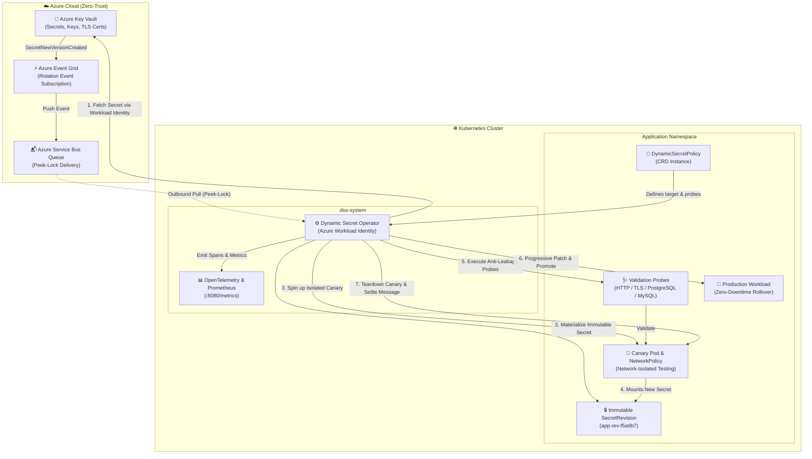

# Dynamic Secret Operator (DSO)

[](https://github.com/quantumsys-dev/dynamic-secret-operator/actions)
[](LICENSE)
[](https://golangci-lint.run/)
[](https://chainguard.dev)
[](https://sigstore.dev)
[](https://kubernetes.io/docs/concepts/security/pod-security-standards/)

**Dynamic Secret Operator (DSO)** is a production-grade, enterprise Kubernetes operator engineered for **zero-downtime, progressive secret and certificate rotations**. 

Backed by **Azure Key Vault**, **Azure Workload Identity**, and **Event-Driven Azure Service Bus Peek-Lock**, DSO eliminates `CrashLoopBackOff` outages during credential rotations through immutable SecretRevisions, isolated canary verification probes, circuit-breaker backoffs, and automated promotion.

---

## 🏛️ Architecture Overview



---

## ✨ Key Enterprise Capabilities

| Feature | Description |
| :--- | :--- |
| **Zero-Trust Passwordless Auth** | Integrates exclusively with **Azure Workload Identity** using projected federated tokens. No static credentials, client secrets, or long-lived keys. |
| **Immutable SecretRevisions** | Materializes cryptographically hashed, immutable Kubernetes Secrets (`<workload>-rev-<sha256>`), preventing in-place race conditions. |
| **Progressive Canary Validation** | Spins up isolated canary workloads with strict `NetworkPolicy` ingress rules and executes synthetic validation probes before touching production. |
| **Comprehensive Probe Engine** | Built-in probes for **HTTP**, **TLS** (certificate expiration and thumbprint matching), **PostgreSQL**, and **MySQL** (`SELECT 1`). |
| **Anti-Leakage Error Sanitization** | Intercepts all database and transport errors, stripping passwords, tokens, and raw DSNs before emitting logs or OpenTelemetry spans. |
| **In-Memory Zeroization** | Sensitive byte buffers and secret payloads are zeroed out in RAM (`ZeroBytes`) immediately after materialization. |
| **Circuit Breaker & Backoff** | Exponential backoff and threshold-based circuit breaker halts retry storms and preserves intact production workloads on bad credential updates. |
| **Supply Chain Security** | Built on zero-CVE **Chainguard Static Distroless**, cryptographically signed keylessly via **Sigstore / Cosign OIDC**, with attached **SPDX SBOMs**. |

---

## 🔐 Azure Prerequisites & RBAC Setup

DSO requires an **Azure User-Assigned Managed Identity** with federated credentials configured for your AKS cluster.

### 1. Assign Azure RBAC Roles
Assign the Managed Identity permissions on your Key Vault and Service Bus namespace:

```bash
# 1. Key Vault Secrets User (Read-only secret retrieval)
az role assignment create \
  --role "Key Vault Secrets User" \
  --assignee-object-id "<MANAGED_IDENTITY_OBJECT_ID>" \
  --assignee-principal-type "ServicePrincipal" \
  --scope "/subscriptions/<SUB_ID>/resourceGroups/<RG>/providers/Microsoft.KeyVault/vaults/<VAULT_NAME>"

# 2. Azure Service Bus Data Receiver (Peek-Lock message consumption)
az role assignment create \
  --role "Azure Service Bus Data Receiver" \
  --assignee-object-id "<MANAGED_IDENTITY_OBJECT_ID>" \
  --assignee-principal-type "ServicePrincipal" \
  --scope "/subscriptions/<SUB_ID>/resourceGroups/<RG>/providers/Microsoft.ServiceBus/namespaces/<SERVICEBUS_NAME>"
```

### 2. Establish Workload Identity Federation
```bash
az identity federated-credential create \
  --name "dso-federated-credential" \
  --identity-name "<MANAGED_IDENTITY_NAME>" \
  --resource-group "<RG>" \
  --issuer "<AKS_OIDC_ISSUER_URL>" \
  --subject "system:serviceaccount:dso-system:dso-dynamic-secret-operator" \
  --audience "api://AzureADTokenExchange"
```

---

## 🚀 Quick Start Guide

### 1. Install via Helm

```bash
# Add repository or install from local chart
helm install dso ./deploy/helm/dso \
  --namespace dso-system \
  --create-namespace \
  --set azure.workloadIdentity.clientId="<MANAGED_IDENTITY_CLIENT_ID>" \
  --set metrics.serviceMonitor.enabled=true
```

### 2. Define a `DynamicSecretPolicy`

Create a policy linking your Azure Key Vault secret to your target Kubernetes `Deployment`:

```yaml
apiVersion: dso.quantumsys.dev/v1alpha1
kind: DynamicSecretPolicy
metadata:
  name: order-service-secret-policy
  namespace: production
spec:
  vaultRef:
    keyVaultURI: "https://my-prod-vault.vault.azure.net"
    objectName: "database-password"
    objectType: "Secret"
  workloadSelector:
    kind: "Deployment"
    name: "order-service"
  validationProbes:
    - type: "PostgreSQL"
      endpoint: "postgres-cluster.production.svc.cluster.local:5432"
      queryTimeout: 5
    - type: "HTTP"
      endpoint: "http://localhost:8080/health"
      queryTimeout: 3
  rollbackConfig:
    autoRollback: true
    circuitBreakerThreshold: 3
```

Apply the policy:
```bash
kubectl apply -f order-service-policy.yaml
```

---

## 📊 Observability & Metrics

DSO exposes Prometheus metrics on `:8080/metrics`:

| Metric | Type | Description |
| :--- | :--- | :--- |
| `dso_rotations_total` | Counter | Total number of secret rotations initiated by policy and namespace. |
| `dso_rotations_failed` | Counter | Total number of secret rotations that failed validation or promotion. |
| `dso_circuit_breakers_tripped` | Counter | Count of circuit breakers tripped due to consecutive failure thresholds. |
| `dso_probe_duration_seconds` | Histogram | Validation probe execution latency partitioned by `probe_type`. |

---

## 📚 Architecture Decision Records (ADRs)

Deep-dive design rationale is documented in our ADR repository:
- [**ADR-001: Azure Service Bus Peek-Lock vs Event Grid Webhooks**](docs/architecture/001-asb-peek-lock-vs-webhooks.md)
- [**ADR-002: Immutable Secret Revisions vs In-Place Mutable Updates**](docs/architecture/002-immutable-revisions-vs-mutable.md)

---

## 🛡️ Security & Vulnerability Reporting

This project enforces strict **Zero-Trust Security**. 
- Base images are refreshed automatically against Chainguard Static Distroless.
- All release artifacts are signed via Sigstore Cosign with attached SPDX SBOMs.
- To report a security vulnerability, please refer to our [Security Policy](SECURITY.md).

---

## 📄 License

Licensed under the Apache License, Version 2.0. See [LICENSE](LICENSE) for details.
