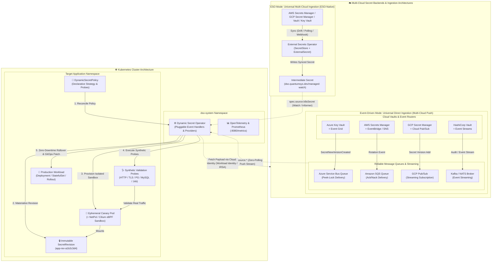

<div align="center">

# 🔐 Dynamic Secret Operator (DSO)

**Zero-Downtime, Progressive Secret & Certificate Rotations for Enterprise Kubernetes**

[](https://github.com/quantumsys-dev/dynamic-secret-operator/actions)
[](https://slsa.dev)
[](https://go.dev/)
[](https://kubernetes.io)
[](LICENSE)
[](https://chainguard.dev)
[](https://sigstore.dev)
[](https://kubernetes.io/docs/concepts/security/pod-security-standards/)

</div>

---

## 📖 Executive Summary

**Dynamic Secret Operator (DSO)** is a production-grade Kubernetes operator engineered to eliminate `CrashLoopBackOff` outages during credential rotations across multi-cloud environments. 

Traditional secret management tools mutate secrets *in-place*, instantly crashing downstream pods if a rotated database credential, API key, or TLS certificate is malformed, not yet active, or fails handshakes. DSO solves this by adopting **ADR-002: Immutable Revisions**. 

Featuring an **extensible, provider-agnostic source abstraction layer**, DSO supports:
- **Event-Driven Multi-Cloud Ingestion** supporting AWS, GCP, and Azure via cloud-native message queues (Amazon SQS, Google Cloud Pub/Sub, Azure Service Bus) & Zero-Trust Federated Workload Identity.
- **Universal Multi-Cloud Synergy with External Secrets Operator (ESO)** for AWS Secrets Manager, Google Cloud Secret Manager, HashiCorp Vault, and Akeyless.
- **eBPF Canary Isolation with CiliumNetworkPolicy** and Hubble packet telemetry.
- **Supply Chain Security** with SLSA Level 3 build provenance, keyless Cosign OIDC signing, and SPDX SBOMs.

## 🏗️ Architecture at a Glance

DSO shifts secret rotation from a risky "push and pray" operation to a safe, event-driven Progressive Delivery pipeline.



---

### 🔄 Two Architectural Ingestion Modes: ESO Mode vs. Event-Driven Mode

DSO provides two distinct, enterprise-grade ingestion models designed to fit any cloud topology:

#### 1. ESO Mode: Universal Multi-Cloud Ingestion (ESO-Native / Decoupled)
- **Concept:** Operates alongside the CNCF standard **External Secrets Operator (ESO)** to synchronize secrets from 30+ external secret stores (AWS Secrets Manager, Google Secret Manager, HashiCorp Vault, Azure Key Vault, Akeyless, CyberArk) into intermediate Kubernetes Secrets.
- **How it Works:** When an upstream secret updates, ESO refreshes the Kubernetes Secret carrying the label `dso.quantumsys.dev/managed: "watch"`. DSO observes the hash drift through standard controller-runtime informers and initiates the progressive canary rollout.
- **Zero Cloud IAM Overhead:** DSO requires **zero** cloud IAM permissions in this mode, running purely on native Kubernetes RBAC.

#### 2. Event-Driven Mode: Universal Direct Ingestion (Multi-Cloud Push-Accelerated)
- **Concept:** Sub-second, reactive push notifications triggered directly by cloud event brokers and queue streams. Rather than relying on periodic polling intervals, upstream secret rotations immediately push notification events to DSO.
- **Multi-Cloud Architecture:** Event-driven ingestion is an architectural pattern supported across **all major cloud providers and hybrid infrastructures**:
  - 🟦 **Microsoft Azure:** `Azure Key Vault` &rarr; `Azure Event Grid` &rarr; `Azure Service Bus Queue` (with Peek-Lock delivery and Azure Workload Identity).
  - 🟧 **Amazon Web Services (AWS):** `AWS Secrets Manager` &rarr; `Amazon EventBridge / SNS` &rarr; `Amazon SQS Queue` (with message visibility timeouts and AWS IAM Roles for Service Accounts - IRSA / EKS Pod Identity).
  - 🟥 **Google Cloud Platform (GCP):** `Google Cloud Secret Manager` &rarr; `Cloud Pub/Sub Topic & Subscription` (with streaming pull and GCP Workload Identity Federation).
  - 🟪 **HashiCorp Vault & Hybrid/On-Prem:** `Vault Event Streams / Audit Webhooks` &rarr; `Apache Kafka / NATS / Event Broker` (with mutual TLS / SPIFFE identities).
- **Sub-Second Latency & Zero Polling:** Eliminates API rate-limit throttling and polling delays, ensuring rotation events trigger canary validation within milliseconds of upstream modification.

---

### 🩺 Synthetic Validation Probes: Role, Execution Flow, and Outcomes

Regardless of whether secret ingestion is driven by **ESO Mode** (watching intermediate secrets) or **Event-Driven Mode** (reactive push streams), DSO **never** promotes a rotated secret directly to production workloads. 

Instead, the operator intercepts the event and executes a zero-trust **Progressive Delivery & Canary Validation Pipeline**:

```mermaid
stateDiagram-v2
    direction LR
    [*] --> Ingestion: Upstream Secret Rotation (ESO Sync / Cloud Queue Push)
    Ingestion --> RevisionPrepared: Materialize Immutable SecretRevision
    RevisionPrepared --> CanaryProvisioning: Deploy Ephemeral Canary + Network Sandbox
    CanaryProvisioning --> Validating: Run spec.validationProbes
    
    state Validating {
        [*] --> CheckProbes: HTTP / TLS / PostgreSQL / MySQL / Job
        CheckProbes --> Passed: All Probes Succeed ✅
        CheckProbes --> Failed: Any Probe Fails or Times Out ❌
    }
    
    Passed --> Promoting: Zero-Downtime Rolling Update & Argo CD Auto-Patch
    Promoting --> Completed: Production Verified & Teardown Canary
    Failed --> RolledBack: Trip Circuit Breaker & Preserve Production
    Completed --> [*]
    RolledBack --> [*]
```



#### 1. Where Validation Probes Fit In
When an upstream rotation occurs, DSO transitions through distinct lifecycle phases before production workloads are touched:
1. **`RevisionPrepared`**: Computes the SHA-256 checksum of the new payload and creates an immutable, cryptographically named Kubernetes Secret (`<workload>-rev-<sha256>`).
2. **`CanaryProvisioning`**: Provisions an isolated canary deployment (`<workload>-canary`) and applies an ephemeral `NetworkPolicy` (or Cilium eBPF egress sandbox). Only this canary pod mounts the candidate `SecretRevision`.
3. **`Validating`**: **This is where `validationProbes` enter the lifecycle.** The operator runs all synthetic probes configured in `spec.validationProbes` against the candidate revision and canary sandbox.

#### 2. How Validation Probes Work
DSO provides a modular, pluggable probe execution engine with strict anti-leakage sanitization:
- **`HTTP` / `HTTPS`**: Issues HTTP requests against canary endpoints, verifying status codes (`200-399`) within `queryTimeout`.
- **`TLS`**: Executes a mutual or one-way TLS handshake, verifying certificate validity dates (not expired, already active) and asserting that the leaf certificate's SHA-256 thumbprint matches the new secret.
- **`PostgreSQL` & `MySQL`**: Opens a real database connection using the rotated username/password and executes a live verification query (`SELECT 1`). All DSNs and credentials are automatically redacted from logs and OpenTelemetry traces.
- **`Job` (Bring Your Own Container)**: Ephemerally schedules an arbitrary Kubernetes Batch Job (`batch/v1.Job`) in the target namespace (e.g., `redis-cli`, custom shell scripts, compliance validators). DSO injects the candidate secret name as `DSO_REVISION_SECRET_NAME`, monitors completion, and parses container exit codes.
- **Automatic Canary Redirection**: For probes targeting the workload, DSO automatically discovers the ready canary pod IP address and redirects the probe's network traffic to the isolated canary instance.

---

#### 3. What Happens When Probes Succeed (✅ Success Path)
When all configured validation probes pass successfully:
1. **Workload Promotion (`Promoting` / `RolloutProgressing`)**:
   - DSO safely patches the production workload (`Deployment`, `StatefulSet`, `DaemonSet`, or `Argo Rollout`) to mount the validated `SecretRevision`.
   - The workload rolls out with zero downtime using native Kubernetes rolling upgrade strategies.
2. **GitOps Harmony (Argo CD Auto-Patch)**:
   - DSO dynamically patches the target Argo CD `Application`'s `spec.ignoreDifferences` with JSON Pointers to the modified revision annotation and secret volumes, preventing Argo CD self-heal revert loops.
3. **Sandbox Teardown & Cleanup**:
   - The ephemeral canary deployment and network sandbox policies are automatically deleted.
   - The policy status transitions to `PromotionCompleted: True`.
   - Consecutive failure counters are reset to zero (`consecutiveFailures: 0`).
4. **Queue Event ACK (Event-Driven Mode)**:
   - The message lock on the event broker (e.g. Azure Service Bus Peek-Lock, AWS SQS visibility timeout, GCP Pub/Sub ack) is completed and acknowledged, finalizing the event stream.

---

#### 4. What Happens When Probes Fail (❌ Failure & Rollback Path)
If any probe fails, times out, or the canary pod enters `CrashLoopBackOff`:
1. **Absolute Production Isolation (Zero Outages)**:
   - **Production pods are NEVER touched and NEVER patched.**
   - Production workloads remain running normally with their existing, functional secret revision without disruption.
2. **Masked Diagnostics & Observability**:
   - DSO captures the exact failure cause (e.g., `password authentication failed`, `certificate expired`, `connection timed out`) and redacts all secrets before recording the error into `status.conditions`.
   - Emits failure metrics to Prometheus (`dso_probe_failures_total`) and exports OpenTelemetry tracing spans.
3. **Transient Retries & Circuit Breaker Protection**:
   - DSO increments the failure counter (`consecutiveFailures++`) and retries with exponential backoff (in Event-Driven Mode, the message is released/NACKed to allow retry).
   - If failures reach `spec.rollbackConfig.circuitBreakerThreshold` (default: 3):
     - DSO **trips the circuit breaker** and halts further rollout attempts to prevent authentication lockouts or denial of service against upstream backends.
     - The policy transitions to `RolledBack: True` with reason `ValidationProbeFailed`.
     - The failed canary deployment and network policies are deleted to reclaim resources.
4. **Self-Healing on Upstream Correction**:
   - As soon as an administrator or CI/CD pipeline pushes a valid secret to the upstream vault (or ESO syncs a corrected secret), DSO detects the new SHA-256 hash drift, resets the circuit breaker, and automatically starts a new canary validation cycle.

---

## ✨ Key Enterprise Capabilities

| Feature | Description |
| :--- | :--- |
| **Pluggable Provider Architecture** | Extensible source backend abstraction (`source.Provider`) supporting native **Event-Driven Multi-Cloud Push** (Azure Key Vault, AWS Secrets Manager, GCP Secret Manager, Vault) and **Universal ESO-Native** intermediate watch. |
| **Zero-Trust Passwordless Auth** | Integrates natively with cloud federated identities: **Azure Workload Identity**, **AWS IAM Roles for Service Accounts (IRSA) / EKS Pod Identity**, and **GCP Workload Identity**. No static credentials, client secrets, or long-lived tokens. |
| **Immutable SecretRevisions** | Materializes cryptographically hashed, immutable Kubernetes Secrets (`<workload>-rev-<sha256>`), preventing in-place race conditions. |
| **Progressive Canary Validation** | Spins up isolated canary workloads with strict `NetworkPolicy` or eBPF `CiliumNetworkPolicy` ingress rules and executes synthetic validation probes before touching production. |
| **eBPF & Hubble Observability** | Optional native generation of `cilium.io/v2.CiliumNetworkPolicy` for granular L3/L4/L7 egress sandboxing and real-time Hubble packet telemetry. |
| **Comprehensive Probe Engine** | Built-in probes for **HTTP**, **TLS** (certificate expiration and thumbprint matching), **PostgreSQL**, and **MySQL** (`SELECT 1`). |
| **Extensible Job-Based Probes** | "Bring Your Own Container" (`type: Job`) lets users supply a standard `batch/v1.JobTemplateSpec` (e.g., `redis:alpine`, `kafka-consumer`, custom scripts). The operator creates the Job ephemerally in the target namespace, automatically injects `DSO_REVISION_SECRET_NAME` into container environments, monitors completion, captures failure logs into CRD Conditions, and auto-cleans up — with zero driver bloat in the operator binary. |
| **Anti-Leakage Error Sanitization** | Intercepts all database and transport errors, stripping passwords, tokens, and raw DSNs before emitting logs or OpenTelemetry spans. |
| **Scoped Secret Ingestion** | Restricts controller-runtime caches to operator-managed secrets (`dso.quantumsys.dev/managed`), isolating cluster secrets and minimizing memory exposure. |
| **Circuit Breaker & Backoff** | Exponential backoff and threshold-based circuit breaker halts retry storms and preserves intact production workloads on bad credential updates. |
| **Supply Chain Security & SLSA L3** | Built on zero-CVE **Chainguard Static Distroless**, cryptographically signed keylessly via **Sigstore / Cosign OIDC**, with attached **SPDX SBOMs** and verifiable **SLSA Level 3 Build Provenance**. |

*   **🛡️ Immutable Revisions (ADR-002):** Eliminates in-place mutation drift. Rotations generate unique, immutable SecretRevisions (`<workload>-rev-<sha256>`). Production pods are entirely shielded from bad credentials until the new revision passes all canary tests.
*   **🩺 Comprehensive Validation Probes:** Ship with confidence using built-in synthetic probes for **PostgreSQL**, **MySQL** (executing `SELECT 1`), **HTTP/S**, and **TLS** (validating certificate expiration and SHA-256 thumbprint matching).
*   **📜 Native `kubernetes.io/tls` Auto-Parsing:** No more manual scripting. DSO automatically intercepts Key Vault Certificate payloads (PEM/PKCS#12), splits them into `tls.crt` and `tls.key`, and creates native `kubernetes.io/tls` Secrets ready for immediate consumption by Nginx Ingress, Istio, or Gateway API.
*   **🐙 GitOps & Argo CD Harmony:** In-cluster mutations typically cause infinite reconciliation loops with Argo CD's Self-Heal. DSO automatically calculates and injects safe `ignoreDifferences` JSON Pointers into parent Argo CD `Application` resources, utilizing `RetryOnConflict` to avoid 409 Conflict storms during concurrent updates.
*   **♻️ Enterprise Resiliency & Etcd GC:** 
    *   **Circuit Breakers:** Tracks consecutive failures and halts reconciliation to prevent cascading cluster damage. Supports automatic drift-recovery the moment an upstream admin fixes the secret in Key Vault.
    *   **Sliding Window GC:** Automatically garbage-collects orphaned SecretRevisions in `etcd`, keeping only the `Current` and `Desired` revisions to prevent API server bloat.
    *   **Backpressure Handling:** Leverages reliable queue delivery (e.g. Azure Service Bus Peek-Lock, AWS SQS visibility timeouts, GCP Pub/Sub nacks) with explicit timeout context NACKs to ensure rotation events are safely preserved during cluster CPU/Queue saturation.
*   **🚥 Native Rollout Compatibility:** Works natively with standard Kubernetes `Deployment`, `StatefulSet`, and `DaemonSet` resources, as well as native support for **Argo Rollouts (Blue/Green)** for advanced traffic shifting.

## 📖 CRD API Reference Summary

The `DynamicSecretPolicy` CRD is your declarative interface for secret ingestion, isolated canary sandboxing, synthetic validation probes, and automated rollbacks.

DSO features a modular architecture where the **secret source backend** (`spec.source`) and the **validation probe type** (`spec.validationProbes`) are completely pluggable and decoupled:

| Field Block | Purpose | Supported Options |
| :--- | :--- | :--- |
| `spec.source` | Pluggable secret backend ingestion | `K8sSecret` (ESO Universal Multi-Cloud), `AzureKeyVault`, `AWSSecretsManager`, `GCPSecretManager`, `Vault` |
| `spec.workloadSelector` | Target workload resource to protect and roll over | `Deployment`, `StatefulSet`, `DaemonSet`, `Rollout` (Argo Rollouts Blue/Green) |
| `spec.validationProbes` | Synthetic zero-trust canary validation checks | `HTTP` / `HTTPS`, `TLS` (handshake & thumbprint), `PostgreSQL`, `MySQL` (`SELECT 1`), `Job` (Bring Your Own Container) |
| `spec.rollbackConfig` | Resiliency, backoff, and circuit breaker protection | `autoRollback: true`, `circuitBreakerThreshold: 3` |

### Declarative Policy Structure

```yaml
apiVersion: dso.quantumsys.dev/v1alpha1
kind: DynamicSecretPolicy
metadata:
  name: example-policy
  namespace: production
spec:
  # 1. Pluggable Source Backend (K8sSecret / AzureKeyVault / AWSSecretsManager / GCPSecretManager / Vault)
  source:
    type: "K8sSecret" # e.g. "K8sSecret" for ESO, "AzureKeyVault" for Azure push
    k8sSecret:
      name: "eso-synced-credentials"

  # 2. Target Workload to Protect and Roll Over
  workloadSelector:
    kind: "Deployment" # Options: Deployment, StatefulSet, DaemonSet, Rollout
    name: "my-service"

  # 3. Workload Volume Injection Boundary (Optional)
  targetRef:
    volumeName: "credentials-volume"

  # 4. Pluggable Synthetic Validation Probes (HTTP, TLS, PostgreSQL, MySQL, Job)
  validationProbes:
    - type: "HTTP"
      endpoint: "http://my-service.production.svc.cluster.local:8080/healthz"
      path: "/healthz"
      expectedStatus: 200
      queryTimeout: 5

  # 5. Circuit Breaker & Automatic Rollback Safeguards
  rollbackConfig:
    autoRollback: true
    circuitBreakerThreshold: 3
```

---

### 📚 Dedicated Provider Guides & Policy Patterns

For complete, copy-paste ready `DynamicSecretPolicy` manifests featuring diverse probe types (`HTTP`, `TLS`, `PostgreSQL`, `MySQL`, `Job`) tailored to each cloud ecosystem, consult our dedicated provider documentation:

- 🟢 **[Universal Multi-Cloud via ESO Guide](docs/providers/eso.md)** – *Production Ready* (Patterns for HTTP Health, Redis Job, PostgreSQL/MySQL, and Ingress TLS probes)
- 🟢 **[Microsoft Azure Key Vault Guide](docs/providers/azure.md)** – *Production Ready* (Patterns for Relational Database, Ingress TLS Handshake, Microservice HTTP, and Redis Job probes)
- 🟡 **[Amazon Web Services (AWS) Guide](docs/providers/aws.md)** – *In Development (Roadmap v0.3)* (Patterns for Aurora MySQL, Microservice HTTP, Ingress TLS, and ElastiCache Redis Job probes)
- 🟡 **[Google Cloud Platform (GCP) Guide](docs/providers/gcp.md)** – *In Development (Roadmap v0.3)* (Patterns for Memorystore Redis Job, Microservice HTTP, Cloud SQL Database, and Ingress TLS probes)
- 📖 **[Pluggable Providers Overview](docs/providers/overview.md)** – Architectural model of the provider registry and ingestion engine
- 📖 **[Comprehensive CRD API Reference](docs/api-reference.md)** – Full schema field definitions, status conditions, and Kyverno policy rules

## 🗺️ Future Roadmap: Multi-Cloud Expansion

DSO's core progressive delivery engine—the state machine, immutable SecretRevisions, isolated canary sandboxing, and synthetic validation probes—is entirely cloud-agnostic.

- **✅ Phase 1 (Production Ready - v0.2.x):**
  - **ESO Mode (Universal Multi-Cloud):** Seamless progressive delivery for 30+ secret backends via External Secrets Operator across EKS, GKE, AKS, and bare-metal Kubernetes.
  - **Event-Driven Mode (Azure):** Native sub-second push ingestion via Azure Key Vault, Event Grid, and Service Bus Peek-Lock queues with Azure Workload Identity.
- **🚀 Phase 2 (Roadmap - v0.3.x):**
  - **Event-Driven Mode (AWS):** Native push adapter for AWS Secrets Manager via Amazon EventBridge / SNS & Amazon SQS using AWS IAM Roles for Service Accounts (IRSA) and EKS Pod Identity.
  - **Event-Driven Mode (Google Cloud):** Native push adapter for Google Cloud Secret Manager via Cloud Pub/Sub using GCP Workload Identity Federation.
  - **Event-Driven Mode (HashiCorp Vault & On-Prem):** Native push adapter for Vault Event Streams and Audit Webhooks via Kafka / NATS / CloudEvents. 

---

## 💡 Examples

Explore our comprehensive reference architecture examples for testing:

### ☁️ Azure Kubernetes Service (AKS) Examples (`examples/azure`)
- [**Azure Multi-Secret Rotation**](examples/azure/multi-secret-rotation/): Multi-secret workload auto-rotation consuming PostgreSQL, Redis, and Payment API keys with dedicated validation probes.
- [**Azure Fullstack DB Rotation**](examples/azure/fullstack-db-rotation/): Live AKS cluster integration with Azure Key Vault, Service Bus, and Workload Identity.
- [**Azure Job-Based Redis Probe**](examples/azure/job-based-redis-probe/): Ephemeral Batch Job probe running custom CLI validation scripts against rotated Redis cache tokens.
- [**Azure Argo Rollouts Blue/Green**](examples/azure/argo-rollouts-blue-green/): Live AKS Blue/Green promotion triggered by Azure Key Vault rotations.
- [**Azure TLS Certificate Rotation**](examples/azure/tls-certificate-rotation/): Live AKS TLS Gateway with Azure Key Vault SSL certificate auto-parsing.
- [**Azure Nginx Color Canary**](examples/azure/nginx-color-rotation/): Live AKS Canary rollout with Argo CD `ignoreDifferences` auto-patching.

### 🌐 External Secrets Operator (ESO) Multi-Cloud Examples (`examples/eso`)
- [**ESO Argo Rollouts Blue/Green**](examples/eso/argo-rollouts-blue-green/): Decoupled Blue/Green rollout triggered by synced Kubernetes secrets.
- [**ESO TLS Certificate Rotation**](examples/eso/tls-certificate-rotation/): Decoupled TLS ingress certificate rotation with synthetic TLS handshake verification.
- [**ESO Nginx Color Canary**](examples/eso/nginx-color-rotation/): Canary rollout with synthetic Job hex color verification and Argo CD drift protection.
- [**ESO Fullstack DB Rotation**](examples/eso/fullstack-db-rotation/): Zero-downtime PostgreSQL credential rollover via synced secrets.
- [**ESO Job-Based Redis Probe**](examples/eso/job-based-redis-probe/): Ephemeral validation Job running `redis-cli PING` on synced secret update.
- [**ESO Multi-Secret Rotation**](examples/eso/multi-secret-rotation/): Multi-secret microservice with independent validation probes per volume.
- [**ESO Cilium Hubble Observability**](examples/eso/cilium-hubble-observability/): eBPF-based L3/L4/L7 egress network sandboxing and telemetry.
- [**ESO Circuit Breaker & Rollback**](examples/eso/circuit-breaker-rollback/): Automatic circuit breaker tripping and rollback on invalid secrets.

---

## 📚 Documentation & Architecture Decision Records (ADRs)

For comprehensive details on enterprise integration, architecture, and operation:

- [Getting Started Guide (5-Minute Quickstart)](docs/getting-started.md)
- [Operating Modes Guide (ESO Mode vs Event-Driven Mode)](docs/operating-modes.md)
- [API Reference](docs/api-reference.md)
- [Configuration & Enterprise Tuning](docs/configuration.md)
- [Troubleshooting & Runbooks](docs/troubleshooting.md)
- [GitOps: Argo CD Self-Heal Integration](docs/gitops-argo-cd.md)
- [Security & Threat Model](docs/security.md)
- [Pluggable Providers Overview](docs/providers/overview.md)
  - [Microsoft Azure Key Vault Guide (Production Ready)](docs/providers/azure.md)
  - [Universal Multi-Cloud via ESO Guide (Production Ready)](docs/providers/eso.md)
  - [AWS Secrets Manager Guide (In Development)](docs/providers/aws.md)
  - [Google Cloud Secret Manager Guide (In Development)](docs/providers/gcp.md)

**Architecture Decision Records (ADRs):**
- [ADR-001: Azure Service Bus Peek-Lock vs Webhooks](docs/architecture/001-asb-peek-lock-vs-webhooks.md)
- [ADR-002: Immutable Revisions vs Mutable Updates](docs/architecture/002-immutable-revisions-vs-mutable.md)
- [ADR-003: Decoupling Secret Ingestion & ESO Standard](docs/architecture/003-decoupling-secret-ingestion-eso.md)

We actively welcome community contributions, PRs, and provider plugin development to help make DSO the universal standard for progressive secret delivery across all major cloud providers.

---

<div align="center">
  <b>Built with 🩵 by the QuantumSys Architecture Team.</b><br>
  For runtime flags and enterprise concurrency tuning, see the <a href="docs/configuration.md">Configuration Guide</a>.<br>
  For operational runbooks and DLQ management, refer to the <a href="docs/troubleshooting.md">Troubleshooting Guide</a>.<br>
  To report vulnerabilities, please read our <a href="SECURITY.md">Security Policy</a>.
</div>
