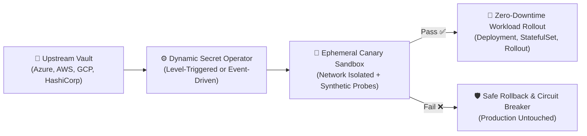

# Dynamic Secret Operator (DSO) Documentation Portal

Welcome to the official documentation portal for the **Dynamic Secret Operator (DSO)**.

DSO is an enterprise-grade Kubernetes operator built to automate zero-trust secret rotation, progressive canary validation, synthetic health probing, and instant automated rollbacks without application downtime.

---

## 🧭 Documentation Index & Sitemap

### 🏛️ Core Architecture & Engineering Standards

Deep dives into the internal mechanics, security controls, operational tuning, and Kubernetes CRD specifications:

| Document | Description |
| :--- | :--- |
| 📋 **[API Reference](architecture/api-reference.md)** | Complete CustomResourceDefinition (CRD) specification for `DynamicSecretPolicy` (`v1alpha1`), including discriminated source unions, validation probes, and rollback rules. |
| 🔄 **[Operating Modes: ESO vs. Event-Driven](architecture/operating-modes.md)** | Comparative guide between the **Universal Decoupled (ESO)** model and **Multi-Cloud Event-Driven (Push)** model, including a decision matrix and convergence lifecycle. |
| ⚙️ **[Configuration & Tuning](architecture/configuration.md)** | Comprehensive guide to CLI flags, environment variables, Helm `values.yaml`, high-throughput concurrency tuning, and multi-tenant RBAC scoping. |
| 🛡️ **[Security Architecture & Threat Model](architecture/security.md)** | Zero Trust architecture, Go runtime memory lifecycle model, non-root Distroless container hardening, and mathematically fuzz-tested error sanitization. |
| 🐙 **[GitOps Integration: Argo CD](architecture/gitops-argo-cd.md)** | Strategies for preventing Self-Heal revert loops and drift wars using fine-grained JQ path expressions and system-level `argocd-cm` rules. |
| 📊 **[Observability & Metrics Reference](architecture/metrics.md)** | Complete Prometheus metrics catalog (`dso_*`), cardinality protection, alerting rules, and OpenTelemetry distributed tracing integration. |
| 🔧 **[Universal Architecture Troubleshooting](architecture/troubleshooting.md)** | Operator-level runbooks: leader election, canary scheduling, probe failures, circuit breaker tripping, and GitOps drift remediation. |

---

### ☁️ Cloud Secret Providers

DSO supports both direct event-driven cloud push and decoupled multi-cloud synchronization. Each provider features a dedicated documentation triad (**README**, **Getting Started**, and **Troubleshooting**):

| Provider | Status | Overview & Architecture | Step-by-Step Setup | Diagnostic & Troubleshooting |
| :--- | :--- | :--- | :--- | :--- |
| **Microsoft Azure** | 🟢 Production Ready | [Azure README](providers/azure/README.md) | [Azure Getting Started](providers/azure/getting-started.md) | [Azure Troubleshooting](providers/azure/troubleshooting.md) |
| **Universal Multi-Cloud (ESO)** | 🟢 Production Ready | [ESO README](providers/eso/README.md) | [ESO Getting Started](providers/eso/getting-started.md) | [ESO Troubleshooting](providers/eso/troubleshooting.md) |
| **Amazon Web Services (AWS)** | 🟡 Roadmap v0.3 / ESO Today | [AWS README](providers/aws/README.md) | [AWS Getting Started](providers/aws/getting-started.md) | [AWS Troubleshooting](providers/aws/troubleshooting.md) |
| **Google Cloud Platform (GCP)** | 🟡 Roadmap v0.3 / ESO Today | [GCP README](providers/gcp/README.md) | [GCP Getting Started](providers/gcp/getting-started.md) | [GCP Troubleshooting](providers/gcp/troubleshooting.md) |
| **Providers Overview** | Index & Catalog | [Providers Overview](providers/overview.md) | — | — |

---

### 📐 Architecture Decision Records (ADRs)

Historical and design rationales for core architectural decisions:

* [**ADR-001: Azure Service Bus Peek-Lock vs Webhooks**](adr/001-asb-peek-lock-vs-webhooks.md) – Why queue-based peek-lock ingestion was selected over HTTP ingress webhooks.
* [**ADR-002: Immutable Revisions vs Mutable In-Place**](adr/002-immutable-revisions-vs-mutable.md) – Why DSO generates immutable, versioned secrets instead of mutating in-place.
* [**ADR-003: Decoupling Secret Ingestion & ESO Standard**](adr/003-decoupling-secret-ingestion-eso.md) – Why DSO standardizes on the CNCF External Secrets Operator for provider-agnostic multi-cloud ingestion.

---

### 🚀 Production-Grade Reference Examples

Working deployments with multi-cloud parity across PowerShell (`deploy.ps1`) and Bash (`deploy.sh`):

* **[Azure Key Vault Reference Examples](../examples/azure/)**:
  - [Automated TLS Certificate Rotation with Azure DNS & Circuit Breaker](../examples/azure/tls-certificate-rotation/README.md)
  - [Fullstack Database Rotation with Go Microservice](../examples/azure/fullstack-db-rotation/README.md)
  - [NGINX Dynamic Color Rotation on AKS](../examples/azure/nginx-color-rotation/README.md)
  - [Job-Based Redis Probe with Azure Cache for Redis](../examples/azure/job-based-redis-probe/README.md)

* **[Universal Multi-Cloud ESO Reference Examples](../examples/eso/)**:
  - [Multi-Secret Rotation (MySQL + Redis Simultaneously)](../examples/eso/multi-secret-rotation/README.md)
  - [Fullstack Database Rotation with Go Microservice](../examples/eso/fullstack-db-rotation/README.md)
  - [Job-Based Redis Probe with Python redis-py](../examples/eso/job-based-redis-probe/README.md)
  - [NGINX Dynamic Color Rotation](../examples/eso/nginx-color-rotation/README.md)
  - [Automated TLS Certificate Rotation](../examples/eso/tls-certificate-rotation/README.md)
  - [Argo Rollouts Blue/Green Progressive Delivery](../examples/eso/argo-rollouts-blue-green/README.md)
---

## 🎯 Recommended Reading Paths

Depending on your role and operational goals, we recommend the following learning tracks:

### 1. "I want to deploy DSO in my cluster right now"
1. Read the [Operating Modes Guide](architecture/operating-modes.md) to choose between **ESO Mode** and **Event-Driven Mode**.
2. Follow the setup guide for your cloud backend:
   - For AWS, GCP, on-prem, or multi-cloud: [ESO Getting Started Guide](providers/eso/getting-started.md).
   - For native Azure: [Azure Getting Started Guide](providers/azure/getting-started.md).
3. Review the [Configuration Guide](architecture/configuration.md) to set resource limits and Helm values.

### 2. "I manage GitOps deployments with Argo CD"
1. Study the [GitOps Integration: Argo CD Guide](architecture/gitops-argo-cd.md) to understand drift prevention.
2. Apply the recommended fine-grained `jqPathExpressions` to your `Application` manifests to avoid self-heal revert loops.

### 3. "I am setting up enterprise observability & alerts"
1. Consult the [Observability & Metrics Reference](architecture/metrics.md).
2. Enable `metrics.serviceMonitor.enabled: true` in your Helm values.
3. Import the production Prometheus alerting rules for circuit breaker and error rate monitoring.

### 4. "I need to troubleshoot an ongoing issue"
1. Start with the [Universal Architecture Troubleshooting Guide](architecture/troubleshooting.md) to diagnose general controller, canary, or probe issues.
2. If the issue is related to cloud IAM, permissions, or queues, consult your specific provider troubleshooting runbook:
   - [Azure Troubleshooting](providers/azure/troubleshooting.md)
   - [AWS Troubleshooting](providers/aws/troubleshooting.md)
   - [GCP Troubleshooting](providers/gcp/troubleshooting.md)
   - [ESO Troubleshooting](providers/eso/troubleshooting.md)

---

## 🔒 Security & Community

- **Security Vulnerability Reporting:** Please review our [Security Policy](../SECURITY.md).
- **Contributing Guidelines:** Learn how to contribute to DSO in [CONTRIBUTING.md](../CONTRIBUTING.md).
- **GitHub Repository:** [quantumsys-dev/dynamic-secret-operator](https://github.com/quantumsys-dev/dynamic-secret-operator)
