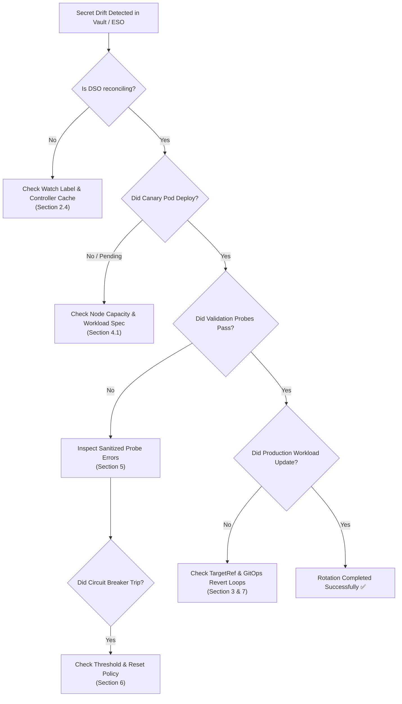

# Universal Architecture Troubleshooting Guide

This guide provides operational diagnostics, troubleshooting procedures, and remediation playbooks for common issues encountered when operating the **Dynamic Secret Operator (DSO)**.

> [!NOTE]
> This document focuses on **universal, operator-level, and architecture-wide issues** independent of your cloud provider. For cloud-specific authentication and infrastructure setup, consult the provider-specific guides:
> - [Azure Key Vault Troubleshooting](../providers/azure/troubleshooting.md)
> - [AWS Secrets Manager Troubleshooting](../providers/aws/troubleshooting.md)
> - [GCP Secret Manager Troubleshooting](../providers/gcp/troubleshooting.md)
> - [External Secrets Operator (ESO) Troubleshooting](../providers/eso/troubleshooting.md)

---

## 📑 Diagnostic Navigation

1. [Diagnostic Workflow & Quick Commands](#1-diagnostic-workflow--quick-commands)
2. [Operator Engine & Lifecycle Issues](#2-operator-engine--lifecycle-issues)
3. [Workload Discovery & Mutation Issues](#3-workload-discovery--mutation-issues)
4. [Ephemeral Canary Sandbox Issues](#4-ephemeral-canary-sandbox-issues)
5. [Synthetic Validation Probe Failures](#5-synthetic-validation-probe-failures)
6. [Circuit Breaker Tripping & Recovery](#6-circuit-breaker-tripping--recovery)
7. [GitOps Reconciliation Drift (Argo CD / Flux)](#7-gitops-reconciliation-drift-argo-cd--flux)
8. [CRD & CEL Schema Validation Errors](#8-crd--cel-schema-validation-errors)

---

## 1. Diagnostic Workflow & Quick Commands

Whenever a secret rotation does not proceed as expected, follow this diagnostic sequence:



### Essential CLI Diagnostic Commands

```bash
# 1. Inspect status and condition history of the policy
kubectl describe dynamicsecretpolicy <POLICY_NAME> -n <NAMESPACE>

# 2. View operator logs filtered by policy name
kubectl logs -n dso-system deploy/dynamic-secret-operator -c manager --tail=200 | grep "<POLICY_NAME>"

# 3. Check materialized revision secrets in the namespace
kubectl get secrets -n <NAMESPACE> -l dso.quantumsys.dev/managed=true

# 4. Check active canary pods
kubectl get pods -n <NAMESPACE> -l dso.quantumsys.dev/canary=true
```

---

## 2. Operator Engine & Lifecycle Issues

### 2.1 Leader Election Contention & Lease Lockouts
#### Symptom:
The operator pod is running, but logs state:
```
attempting to acquire leader lease dso-system/dynamic-secret-operator-leader...
```
No reconciliations take place.

#### Root Cause:
When running multiple replicas, only the active leader reconciles policies. If the current leader experiences a node failure, clock skew, or network partition, controller-runtime waits for the lease duration (default: 15s) to expire before promoting a follower.

#### Remediation:
1. Check the active lease owner:
   ```bash
   kubectl get lease dynamic-secret-operator-leader -n dso-system -o yaml
   ```
2. Verify node clock synchronization (NTP). If nodes have severe clock drift, leader election leases may fail to renew.

---

### 2.2 Operator Pod OOMKilled / High CPU Under Rotation Storms
#### Symptom:
The DSO pod is terminated with `Exit Code 137` (`OOMKilled`) or CPU throttling is observed during mass secret rotation events.

#### Root Cause:
If hundreds of policies trigger rotation simultaneously, running unbounded concurrent reconciliations can exhaust memory resources.

#### Remediation:
1. Adjust concurrency settings in Helm `values.yaml`:
   ```yaml
   controller:
     maxConcurrentReconciles: 5 # Reduce concurrency to bound memory
     eventBufferSize: 1000
   resources:
     limits:
       memory: 512Mi
       cpu: 500m
     requests:
       memory: 128Mi
       cpu: 100m
   ```
2. For large clusters (> 1,000 policies), see the enterprise tuning guidelines in [configuration.md](configuration.md#4-enterprise-concurrency--tuning-guide).

---

### 2.3 Namespaced RBAC Scope & Watch Failures
#### Symptom:
Operator logs report `403 Forbidden` when attempting to list or watch workloads:
```
cannot list resource "deployments" in API group "apps" in the namespace "team-billing": User cannot list resource in the namespace
```

#### Root Cause:
DSO was deployed with `rbac.scope: "Namespaced"` and an explicit `rbac.watchNamespaces` list that does not include the target workload's namespace.

#### Remediation:
1. Either switch to cluster-wide RBAC:
   ```yaml
   rbac:
     scope: "Cluster"
   ```
2. Or add the missing namespace to `rbac.watchNamespaces` in your Helm configuration:
   ```yaml
   rbac:
     scope: "Namespaced"
     watchNamespaces:
       - team-billing
       - team-orders
   ```

---

### 2.4 Cache Ingestion & The Watch Label Contract
#### Symptom:
An intermediate secret is updated by an external tool (e.g. ESO, CI/CD, or manual patch), but DSO never reacts or logs any activity.

#### Root Cause:
To prevent caching every secret in the cluster in memory, DSO's controller-runtime informer strictly filters secrets by the label:
```yaml
dso.quantumsys.dev/managed: "watch"
```
If this label is missing on an externally managed secret, the operator's cache ignores it entirely.

#### Remediation:
1. Verify if the label exists on the secret:
   ```bash
   kubectl get secret <SECRET_NAME> -n <NAMESPACE> --show-labels
   ```
2. Add the required label:
   ```bash
   kubectl label secret <SECRET_NAME> -n <NAMESPACE> dso.quantumsys.dev/managed=watch --overwrite
   ```

---

## 3. Workload Discovery & Mutation Issues

### 3.1 `WorkloadNotFound`
#### Symptom:
Policy condition displays:
```yaml
status:
  conditions:
    - type: Ready
      status: "False"
      reason: WorkloadNotFound
      message: "target workload Deployment 'order-service' not found in namespace 'production'"
```

#### Root Cause:
1. Typo in `spec.workloadSelector.name`.
2. Wrong `spec.workloadSelector.kind` (e.g. specified `Deployment` when the resource is a `StatefulSet`, `DaemonSet`, or `Rollout`).
3. The `DynamicSecretPolicy` is deployed in a different namespace than the target workload.

#### Remediation:
Ensure the workload exists in the **same** namespace as the policy:
```bash
kubectl get <KIND> <NAME> -n <NAMESPACE>
```
Update `spec.workloadSelector` in the policy to match the exact resource name and kind.

---

### 3.2 Volume or Container Target Not Found (`VolumeNotFound` / `TargetNotFound`)
#### Symptom:
Policy status indicates failure resolving the target secret mount:
```yaml
status:
  conditions:
    - type: Ready
      status: "False"
      reason: VolumeNotFound
      message: "volume 'db-secret-volume' not found in target workload pod template"
```

#### Root Cause:
If `spec.targetRef.volumeName` is specified, the target workload's `spec.template.spec.volumes` must contain a volume matching that name. If `spec.targetRef.envName` is used, the container name (if specified) must exist.

#### Remediation:
1. Inspect the workload's pod template:
   ```bash
   kubectl get deployment <NAME> -n <NAMESPACE> -o jsonpath='{.spec.template.spec.volumes[*].name}'
   ```
2. Update `spec.targetRef.volumeName` in your policy to match the existing volume name.

---

## 4. Ephemeral Canary Sandbox Issues

### 4.1 Canary Pod Stuck in `Pending`
#### Symptom:
Canary pod `<workload>-canary-xxxx` remains in `Pending` status until `canaryStrategy.timeoutSeconds` expires:
```yaml
status:
  conditions:
    - type: CanaryReady
      status: "False"
      reason: CanaryTimeout
      message: "canary deployment failed to reach ready state within 30s timeout"
```

#### Root Cause:
1. **Cluster Capacity:** Nodes have insufficient CPU or Memory to schedule the extra 1-replica canary pod.
2. **Scheduling Constraints:** Workload has strict anti-affinity rules, node selectors, or taints that prevent scheduling a second replica.
3. **PVC Conflicts:** If targeting a StatefulSet with a `ReadWriteOnce` (RWO) PersistentVolumeClaim, the canary pod cannot mount the volume simultaneously.

#### Remediation:
1. Inspect the pending pod's scheduling events:
   ```bash
   kubectl describe pod -n <NAMESPACE> -l dso.quantumsys.dev/canary=true
   ```
2. If cluster resources are constrained, free capacity or increase `spec.canaryStrategy.timeoutSeconds` to give the cluster autoscaler time to provision a new node.

---

### 4.2 Canary Pod in `CrashLoopBackOff`
#### Symptom:
The canary pod starts, but immediately crashes and terminates:
```bash
kubectl get pods -n <NAMESPACE> -l dso.quantumsys.dev/canary=true
```
```
NAME                           READY   STATUS             RESTARTS
order-service-canary-78b9...   0/1     CrashLoopBackOff   2
```

#### Root Cause:
The application binary in the canary pod cannot boot with the rotated candidate credentials (e.g. configuration file syntax error, unparseable secret JSON, or missing required environment variables).

#### Remediation:
1. View the canary pod's container logs:
   ```bash
   kubectl logs -n <NAMESPACE> -l dso.quantumsys.dev/canary=true --tail=50
   ```
2. Confirm whether the candidate secret payload in the vault matches the schema expected by the application.
3. Note: **Your production workload is completely safe.** DSO leaves the production deployment untouched when the canary fails.

---

### 4.3 Ephemeral NetworkPolicy Egress Blocks
#### Symptom:
Canary pod boots, but synthetic validation probes time out with connection refused or I/O timeout.

#### Root Cause:
By default, DSO applies an ephemeral `NetworkPolicy` to isolate the canary pod. Ingress is completely denied, and Egress is restricted to:
1. CoreDNS (`k8s-app in (kube-dns, coredns)`) on port 53.
2. The exact IP/CIDR and port resolved from `spec.validationProbes[].endpoint`.

If the endpoint is an external database or cloud-managed service, and DNS resolution fails or the cluster egress firewall drops traffic, the probe will fail.

#### Remediation:
1. Inspect the generated canary network policy:
   ```bash
   kubectl get netpol -n <NAMESPACE> -l dso.quantumsys.dev/canary=true -o yaml
   ```
2. If using **Cilium eBPF**, configure `spec.networkPolicy.provider: "Cilium"` on the policy to enable FQDN-based egress filtering.

---

## 5. Synthetic Validation Probe Failures

### 5.1 Database Probes (PostgreSQL / MySQL)
#### Symptom:
```
database authentication failed: [REDACTED]
```

#### Root Causes & Remediation:
1. **Password Key Name Mismatch:** By default, DSO looks for keys `password`, `pass`, or `POSTGRES_PASSWORD`. If your secret uses a custom key (e.g. `db_password`), declare it explicitly in the probe spec:
   ```yaml
   validationProbes:
     - type: PostgreSQL
       endpoint: "postgres.production:5432"
       credentials:
         passwordKey: "db_password"
         usernameKey: "db_user"
         databaseKey: "db_name"
   ```
2. **Database TLS Enforcement:** If the database requires SSL/TLS, ensure your endpoint includes TLS options or the probe timeout is sufficient for the SSL handshake.

---

### 5.2 HTTP / HTTPS Probes
#### Symptom:
```
http probe failed: expected status code 200-399, got 503 Service Unavailable
```

#### Root Causes & Remediation:
1. **Slow Application Warm-Up:** The application container in the canary pod might require a few seconds to initialize its HTTP server. Increase `queryTimeout`:
   ```yaml
   validationProbes:
     - type: HTTP
       endpoint: "http://order-service.production.svc.cluster.local:8080/healthz"
       queryTimeout: 15
   ```
2. **Canary IP Routing:** For in-cluster endpoints, DSO automatically discovers the canary pod's IP and redirects traffic to test the canary specifically. Verify that the canary container exposes the target port.

---

### 5.3 Batch Job Probes (`batch/v1.Job`)
#### Symptom:
```
job probe failed: job 'order-service-job-probe-xxxx' failed or timed out
```

#### Root Causes & Remediation:
1. **Missing Revision Secret Env:** Job probe containers must reference `$(DSO_REVISION_SECRET_NAME)` to mount or read the candidate credentials:
   ```yaml
   volumes:
     - name: secret-volume
       secret:
         secretName: $(DSO_REVISION_SECRET_NAME)
   ```
2. **Job Timeout:** If the validation script or data migration takes longer than expected, increase `spec.validationProbes[].job.timeoutSeconds` (default: 60s).
3. **Inspect Failed Job Logs:**
   ```bash
   kubectl logs -n <NAMESPACE> job/<JOB_NAME>
   ```

---

## 6. Circuit Breaker Tripping & Recovery

### 6.1 Understanding the Circuit Breaker
To protect upstream databases and identity providers from brute-force account lockouts, DSO increments `status.consecutiveFailures` on every failed rotation cycle.

When `consecutiveFailures` reaches `spec.rollbackConfig.circuitBreakerThreshold` (default: 3):
1. The operator **trips the circuit breaker** and halts automated reconciliations.
2. Policy condition reflects:
   ```yaml
   status:
     conditions:
       - type: CircuitBreakerTripped
         status: "True"
         reason: ConsecutiveFailuresExceeded
         message: "consecutive rotation failures (3) exceeded threshold (3); reconciliations halted"
   ```
3. Emits Prometheus metric `dso_circuit_breakers_tripped_total`.

### 6.2 Recovery Procedures

#### Option A: Automated Recovery on Upstream Fix (Recommended)
You do **not** need to restart the operator or delete pods. As soon as a corrected secret is committed to your upstream vault (or ESO syncs a new secret hash):
1. DSO detects the new SHA-256 hash drift.
2. Automatically resets `consecutiveFailures` to `0`.
3. Un-trips `CircuitBreakerTripped` to `False`.
4. Executes a fresh canary validation cycle.

#### Option B: Manual Force Reset
To force a re-evaluation without updating the upstream secret:
```bash
# Apply a trigger annotation to force an immediate reconciliation cycle
kubectl annotate dynamicsecretpolicy <POLICY_NAME> -n <NAMESPACE> \
  dso.quantumsys.dev/reconcile-trigger="$(date +%s)" --overwrite
```

---

## 7. GitOps Reconciliation Drift (Argo CD / Flux)

### 7.1 The Infinite Self-Heal Revert Loop
#### Symptom:
1. DSO validates the new secret and updates the production workload volume.
2. Within seconds, the workload rolls back to the old secret.
3. Pods restart in an infinite loop.
4. Argo CD UI alternates between `Synced` and `OutOfSync`.

#### Root Cause:
Argo CD with `selfHeal: true` and `prune: true` detects DSO's in-cluster workload mutations (secret volume name, revision annotation) as unauthorized drift from Git and reverts them.

#### Remediation:
Configure fine-grained `ignoreDifferences` in your Argo CD `Application` or global `argocd-cm` ConfigMap:

```yaml
spec:
  ignoreDifferences:
    - group: apps
      kind: Deployment
      jsonPointers:
        - /spec/template/metadata/annotations/dso.quantumsys.dev~1revision
      jqPathExpressions:
        # Ignore ONLY volumes pointing to DSO revision secrets
        - .spec.template.spec.volumes[] | select(.secret.secretName != null and (.secret.secretName | test("-rev-[0-9a-f]{12}$")))
        - .spec.template.spec.containers[].env[]? | select(.valueFrom.secretKeyRef.name != null and (.valueFrom.secretKeyRef.name | test("-rev-[0-9a-f]{12}$")))
```
For complete configuration details, see [GitOps Integration: Managing Argo CD Drift](gitops-argo-cd.md).

> [!WARNING]
> **Do not use automatic in-cluster patching (`ARGOCD_AUTOPATCH_ENABLED="true"`) in App-of-Apps environments.** Commit `ignoreDifferences` directly to Git instead.

---

## 8. CRD & CEL Schema Validation Errors

Kubernetes Common Expression Language (CEL) validates `DynamicSecretPolicy` manifests on submission:

| Error Message | Cause | Remediation |
| :--- | :--- | :--- |
| `target workload name must not be empty` | `spec.workloadSelector.name` is missing or empty. | Provide the exact workload name. |
| `timeoutSeconds must be greater than 0` | `spec.canaryStrategy.timeoutSeconds` is $\le 0$. | Set `timeoutSeconds` to a positive integer (e.g. 30). |
| `job specification is required when probe type is Job` | `validationProbes[].type: Job` specified without a `job` block. | Add the `job.jobTemplate` configuration. |
| `queryTimeout must be at least 1 second` | `queryTimeout` was set to 0. | Omit or set to $\ge 1$. |

---

## 🔗 Related Resources

- [Operator Configuration Reference](configuration.md)
- [Observability & Metrics Reference](metrics.md)
- [GitOps Integration Guide](gitops-argo-cd.md)
- [Security Architecture & Threat Model](security.md)
