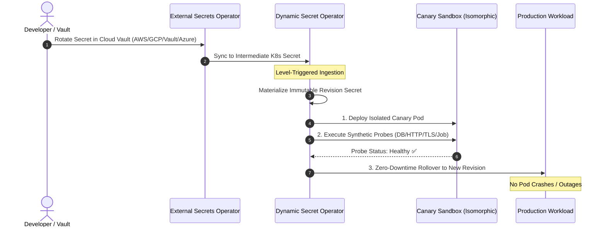

# Getting Started with Dynamic Secret Operator (DSO)

Get up and running with automated, zero-downtime dynamic secret rotation in **under 5 minutes** using Kubernetes, [External Secrets Operator (ESO)](https://external-secrets.io/), and **Dynamic Secret Operator (DSO)**.

---

## Prerequisites

- A cloud Kubernetes cluster (v1.28+) (e.g., AKS, EKS, or GKE)
- [`kubectl`](https://kubernetes.io/docs/tasks/tools/) configured with cluster admin access
- [`helm`](https://helm.sh/docs/intro/install/) (v3.12+)

---

## Operating Modes: Choose Your Model

DSO supports two distinct operating modes depending on your architecture:

| Mode | Architecture | How Ingestion Works | Cloud IAM Credentials |
| :--- | :--- | :--- | :--- |
| **ESO Mode (Universal Multi-Cloud)** | Decoupled | Pulls from 30+ vaults via External Secrets Operator; watches intermediate secret | **None** (100% Kubernetes RBAC) |
| **Event-Driven Mode (Multi-Cloud Push)** | Push-Based | Upstream vault rotations immediately push events through cloud message queues across **AWS, GCP, and Azure** (Amazon SQS, GCP Pub/Sub, Azure Service Bus) | Federated Identity (AWS IRSA / GCP Workload Identity / Azure Workload Identity) |

> 📖 **Detailed Architecture & Decision Matrix:** For an in-depth comparison, sequence diagrams, and guidance on selecting between ESO Mode and Event-Driven Mode, see the dedicated [**Operating Modes Guide**](operating-modes.md).

---

## 5-Minute Quickstart



---

### Step 1: Install External Secrets Operator (ESO)

*(Required for ESO Mode)* Add the ESO Helm repository and install the operator:

```bash
helm repo add external-secrets https://charts.external-secrets.io
helm repo update

helm install external-secrets \
  external-secrets/external-secrets \
  --namespace external-secrets \
  --create-namespace \
  --set installCRDs=true \
  --wait
```

---

### Step 2: Install Dynamic Secret Operator (DSO)

> [!IMPORTANT]
> **Understanding Installation Differences Across Providers:**
> 
> How you install and configure DSO depends directly on the secret provider backend you are using:
> - **Microsoft Azure (Production Ready):** Ingests real-time events from Azure Key Vault via Azure Service Bus. Requires configuring Azure Workload Identity (`clientId`, `tenantId`) and Service Bus details (`namespace`, `queueName`).
> - **Amazon Web Services - AWS (In Development):** Targets event-driven ingestion via Amazon EventBridge and SQS queues. Requires AWS IRSA / EKS Pod Identity role ARN, SQS queue URL, and AWS region.
> - **Google Cloud Platform - GCP (In Development):** Targets event-driven ingestion via Cloud Pub/Sub subscriptions. Requires GKE Workload Identity service account and Pub/Sub subscription path.
> - **Universal Multi-Cloud via ESO (Production Ready):** Operates without any direct cloud IAM credentials inside DSO (`azure.workloadIdentity.enabled=false`). ESO synchronizes secrets from AWS, GCP, Vault, Azure, or any supported vault into intermediate Kubernetes secrets, which DSO watches to trigger progressive canary rollouts.

Select the installation option matching your environment:

---

#### Option 1: Microsoft Azure (🟢 Production Ready)
*Event-driven via Azure Key Vault, Event Grid, Service Bus, and Azure Workload Identity.*  
*(See the [Azure Key Vault Provider Guide](providers/azure.md) for full prerequisites and setup).*

**PowerShell (Windows):**
```powershell
helm install dso oci://ghcr.io/quantumsys-dev/charts/dynamic-secret-operator `
  --namespace dso-system `
  --create-namespace `
  --set mode=event-driven `
  --set provider=azure `
  --set azure.workloadIdentity.enabled=true `
  --set azure.workloadIdentity.clientId="<MANAGED_IDENTITY_CLIENT_ID>" `
  --set azure.workloadIdentity.tenantId="<AZURE_TENANT_ID>" `
  --set azure.serviceBus.namespace="<SERVICEBUS_NAMESPACE_FQDN>" `
  --set azure.serviceBus.queueName="dso-vault-events" `
  --wait
```

**Bash (Linux / macOS):**
```bash
helm install dso oci://ghcr.io/quantumsys-dev/charts/dynamic-secret-operator \
  --namespace dso-system \
  --create-namespace \
  --set mode=event-driven \
  --set provider=azure \
  --set azure.workloadIdentity.enabled=true \
  --set azure.workloadIdentity.clientId="<MANAGED_IDENTITY_CLIENT_ID>" \
  --set azure.workloadIdentity.tenantId="<AZURE_TENANT_ID>" \
  --set azure.serviceBus.namespace="<SERVICEBUS_NAMESPACE_FQDN>" \
  --set azure.serviceBus.queueName="dso-vault-events" \
  --wait
```

---

#### Option 2: Amazon Web Services (AWS) (🟡 In Development – Roadmap v0.3)
> [!NOTE]
> Native AWS event-driven ingestion (EventBridge $\to$ SQS) is currently under active development.
> For production AWS clusters today, use **Option 4 (Universal Multi-Cloud via ESO)** below. See also the [AWS Secrets Manager Provider Guide](providers/aws.md).

**PowerShell (Windows):**
```powershell
# Note: Native AWS provider is currently under development (Roadmap v0.3.0)
helm install dso oci://ghcr.io/quantumsys-dev/charts/dynamic-secret-operator `
  --namespace dso-system `
  --create-namespace `
  --set mode=event-driven `
  --set provider=aws `
  --set aws.enabled=true `
  --set aws.roleArn="arn:aws:iam::<ACCOUNT_ID>:role/dso-secret-operator-role" `
  --set aws.sqs.queueUrl="https://sqs.<REGION>.amazonaws.com/<ACCOUNT_ID>/dso-vault-events" `
  --set aws.region="<REGION>" `
  --wait
```

**Bash (Linux / macOS):**
```bash
# Note: Native AWS provider is currently under development (Roadmap v0.3.0)
helm install dso oci://ghcr.io/quantumsys-dev/charts/dynamic-secret-operator \
  --namespace dso-system \
  --create-namespace \
  --set mode=event-driven \
  --set provider=aws \
  --set aws.enabled=true \
  --set aws.roleArn="arn:aws:iam::<ACCOUNT_ID>:role/dso-secret-operator-role" \
  --set aws.sqs.queueUrl="https://sqs.<REGION>.amazonaws.com/<ACCOUNT_ID>/dso-vault-events" \
  --set aws.region="<REGION>" \
  --wait
```

---

#### Option 3: Google Cloud Platform (GCP) (🟡 In Development – Roadmap v0.3)
> [!NOTE]
> Native GCP event-driven ingestion (Secret Manager $\to$ Pub/Sub) is currently under active development.
> For production GCP clusters today, use **Option 4 (Universal Multi-Cloud via ESO)** below. See also the [Google Cloud Secret Manager Provider Guide](providers/gcp.md).

**PowerShell (Windows):**
```powershell
# Note: Native GCP provider is currently under development (Roadmap v0.3.0)
helm install dso oci://ghcr.io/quantumsys-dev/charts/dynamic-secret-operator `
  --namespace dso-system `
  --create-namespace `
  --set mode=event-driven `
  --set provider=gcp `
  --set gcp.enabled=true `
  --set gcp.workloadIdentity.serviceAccount="dso-sa@<PROJECT_ID>.iam.gserviceaccount.com" `
  --set gcp.pubsub.subscription="projects/<PROJECT_ID>/subscriptions/dso-vault-events-sub" `
  --wait
```

**Bash (Linux / macOS):**
```bash
# Note: Native GCP provider is currently under development (Roadmap v0.3.0)
helm install dso oci://ghcr.io/quantumsys-dev/charts/dynamic-secret-operator \
  --namespace dso-system \
  --create-namespace \
  --set mode=event-driven \
  --set provider=gcp \
  --set gcp.enabled=true \
  --set gcp.workloadIdentity.serviceAccount="dso-sa@<PROJECT_ID>.iam.gserviceaccount.com" \
  --set gcp.pubsub.subscription="projects/<PROJECT_ID>/subscriptions/dso-vault-events-sub" \
  --wait
```

---

#### Option 4: Universal Multi-Cloud via External Secrets Operator (ESO) (🟢 Production Ready)
*Recommended for AWS, GCP, HashiCorp Vault, Azure, or multi-cloud clusters today. Simply set `mode=eso` (requires no cloud credentials or provider parameter inside DSO).*  
*(See the [ESO Universal Provider Guide](providers/eso.md) for full prerequisites and setup).*

**PowerShell (Windows):**
```powershell
helm install dso oci://ghcr.io/quantumsys-dev/charts/dynamic-secret-operator `
  --namespace dso-system `
  --create-namespace `
  --set mode=eso `
  --wait
```

**Bash (Linux / macOS):**
```bash
helm install dso oci://ghcr.io/quantumsys-dev/charts/dynamic-secret-operator \
  --namespace dso-system \
  --create-namespace \
  --set mode=eso \
  --wait
```

---

Verify DSO is running:

```bash
kubectl get pods -n dso-system
```

---

### Step 3: Deploy a Demo Application & Database

Create a demo namespace and deploy PostgreSQL alongside a sample backend application:

```bash
kubectl create namespace dso-demo

cat <<EOF | kubectl apply -n dso-demo -f -
apiVersion: apps/v1
kind: Deployment
metadata:
  name: demo-backend
  labels:
    app: demo-backend
spec:
  replicas: 2
  selector:
    matchLabels:
      app: demo-backend
  template:
    metadata:
      labels:
        app: demo-backend
    spec:
      containers:
        - name: app
          image: nginx:alpine
          ports:
            - containerPort: 80
          env:
            - name: DB_PASSWORD
              valueFrom:
                secretKeyRef:
                  name: demo-backend-db-pass-initial
                  key: password
---
apiVersion: v1
kind: Secret
metadata:
  name: demo-backend-db-pass-initial
type: Opaque
stringData:
  password: "initial-demo-password"
---
apiVersion: v1
kind: Secret
metadata:
  name: eso-synced-db-pass
  labels:
    dso.quantumsys.dev/managed: "watch"
type: Opaque
stringData:
  password: "initial-demo-password"
EOF
```

> **Using real Cloud Vaults (AWS, GCP, Vault, Azure)?** Configure ESO's `ExternalSecret` resource to synchronize the secret and attach the watch label in its `target.template`:
>
> ```yaml
> apiVersion: external-secrets.io/v1beta1
> kind: ExternalSecret
> metadata:
>   name: db-pass-eso
>   namespace: dso-demo
> spec:
>   refreshInterval: "1h"
>   secretStoreRef:
>     name: vault-backend
>     kind: SecretStore
>   target:
>     name: eso-synced-db-pass
>     template:
>       metadata:
>         labels:
>           dso.quantumsys.dev/managed: "watch" # Tells DSO to monitor this secret
>   data:
>     - secretKey: password
>       remoteRef:
>         key: database/production
>         property: password
> ```

---

### Step 4: Apply the DynamicSecretPolicy

Define a `DynamicSecretPolicy` that monitors the synchronized secret, defines a synthetic health probe, and configures automated canary validation before promoting to production:

```bash
cat <<EOF | kubectl apply -n dso-demo -f -
apiVersion: dso.quantumsys.dev/v1alpha1
kind: DynamicSecretPolicy
metadata:
  name: demo-backend-policy
spec:
  workloadSelector:
    kind: Deployment
    name: demo-backend
  source:
    type: K8sSecret
    k8sSecret:
      name: eso-synced-db-pass
  strategy: Canary
  networkPolicy:
    provider: Standard
  validationProbes:
    - type: HTTP
      endpoint: "http://localhost:80"
      queryTimeout: 5
  rollbackConfig:
    autoRollback: true
    circuitBreakerThreshold: 3
EOF
```

Inspect the policy status:

```bash
kubectl get dynamicsecretpolicies -n dso-demo
```

---

### Step 5: Test Automated Zero-Downtime Secret Rotation

Simulate a secret rotation in your vault by updating the intermediate secret (as ESO would do automatically upon external secret change):

```bash
kubectl patch secret eso-synced-db-pass -n dso-demo \
  -p '{"stringData":{"password":"new-rotated-super-secret"}}'
```

Watch DSO execute the rotation lifecycle in real-time:

```bash
kubectl get dynamicsecretpolicy demo-backend-policy -n dso-demo -w
```

You will observe:
1. **CanaryProvisioning**: DSO spins up an ephemeral canary pod with the newly generated revision secret (`demo-backend-db-pass-rev-<hash>`).
2. **Validating**: Synthetic probes execute against the canary inside the isolated network sandbox.
3. **Promoting**: Once probes succeed, DSO updates the primary deployment's volume/env references with zero downtime.
4. **Active**: The deployment reaches 100% healthy state on the new secret revision.

---

## Next Steps & Enterprise Scenarios

- [Cloud Providers Overview](providers/overview.md)
  - [Microsoft Azure Key Vault Guide (Production Ready)](providers/azure.md)
  - [Universal Multi-Cloud via ESO Guide (Production Ready)](providers/eso.md)
  - [AWS Secrets Manager Guide (In Development)](providers/aws.md)
  - [Google Cloud Secret Manager Guide (In Development)](providers/gcp.md)
- [Operating Modes Guide (ESO Mode vs Event-Driven Mode)](operating-modes.md)
- [Circuit Breaker & Rollback Guide](../examples/eso/circuit-breaker-rollback/README.md)
- [Cilium eBPF & Hubble Observability](../examples/eso/cilium-hubble-observability/README.md)
- [Argo Rollouts Blue/Green Progressive Delivery](../examples/eso/argo-rollouts-blue-green/README.md)
- [Argo CD GitOps Self-Heal Integration](gitops-argo-cd.md)
- [Production Architecture & Threat Model](security.md)
