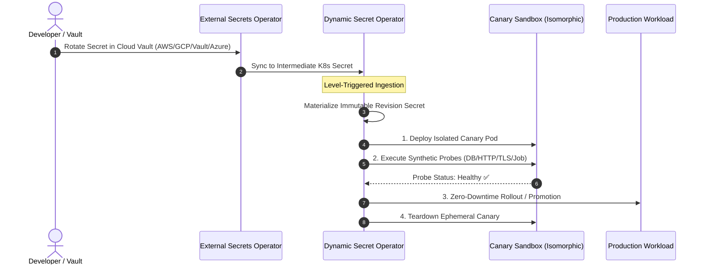

# Getting Started with Dynamic Secret Operator (DSO)

Get up and running with automated, zero-downtime dynamic secret rotation in **under 5 minutes** using Kubernetes, [External Secrets Operator (ESO)](https://external-secrets.io/), and **Dynamic Secret Operator (DSO)**.

---

## Prerequisites

- A Kubernetes cluster (v1.28+) (e.g., [Kind](https://kind.sigs.k8s.io/), [Minikube](https://minikube.sigs.k8s.io/), AKS, EKS, or GKE)
- [`kubectl`](https://kubernetes.io/docs/tasks/tools/) configured with cluster admin access
- [`helm`](https://helm.sh/docs/intro/install/) (v3.12+)

---

## 5-Minute Quickstart



---

### Step 1: Install External Secrets Operator (ESO)

Add the ESO Helm repository and install the operator:

```bash
helm repo add external-secrets https://charts.external-secrets.io
helm repo update

helm install external-secrets \
  external-secrets/external-secrets \
  --namespace external-secrets \
  --create-namespace \
  --set installCRDs=true \
  --wait
```

---

### Step 2: Install Dynamic Secret Operator (DSO)

Install DSO and its Custom Resource Definitions (CRDs) via Helm from GitHub Container Registry (OCI):

```bash
helm install dso oci://ghcr.io/quantumsys-dev/charts/dynamic-secret-operator \
  --namespace dso-system \
  --create-namespace \
  --wait
```

*(Alternatively, apply manifests directly from the repository)*:

```bash
kubectl apply -f https://raw.githubusercontent.com/quantumsys-dev/dynamic-secret-operator/main/config/crd/bases/dso.quantumsys.dev_dynamicsecretpolicies.yaml
kubectl apply -f https://raw.githubusercontent.com/quantumsys-dev/dynamic-secret-operator/main/deploy/helm/dso/templates/
```

Verify DSO is running:

```bash
kubectl get pods -n dso-system
```

---

### Step 3: Deploy a Demo Application & Database

Create a demo namespace and deploy PostgreSQL alongside a sample backend application:

```bash
kubectl create namespace dso-demo

cat <<EOF | kubectl apply -n dso-demo -f -
apiVersion: apps/v1
kind: Deployment
metadata:
  name: demo-backend
  labels:
    app: demo-backend
spec:
  replicas: 2
  selector:
    matchLabels:
      app: demo-backend
  template:
    metadata:
      labels:
        app: demo-backend
    spec:
      containers:
        - name: app
          image: nginx:alpine
          ports:
            - containerPort: 80
          env:
            - name: DB_PASSWORD
              valueFrom:
                secretKeyRef:
                  name: demo-backend-db-pass-initial
                  key: password
---
apiVersion: v1
kind: Secret
metadata:
  name: demo-backend-db-pass-initial
type: Opaque
stringData:
  password: "initial-demo-password"
---
apiVersion: v1
kind: Secret
metadata:
  name: eso-synced-db-pass
  labels:
    dso.quantumsys.dev/managed: "watch"
type: Opaque
stringData:
  password: "initial-demo-password"
EOF
```

---

### Step 4: Apply the DynamicSecretPolicy

Define a `DynamicSecretPolicy` that monitors the synchronized secret, defines a synthetic health probe, and configures automated canary validation before promoting to production:

```bash
cat <<EOF | kubectl apply -n dso-demo -f -
apiVersion: dso.quantumsys.dev/v1alpha1
kind: DynamicSecretPolicy
metadata:
  name: demo-backend-policy
spec:
  workloadSelector:
    kind: Deployment
    name: demo-backend
  source:
    type: K8sSecret
    k8sSecret:
      name: eso-synced-db-pass
  strategy: Canary
  networkPolicy:
    provider: Standard
  validationProbes:
    - type: HTTP
      endpoint: "http://localhost:80"
      timeoutSeconds: 5
  circuitBreaker:
    consecutiveFailureThreshold: 3
    resetTimeoutSeconds: 300
EOF
```

Inspect the policy status:

```bash
kubectl get dynamicsecretpolicies -n dso-demo
```

---

### Step 5: Test Automated Zero-Downtime Secret Rotation

Simulate a secret rotation in your vault by updating the intermediate secret (as ESO would do automatically upon external secret change):

```bash
kubectl patch secret eso-synced-db-pass -n dso-demo \
  -p '{"stringData":{"password":"new-rotated-super-secret"}}'
```

Watch DSO execute the rotation lifecycle in real-time:

```bash
kubectl get dynamicsecretpolicy demo-backend-policy -n dso-demo -w
```

You will observe:
1. **CanaryProvisioning**: DSO spins up an ephemeral canary pod with the newly generated revision secret (`demo-backend-db-pass-rev-<hash>`).
2. **Validating**: Synthetic probes execute against the canary inside the isolated network sandbox.
3. **Promoting**: Once probes succeed, DSO updates the primary deployment's volume/env references with zero downtime.
4. **Active**: The deployment reaches 100% healthy state on the new secret revision.

---

## Next Steps & Enterprise Scenarios

- [Circuit Breaker & Rollback Guide](../examples/eso/circuit-breaker-rollback/README.md)
- [Cilium eBPF & Hubble Observability](../examples/eso/cilium-hubble-observability/README.md)
- [Argo Rollouts Blue/Green Progressive Delivery](../examples/eso/argo-rollouts-blue-green/README.md)
- [Argo CD GitOps Self-Heal Integration](gitops-argo-cd.md)
- [Production Architecture & Threat Model](security.md)
