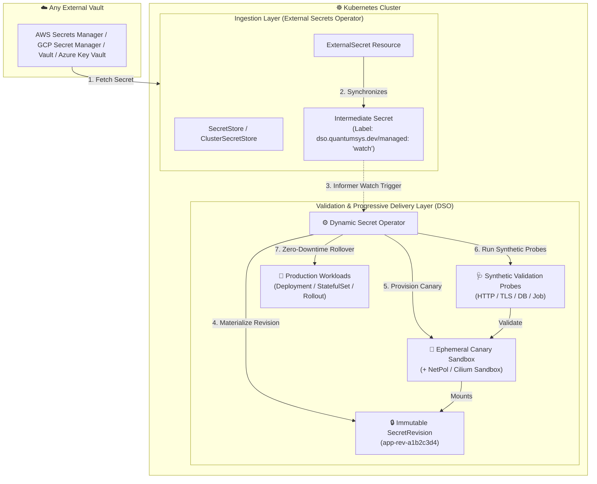
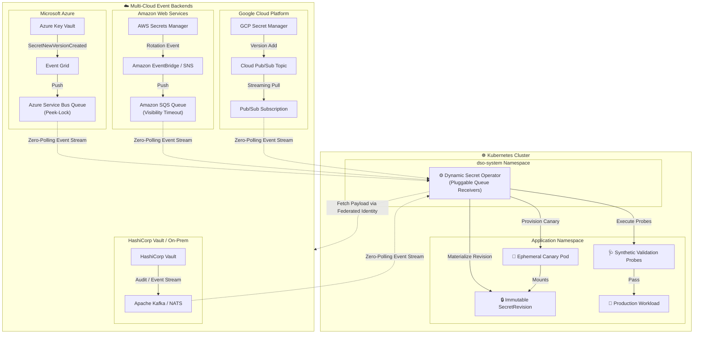
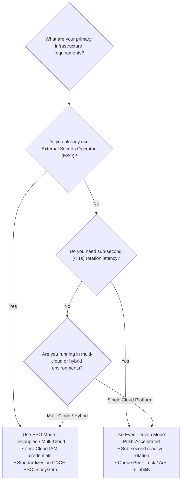

# Operating Modes: Universal Decoupled (ESO) vs. Multi-Cloud Event-Driven

The **Dynamic Secret Operator (DSO)** is engineered with an adaptable, decoupled architecture that supports two distinct operational modes for secret rotation. 

This document details both operating modes, architectural differences, security boundaries, installation instructions, and guidance on selecting the optimal mode for your environment.

---

## 🎯 At a Glance: ESO Mode vs. Event-Driven Mode

| Dimension | ESO Mode (Universal Multi-Cloud / Decoupled) | Event-Driven Mode (Multi-Cloud Push-Accelerated) |
| :--- | :--- | :--- |
| **Ingestion Paradigm** | Decoupled Level-Triggered (Secret Drift via Informers) | Reactive Push-Accelerated (Event Streams & Message Queues) |
| **Supported Secret Vaults** | 30+ providers via CNCF External Secrets Operator (AWS, GCP, Vault, Azure, 1Password, etc.) | Cloud Vaults with Event Emitters (Azure Key Vault, AWS Secrets Manager, GCP Secret Manager, Vault) |
| **Latency from Rotation** | Sub-second after ESO sync (governed by ESO `refreshInterval` or webhook) | Sub-second instant reactive trigger (< 500ms from vault commit) |
| **Cloud IAM Credentials for DSO** | **None** (100% Kubernetes RBAC only) | Federated Workload Identity (Azure Workload Identity, AWS IRSA, GCP Workload Identity) |
| **Inter-Operator Synergies** | Synergizes with External Secrets Operator (ESO) | Direct queue consumer (Azure Service Bus, AWS SQS, GCP Pub/Sub, Kafka) |
| **Failure Recovery** | Level-triggered state reconciliation on next resync | Peek-Lock / Visibility Timeout with explicit NACKs and Dead-Letter Queues (DLQ) |
| **Best Suited For** | Multi-cloud, hybrid, on-premises, and GitOps-centric clusters standardizing on ESO | High-frequency rotations, strict compliance requiring immediate (< 1s) rotation, and zero polling overhead |

---

## 🏗️ Architectural Deep Dive

### ESO Mode: Universal Multi-Cloud Ingestion (ESO-Native / Decoupled)

In **ESO Mode**, DSO embraces [**ADR-003: Decoupling Secret Ingestion**](architecture/003-decoupling-secret-ingestion-eso.md). DSO delegates external vault authentication, network connectivity, and secret formatting to the CNCF project [**External Secrets Operator (ESO)**](https://external-secrets.io/).



#### How It Works:
1. **Synchronization:** ESO polls or receives webhooks from the external vault and writes the updated secret into a target Kubernetes Secret.
2. **Scoping Label:** The synced secret must carry the metadata label:
   ```yaml
   dso.quantumsys.dev/managed: "watch"
   ```
   *(Configured via `spec.target.template.metadata.labels` on the `ExternalSecret` resource).*
3. **Informer Detection:** DSO's controller-runtime cache monitors only secrets with this label, ensuring minimal memory footprint. When a drift in secret data occurs, DSO triggers reconciliation.
4. **Progressive Delivery:** DSO materializes an immutable `SecretRevision`, spins up an isolated canary, executes validation probes, and safely promotes the workload.

---

### Event-Driven Mode: Universal Direct Ingestion (Multi-Cloud Push)

In **Event-Driven Mode**, DSO acts as an **event-driven consumer** connected to reliable cloud message queues across **AWS, GCP, and Azure** (Amazon SQS, Google Cloud Pub/Sub, Azure Service Bus). Rather than waiting on polling intervals, secret changes in external vaults immediately push event notifications directly to DSO.



#### How It Works:
1. **Event Emission:** An admin, automation engine, or rotation lambda updates a secret in the cloud vault. The cloud event router (Event Grid, EventBridge, Pub/Sub) receives the change notification.
2. **Reliable Queue Delivery:** The event is forwarded to a dedicated message queue (Azure Service Bus, AWS SQS, GCP Pub/Sub).
3. **Peek-Lock / Streaming Consumption:** DSO connects to the queue using **Cloud Federated Identity** (Azure Workload Identity, AWS IRSA / EKS Pod Identity, GCP Workload Identity). Messages are processed using peek-lock semantics:
   - If validation succeeds, DSO acknowledges (ACK/Completes) the message.
   - If cluster pressure or temporary network timeouts occur, DSO releases (NACK/Abandons) the message with backoff.
   - If the secret is corrupt or consistently fails validation thresholds, it routes to a Dead-Letter Queue (DLQ).
4. **Sub-Second Execution:** Rotation starts within milliseconds of the secret being committed upstream.

---

## 📦 Installation Guide by Mode

### Option A: Installing DSO for ESO Mode (Decoupled / Multi-Cloud)

In ESO Mode, DSO requires **no cloud credentials**, no IAM roles, and no managed identities.

#### Step 1: Install External Secrets Operator (ESO)
```bash
helm repo add external-secrets https://charts.external-secrets.io
helm repo update

helm install external-secrets \
  external-secrets/external-secrets \
  --namespace external-secrets \
  --create-namespace \
  --set installCRDs=true \
  --wait
```

#### Step 2: Install DSO in ESO Mode (Universal Multi-Cloud)
*(See the [ESO Universal Provider Guide](providers/eso.md) for complete details).*

**PowerShell (Windows):**
```powershell
helm install dso oci://ghcr.io/quantumsys-dev/charts/dynamic-secret-operator `
  --namespace dso-system `
  --create-namespace `
  --set mode=eso `
  --wait
```

**Bash (Linux / macOS):**
```bash
helm install dso oci://ghcr.io/quantumsys-dev/charts/dynamic-secret-operator \
  --namespace dso-system \
  --create-namespace \
  --set mode=eso \
  --wait
```

#### Step 3: Configure `ExternalSecret` with Watch Label
Ensure your `ExternalSecret` attaches the required label to the generated secret:

```yaml
apiVersion: external-secrets.io/v1beta1
kind: ExternalSecret
metadata:
  name: database-credentials-sync
  namespace: production
spec:
  refreshInterval: "1h"
  secretStoreRef:
    name: cloud-vault-backend
    kind: SecretStore
  target:
    name: db-credentials-synced
    template:
      metadata:
        labels:
          dso.quantumsys.dev/managed: "watch" # Mandatory for DSO discovery
  data:
    - secretKey: password
      remoteRef:
        key: production/database
        property: password
```

#### Step 4: Define `DynamicSecretPolicy` (ESO Mode)
```yaml
apiVersion: dso.quantumsys.dev/v1alpha1
kind: DynamicSecretPolicy
metadata:
  name: database-policy
  namespace: production
spec:
  source:
    type: K8sSecret
    k8sSecret:
      name: db-credentials-synced
  workloadSelector:
    kind: Deployment
    name: order-service
  targetRef:
    volumeName: db-secret-volume
  validationProbes:
    - type: PostgreSQL
      endpoint: "postgres.production.svc.cluster.local:5432"
      queryTimeout: 5
  rollbackConfig:
    autoRollback: true
    circuitBreakerThreshold: 3
```

---

### Option B: Installing DSO for Event-Driven Mode (Multi-Cloud Push-Accelerated)

In Event-Driven Mode, DSO connects directly to cloud message queues across **AWS**, **GCP**, and **Azure**, relying on federated cloud authentication for zero-credential secret retrieval.

#### 1. Cloud Architecture Overview

| Cloud Provider | Secret Store | Event Router | Queue / Stream Transport | Federated Identity Mechanism |
| :--- | :--- | :--- | :--- | :--- |
| **Microsoft Azure** | Azure Key Vault | Event Grid | Azure Service Bus Queue (`Peek-Lock`) | Azure Workload Identity (Entra ID OIDC) |
| **Amazon Web Services (AWS)** | AWS Secrets Manager | Amazon EventBridge / SNS | Amazon SQS Queue (`Visibility Timeout`) | AWS IAM Roles for Service Accounts (IRSA) / EKS Pod Identity |
| **Google Cloud Platform (GCP)** | Cloud Secret Manager | Eventarc / Pub/Sub Topic | Cloud Pub/Sub Subscription (`StreamingPull`) | GCP Workload Identity Federation |

---

#### 2. Provider Deployment Guides

##### 🟦 Microsoft Azure (Key Vault + Event Grid + Service Bus)

**Prerequisites:**
- Azure Key Vault with secrets/certificates.
- Azure Service Bus with a queue (e.g. `dso-vault-events`).
- Event Grid System Topic subscribed to Key Vault `SecretNewVersionCreated` events, forwarding to the Service Bus queue.
- User-Assigned Managed Identity federated with AKS OIDC issuer:
  - Role: `Key Vault Secrets User` on Key Vault.
  - Role: `Azure Service Bus Data Receiver` on Service Bus.

**Helm Installation (Production Ready):**  
*(See the [Azure Key Vault Provider Guide](providers/azure.md) for full infrastructure setup).*

*PowerShell (Windows):*
```powershell
helm install dso oci://ghcr.io/quantumsys-dev/charts/dynamic-secret-operator `
  --namespace dso-system `
  --create-namespace `
  --set mode=event-driven `
  --set provider=azure `
  --set azure.workloadIdentity.enabled=true `
  --set azure.workloadIdentity.clientId="<MANAGED_IDENTITY_CLIENT_ID>" `
  --set azure.workloadIdentity.tenantId="<AZURE_TENANT_ID>" `
  --set azure.serviceBus.namespace="<SERVICEBUS_NAMESPACE_FQDN>" `
  --set azure.serviceBus.queueName="dso-vault-events" `
  --wait
```

*Bash (Linux / macOS):*
```bash
helm install dso oci://ghcr.io/quantumsys-dev/charts/dynamic-secret-operator \
  --namespace dso-system \
  --create-namespace \
  --set mode=event-driven \
  --set provider=azure \
  --set azure.workloadIdentity.enabled=true \
  --set azure.workloadIdentity.clientId="<MANAGED_IDENTITY_CLIENT_ID>" \
  --set azure.workloadIdentity.tenantId="<AZURE_TENANT_ID>" \
  --set azure.serviceBus.namespace="<SERVICEBUS_NAMESPACE_FQDN>" \
  --set azure.serviceBus.queueName="dso-vault-events" \
  --wait
```

**Azure DynamicSecretPolicy:**
```yaml
apiVersion: dso.quantumsys.dev/v1alpha1
kind: DynamicSecretPolicy
metadata:
  name: payment-vault-policy
  namespace: production
spec:
  source:
    type: AzureKeyVault
    azureKeyVault:
      keyVaultURI: "https://my-prod-vault.vault.azure.net"
      objectName: "payment-db-password"
      objectType: Secret
  workloadSelector:
    kind: Deployment
    name: payment-service
  targetRef:
    volumeName: db-secret-volume
  validationProbes:
    - type: PostgreSQL
      endpoint: "postgres.production.svc.cluster.local:5432"
      queryTimeout: 5
  rollbackConfig:
    autoRollback: true
    circuitBreakerThreshold: 3
```

##### 🟧 Amazon Web Services (AWS Secrets Manager + EventBridge + SQS)

> [!WARNING]
> **Status: 🟡 Under Active Development (Roadmap v0.3.0)**  
> Direct event-driven ingestion for AWS is currently in development. For production AWS environments today, use **[Option A: ESO Mode](#option-a-installing-dso-for-eso-mode-decoupled--multi-cloud)**. See the [AWS Secrets Manager Provider Guide](providers/aws.md) for details.

**Prerequisites:**
- AWS Secrets Manager secret.
- Amazon SQS queue (e.g. `dso-vault-events`).
- Amazon EventBridge rule filtering for `AWS Secrets Manager Secret Rotation` events, routing to the SQS queue.
- AWS IAM Role for Service Accounts (IRSA) / EKS Pod Identity bound to the `dso-system:dso-controller-manager` service account with `secretsmanager:GetSecretValue` and `sqs:ReceiveMessage/DeleteMessage` permissions.

**Helm Installation (v0.3 Preview):**

*PowerShell (Windows):*
```powershell
# Note: Native AWS provider is currently under development (Roadmap v0.3.0)
helm install dso oci://ghcr.io/quantumsys-dev/charts/dynamic-secret-operator `
  --namespace dso-system `
  --create-namespace `
  --set mode=event-driven `
  --set provider=aws `
  --set aws.enabled=true `
  --set aws.roleArn="arn:aws:iam::<ACCOUNT_ID>:role/dso-secret-operator-role" `
  --set aws.sqs.queueUrl="https://sqs.<REGION>.amazonaws.com/<ACCOUNT_ID>/dso-vault-events" `
  --set aws.region="<REGION>" `
  --wait
```

*Bash (Linux / macOS):*
```bash
# Note: Native AWS provider is currently under development (Roadmap v0.3.0)
helm install dso oci://ghcr.io/quantumsys-dev/charts/dynamic-secret-operator \
  --namespace dso-system \
  --create-namespace \
  --set mode=event-driven \
  --set provider=aws \
  --set aws.enabled=true \
  --set aws.roleArn="arn:aws:iam::<ACCOUNT_ID>:role/dso-secret-operator-role" \
  --set aws.sqs.queueUrl="https://sqs.<REGION>.amazonaws.com/<ACCOUNT_ID>/dso-vault-events" \
  --set aws.region="<REGION>" \
  --wait
```

**AWS DynamicSecretPolicy:**
```yaml
apiVersion: dso.quantumsys.dev/v1alpha1
kind: DynamicSecretPolicy
metadata:
  name: aws-payment-policy
  namespace: production
spec:
  source:
    type: AWSSecretsManager
    awsSecretsManager:
      secretArn: "arn:aws:secretsmanager:us-east-1:123456789012:secret:payment-db-cred"
  workloadSelector:
    kind: Deployment
    name: payment-service
  targetRef:
    volumeName: db-secret-volume
  validationProbes:
    - type: PostgreSQL
      endpoint: "postgres.production.svc.cluster.local:5432"
      queryTimeout: 5
  rollbackConfig:
    autoRollback: true
    circuitBreakerThreshold: 3
```

##### 🟥 Google Cloud Platform (GCP Secret Manager + Pub/Sub)

> [!WARNING]
> **Status: 🟡 Under Active Development (Roadmap v0.3.0)**  
> Direct event-driven ingestion for GCP is currently in development. For production GCP environments today, use **[Option A: ESO Mode](#option-a-installing-dso-for-eso-mode-decoupled--multi-cloud)**. See the [Google Cloud Secret Manager Provider Guide](providers/gcp.md) for details.

**Prerequisites:**
- Google Cloud Secret Manager secret.
- Cloud Pub/Sub Topic and Subscription (e.g. `dso-vault-events-sub`).
- Secret Manager configured with event notifications publishing to the Cloud Pub/Sub topic on secret version additions.
- GCP Service Account federated with GKE Workload Identity with `secretmanager.secretAccessor` and `pubsub.subscriber` roles.

**Helm Installation (v0.3 Preview):**

*PowerShell (Windows):*
```powershell
# Note: Native GCP provider is currently under development (Roadmap v0.3.0)
helm install dso oci://ghcr.io/quantumsys-dev/charts/dynamic-secret-operator `
  --namespace dso-system `
  --create-namespace `
  --set mode=event-driven `
  --set provider=gcp `
  --set gcp.enabled=true `
  --set gcp.workloadIdentity.serviceAccount="dso-sa@<PROJECT_ID>.iam.gserviceaccount.com" `
  --set gcp.pubsub.subscription="projects/<PROJECT_ID>/subscriptions/dso-vault-events-sub" `
  --wait
```

*Bash (Linux / macOS):*
```bash
# Note: Native GCP provider is currently under development (Roadmap v0.3.0)
helm install dso oci://ghcr.io/quantumsys-dev/charts/dynamic-secret-operator \
  --namespace dso-system \
  --create-namespace \
  --set mode=event-driven \
  --set provider=gcp \
  --set gcp.enabled=true \
  --set gcp.workloadIdentity.serviceAccount="dso-sa@<PROJECT_ID>.iam.gserviceaccount.com" \
  --set gcp.pubsub.subscription="projects/<PROJECT_ID>/subscriptions/dso-vault-events-sub" \
  --wait
```

**GCP DynamicSecretPolicy:**
```yaml
apiVersion: dso.quantumsys.dev/v1alpha1
kind: DynamicSecretPolicy
metadata:
  name: gcp-payment-policy
  namespace: production
spec:
  source:
    type: GCPSecretManager
    gcpSecretManager:
      secretId: "projects/my-project/secrets/payment-db-password"
  workloadSelector:
    kind: Deployment
    name: payment-service
  targetRef:
    volumeName: db-secret-volume
  validationProbes:
    - type: PostgreSQL
      endpoint: "postgres.production.svc.cluster.local:5432"
      queryTimeout: 5
  rollbackConfig:
    autoRollback: true
    circuitBreakerThreshold: 3
```

---

## ⚖️ Decision Matrix: Which Mode Should You Choose?



### Choose **ESO Mode (Decoupled / Multi-Cloud)** if:
- Your organization uses multiple cloud providers simultaneously (AWS + GCP + Azure) or hybrid on-premises Kubernetes.
- You want to adhere strictly to the principle of least privilege, keeping DSO completely isolated from cloud IAM roles.
- You have existing investments in ESO `SecretStore` configurations and templates.

### Choose **Event-Driven Mode (Push-Accelerated)** if:
- You require instant, sub-second secret propagation as soon as an operator or secret manager commits a new version.
- You want to avoid polling API rate limits on cloud vaults.
- You leverage native cloud messaging queues with peek-lock/ack-nack and Dead-Letter Queue (DLQ) guarantees.

---

## 🔗 Related Resources

- [Getting Started Guide (5-Minute Quickstart)](getting-started.md)
- [Cloud Providers Overview](providers/overview.md)
  - [Microsoft Azure Key Vault Guide (Production Ready)](providers/azure.md)
  - [Universal Multi-Cloud via ESO Guide (Production Ready)](providers/eso.md)
  - [AWS Secrets Manager Guide (In Development)](providers/aws.md)
  - [Google Cloud Secret Manager Guide (In Development)](providers/gcp.md)
- [ADR-001: Azure Service Bus Peek-Lock vs Webhooks](architecture/001-asb-peek-lock-vs-webhooks.md)
- [ADR-003: Decoupling Secret Ingestion & ESO Standard](architecture/003-decoupling-secret-ingestion-eso.md)
- [Azure Production Examples](../examples/azure/)
- [ESO Multi-Cloud Examples](../examples/eso/)
