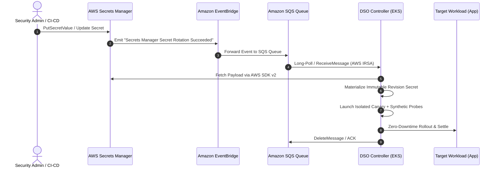

# Amazon Web Services (AWS) Secrets Manager Provider Guide

> [!WARNING]
> **Status: 🟡 Under Active Development (Roadmap v0.3.0)**
>
> Native direct event-driven ingestion for AWS Secrets Manager (via Amazon EventBridge and Amazon SQS) is currently being developed.
> 
> **For production AWS workloads today:** You can achieve automated canary rollout, probe validation, and rollback right now by using the **[Universal Multi-Cloud Provider via External Secrets Operator (ESO)](eso.md)**. See the [ESO AWS Secrets Manager integration](#recommended-production-alternative-today-eso-mode) section below.

---

## 1. Architectural Model (Target v0.3.0)

Once released, DSO's native AWS provider will deliver real-time, event-driven secret rotation without continuous polling:



---

## 2. Planned Infrastructure Prerequisites (v0.3.0)

When native AWS support lands, the setup will require:
1. **AWS EKS Cluster** with IAM Roles for Service Accounts (IRSA) or EKS Pod Identity.
2. **Amazon SQS Queue** (e.g., `dso-vault-events`) receiving notifications.
3. **Amazon EventBridge Rule** capturing `aws.secretsmanager` events and delivering to the SQS queue:
   ```json
   {
     "source": ["aws.secretsmanager"],
     "detail-type": [
       "AWS Secrets Manager Secret Rotation",
       "AWS Service Event via CloudTrail"
     ],
     "detail": {
       "eventName": ["PutSecretValue", "UpdateSecretVersionStage"]
     }
   }
   ```
4. **AWS IAM Role** associated with `dso-system:dso-dynamic-secret-operator` with:
   - `secretsmanager:GetSecretValue`
   - `secretsmanager:DescribeSecret`
   - `sqs:ReceiveMessage`
   - `sqs:DeleteMessage`
   - `sqs:GetQueueAttributes`

---

## 3. Planned Helm Installation (v0.3.0 Preview)

*(Note: Target syntax for the upcoming v0.3.0 release)*

### PowerShell (Windows)
```powershell
# Note: Native AWS provider is currently under development (Roadmap v0.3.0)
helm install dso oci://ghcr.io/quantumsys-dev/charts/dynamic-secret-operator `
  --namespace dso-system `
  --create-namespace `
  --set mode=event-driven `
  --set provider=aws `
  --set aws.enabled=true `
  --set aws.roleArn="arn:aws:iam::<ACCOUNT_ID>:role/dso-secret-operator-role" `
  --set aws.sqs.queueUrl="https://sqs.<REGION>.amazonaws.com/<ACCOUNT_ID>/dso-vault-events" `
  --set aws.region="<REGION>" `
  --wait
```

### Bash (Linux / macOS)
```bash
# Note: Native AWS provider is currently under development (Roadmap v0.3.0)
helm install dso oci://ghcr.io/quantumsys-dev/charts/dynamic-secret-operator \
  --namespace dso-system \
  --create-namespace \
  --set mode=event-driven \
  --set provider=aws \
  --set aws.enabled=true \
  --set aws.roleArn="arn:aws:iam::<ACCOUNT_ID>:role/dso-secret-operator-role" \
  --set aws.sqs.queueUrl="https://sqs.<REGION>.amazonaws.com/<ACCOUNT_ID>/dso-vault-events" \
  --set aws.region="<REGION>" \
  --wait
```

---

## 4. Planned DynamicSecretPolicy CRD (v0.3.0)

When native AWS push ingestion lands in v0.3.0, you can bind secrets directly via `source.type: AWSSecretsManager`. Below are real-world policy patterns demonstrating various probe types:

### Pattern A: Amazon Aurora / RDS MySQL Database Probe
*Validates database credential rotation against an Amazon Aurora or RDS MySQL instance using a live `SELECT 1` query with automatic credential sanitization:*

```yaml
apiVersion: dso.quantumsys.dev/v1alpha1
kind: DynamicSecretPolicy
metadata:
  name: aws-aurora-db-policy
  namespace: production
spec:
  source:
    type: "AWSSecretsManager"
    awsSecretsManager:
      secretArn: "arn:aws:secretsmanager:us-east-1:123456789012:secret:aurora-mysql-creds"
  workloadSelector:
    kind: "Deployment"
    name: "order-service"
  targetRef:
    volumeName: "db-credentials"
  validationProbes:
    - type: "MySQL"
      endpoint: "aurora-mysql.production.svc.cluster.local:3306"
      queryTimeout: 5
  rollbackConfig:
    autoRollback: true
    circuitBreakerThreshold: 3
```

### Pattern B: Web Microservice with HTTP Health Probe
*Asserts that the candidate microservice starts successfully and responds with HTTP 200 before routing live production traffic:*

```yaml
apiVersion: dso.quantumsys.dev/v1alpha1
kind: DynamicSecretPolicy
metadata:
  name: aws-payment-api-policy
  namespace: production
spec:
  source:
    type: "AWSSecretsManager"
    awsSecretsManager:
      secretArn: "arn:aws:secretsmanager:us-east-1:123456789012:secret:payment-api-tokens"
  workloadSelector:
    kind: "Deployment"
    name: "payment-api"
  targetRef:
    volumeName: "api-tokens"
  validationProbes:
    - type: "HTTP"
      endpoint: "http://payment-api.production.svc.cluster.local:8080/healthz"
      path: "/healthz"
      expectedStatus: 200
      queryTimeout: 5
  rollbackConfig:
    autoRollback: true
    circuitBreakerThreshold: 3
```

### Pattern C: Ingress TLS Certificate Handshake Probe
*Intercepts rotated TLS certificates and verifies live TLS handshake and SHA-256 thumbprint matching:*

```yaml
apiVersion: dso.quantumsys.dev/v1alpha1
kind: DynamicSecretPolicy
metadata:
  name: aws-ingress-tls-policy
  namespace: production
spec:
  source:
    type: "AWSSecretsManager"
    awsSecretsManager:
      secretArn: "arn:aws:secretsmanager:us-east-1:123456789012:secret:wildcard-app-tls"
  workloadSelector:
    kind: "Deployment"
    name: "aws-load-balancer-controller"
  validationProbes:
    - type: "TLS"
      endpoint: "gateway.production.svc.cluster.local:443"
      thumbprint: "e3b0c44298fc1c149afbf4c8996fb92427ae41e4649b934ca495991b7852b855"
      queryTimeout: 10
  rollbackConfig:
    autoRollback: true
    circuitBreakerThreshold: 2
```

### Pattern D: "Bring Your Own Container" Ephemeral Batch Job Probe (ElastiCache Redis)
*Schedules an isolated Kubernetes Batch Job running `redis-cli PING` against an Amazon ElastiCache cluster with candidate secret automatically injected as `$(DSO_REVISION_SECRET_NAME)`:*

```yaml
apiVersion: dso.quantumsys.dev/v1alpha1
kind: DynamicSecretPolicy
metadata:
  name: aws-redis-cache-policy
  namespace: production
spec:
  source:
    type: "AWSSecretsManager"
    awsSecretsManager:
      secretArn: "arn:aws:secretsmanager:us-east-1:123456789012:secret:elasticache-redis-auth"
  workloadSelector:
    kind: "Deployment"
    name: "session-worker"
  validationProbes:
    - type: "Job"
      job:
        timeoutSeconds: 30
        jobTemplate:
          spec:
            template:
              spec:
                containers:
                  - name: redis-tester
                    image: redis:7-alpine
                    command: ["/bin/sh", "-c"]
                    args:
                      - |
                        REDIS_PASS=$(cat /secrets/auth/password)
                        redis-cli -h redis-cluster.cache.amazonaws.com -a "$REDIS_PASS" PING | grep PONG
                    volumeMounts:
                      - name: test-secret
                        mountPath: /secrets/auth
                volumes:
                  - name: test-secret
                    secret:
                      secretName: $(DSO_REVISION_SECRET_NAME)
  rollbackConfig:
    autoRollback: true
    circuitBreakerThreshold: 3
```

---

## 5. Recommended Production Alternative Today: ESO Mode

To run dynamic secret rotation on AWS **today in production**, use DSO's **External Secrets Operator (ESO)** integration:

1. Deploy ESO on your AWS EKS cluster:
   ```bash
   helm repo add external-secrets https://charts.external-secrets.io
   helm repo update
   helm install external-secrets external-secrets/external-secrets \
     --namespace external-secrets \
     --create-namespace \
     --set installCRDs=true
   ```

2. Deploy DSO in decoupled ESO mode (requiring **no cloud credentials** inside DSO):
   ```bash
   helm install dso oci://ghcr.io/quantumsys-dev/charts/dynamic-secret-operator \
     --namespace dso-system \
     --create-namespace \
     --set mode=eso
   ```

3. Configure an ESO `SecretStore` authenticating to AWS Secrets Manager via IRSA and an `ExternalSecret` with the watch label `dso.quantumsys.dev/managed: "watch"`:
   ```yaml
   apiVersion: external-secrets.io/v1beta1
   kind: ExternalSecret
   metadata:
     name: aws-db-secret
     namespace: production
   spec:
     refreshInterval: 1m
     secretStoreRef:
       name: aws-secrets-manager
       kind: SecretStore
     target:
       name: aws-synced-db-pass
       template:
         metadata:
           labels:
             dso.quantumsys.dev/managed: "watch"
     data:
       - secretKey: password
         remoteRef:
           key: production/payment-db-credentials
           property: password
   ```

4. Create a `DynamicSecretPolicy` pointing to `k8sSecret.name: "aws-synced-db-pass"`.

For complete details, see the [ESO Provider Guide](eso.md) and [Operating Modes Guide](../operating-modes.md).
