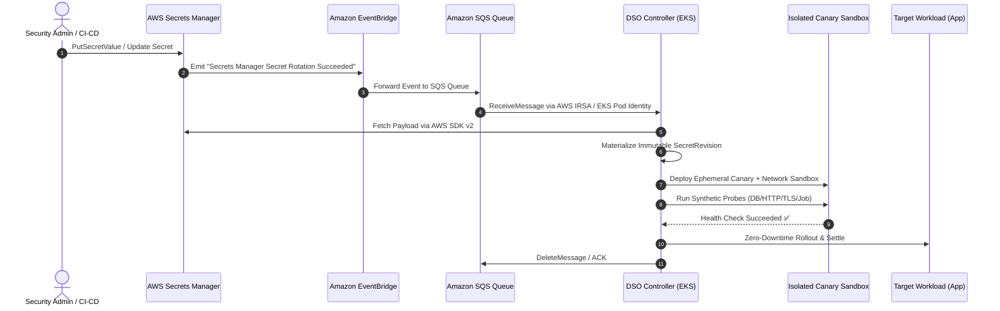

# Amazon Web Services (AWS) Secrets Manager Provider

The **Dynamic Secret Operator (DSO)** supports secret rotation for **AWS Secrets Manager** workloads running on Amazon Elastic Kubernetes Service (EKS) and hybrid AWS environments.

> [!NOTE]
> **Current Support Status:**
> - 🟢 **Production Ready Today:** **[Universal ESO Mode](../eso/README.md)** (Decoupled multi-cloud architecture utilizing CNCF External Secrets Operator with AWS IRSA).
> - 🟡 **Under Active Development (Roadmap v0.3.0):** Native event-driven push ingestion using Amazon EventBridge and Amazon SQS queues.

---

## 🧭 Provider Documentation Navigation

| Document | Description |
| :--- | :--- |
| 📖 **[Getting Started Guide](getting-started.md)** | Step-by-step setup for AWS workloads: Production deployment via ESO mode today, and preview configuration for native EventBridge + SQS. |
| 🔧 **[Troubleshooting Guide](troubleshooting.md)** | Diagnostic playbooks, AWS IAM/IRSA permission errors, SQS queue inspection, EventBridge rule verification, and ESO AWS syncing issues. |

---

## 🏗️ Architectural Model (Native v0.3.0 Target)

Once released in v0.3.0, DSO's native AWS provider will deliver real-time, event-driven secret rotation without continuous polling:

---

## ⚖️ Architectural Options for AWS Environments

| Dimension | Option A: ESO Mode (Production Ready Today) | Option B: Native Event-Driven (Roadmap v0.3.0) |
| :--- | :--- | :--- |
| **Status** | 🟢 **Production Ready** | 🟡 **In Development** |
| **Ingestion Type** | Level-triggered drift detection via ESO | Push-accelerated event stream via SQS |
| **Latency** | Governed by ESO `refreshInterval` or webhook | Sub-second (< 500ms from Secrets Manager commit) |
| **DSO Cloud Credentials** | **None** (100% Kubernetes RBAC only) | AWS IRSA / EKS Pod Identity (`secretsmanager:*`, `sqs:*`) |
| **Infrastructure Setup** | Minimal (Standard ESO Helm Chart) | EventBridge Rule, SQS Queue, IAM Policy |
| **Recommendation** | **Recommended for all AWS production clusters today** | For organizations requiring sub-second rotation latency |

---

## 📂 Related Documentation & Resources

- [AWS Getting Started Guide](getting-started.md)
- [AWS Troubleshooting Guide](troubleshooting.md)
- [Universal Multi-Cloud via ESO Provider Guide](../eso/README.md)
- [Operator Operating Modes Guide](../../architecture/operating-modes.md)
