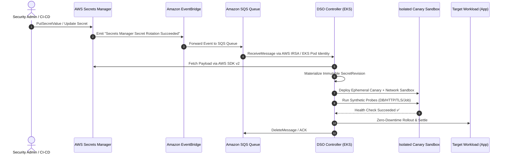

# Amazon Web Services (AWS) Secrets Manager Provider

The **Dynamic Secret Operator (DSO)** supports secret rotation for **AWS Secrets Manager** workloads running on Amazon Elastic Kubernetes Service (EKS) and hybrid AWS environments.

> [!NOTE]
> **Current Support Status:**
> - 🟢 **Production Ready:** **[Universal ESO Mode](../eso/README.md)** (Decoupled multi-cloud architecture utilizing CNCF External Secrets Operator with AWS IRSA).
> - 🟢 **Production Ready:** Native event-driven push ingestion using Amazon EventBridge and Amazon SQS queues.

---

## 🧭 Provider Documentation Navigation

| Document | Description |
| :--- | :--- |
| 📖 **[Getting Started Guide](getting-started.md)** | Step-by-step setup for AWS workloads: Production deployment via ESO mode today, and preview configuration for native EventBridge + SQS. |
| 🔧 **[Troubleshooting Guide](troubleshooting.md)** | Diagnostic playbooks, AWS IAM/IRSA permission errors, SQS queue inspection, EventBridge rule verification, and ESO AWS syncing issues. |

---

## 🏗️ Architectural Model

DSO's native AWS provider delivers real-time, event-driven secret rotation without continuous polling:

```mermaid
sequenceDiagram
    autonumber
    actor SecAdmin as Security Admin / CI-CD
    participant SM as AWS Secrets Manager
    participant EB as Amazon EventBridge
    participant SQS as Amazon SQS Queue
    participant DSO as DSO Controller (EKS)
    participant Canary as Isolated Canary Sandbox
    participant Workload as Target Workload (App)

    SecAdmin->>SM: PutSecretValue / Update Secret
    SM->>EB: Emit "Secrets Manager Secret Rotation Succeeded"
    EB->>SQS: Forward Event to SQS Queue
    SQS->>DSO: ReceiveMessage via AWS IRSA / EKS Pod Identity
    DSO->>SM: Fetch Payload via AWS SDK v2
    DSO->>DSO: Materialize Immutable SecretRevision
    DSO->>Canary: Deploy Ephemeral Canary + Network Sandbox
    DSO->>Canary: Run Synthetic Probes (DB/HTTP/TLS/Job)
    Canary-->>DSO: Health Check Succeeded ✅
    DSO->>Workload: Zero-Downtime Rollout & Settle
    DSO->>SQS: DeleteMessage / ACK
```

---

## ⚖️ Architectural Options for AWS Environments

| Dimension | Option A: ESO Mode | Option B: Native Event-Driven |
| :--- | :--- | :--- |
| **Status** | 🟢 **Production Ready** | 🟢 **Production Ready** |
| **Ingestion Type** | Level-triggered drift detection via ESO | Push-accelerated event stream via SQS |
| **Latency** | Governed by ESO `refreshInterval` or webhook | Sub-second (< 500ms from Secrets Manager commit) |
| **DSO Cloud Credentials** | **None** (100% Kubernetes RBAC only) | AWS IRSA / EKS Pod Identity (`secretsmanager:*`, `sqs:*`) |
| **Infrastructure Setup** | Minimal (Standard ESO Helm Chart) | EventBridge Rule, SQS Queue, IAM Policy |
| **Recommendation** | **Recommended for all AWS production clusters today** | For organizations requiring sub-second rotation latency |

---

## 💡 AWS Secret Naming and ARNs

AWS Secrets Manager uniquely identifies secrets using an ARN format that automatically appends a 6-character random suffix to your secret name (e.g., `arn:aws:secretsmanager:us-east-1:1234567890:secret:my-db-prod-a1b2c3`). 

When configuring a `DynamicSecretPolicy`, you may specify the full ARN or just the friendly name (`my-db-prod`). DSO's internal engine natively parses AWS EventBridge rotation events and automatically trims the trailing `-xxxxxx` random suffix before evaluating matches against your policy. This ensures robust and intuitive matching, whether you provided the friendly name or the full ARN, without triggering spurious cross-talk between secrets sharing similar prefixes.

> [!WARNING]
> **ARN Stripping Edge Case:** Because DSO automatically strips the last 7 characters if they match the `-xxxxxx` pattern, **do not** name your secrets with a friendly name that ends in a hyphen followed by exactly 6 characters (e.g., `my-secret-123456`). If you do, DSO will incorrectly assume this is the AWS random suffix and strip it, causing matching to fail.

---

## 📂 Related Documentation & Resources

- [AWS Getting Started Guide](getting-started.md)
- [AWS Troubleshooting Guide](troubleshooting.md)
- [Universal Multi-Cloud via ESO Provider Guide](../eso/README.md)
- [Operator Operating Modes Guide](../../architecture/operating-modes.md)
