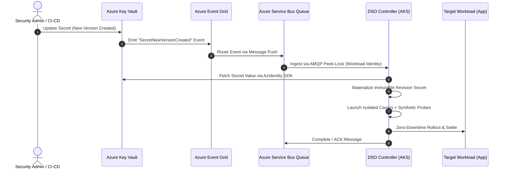

# Microsoft Azure Key Vault Provider Guide

The **Dynamic Secret Operator (DSO)** provides production-ready, event-driven secret rotation for **Microsoft Azure Key Vault**. Utilizing Azure Event Grid and Azure Service Bus queues, DSO ingests secret lifecycle events in sub-second time without continuous API polling, and uses Azure Workload Identity for secure, passwordless authentication.

> **Status:** 🟢 **Production Ready** (Fully supported in DSO v0.1.0+)

---

## 1. Architectural Model



### Key Highlights
- **Real-Time Push:** Azure Event Grid detects when `Microsoft.KeyVault.SecretNewVersionCreated` triggers and forwards it instantly to an Azure Service Bus queue.
- **Zero Polling & Rate Limiting Immunity:** Traditional polling risks throttling Azure Key Vault API limits. DSO maintains a long-lived AMQP `Peek-Lock` receiver against Service Bus.
- **Strict Passwordless Security:** The DSO pod runs under an AKS-federated **Azure User-Assigned Managed Identity** via Azure Workload Identity. No long-lived client secrets, certificates, or tokens are stored in the cluster.

---

## 2. Prerequisites & Azure Infrastructure Setup

Ensure your AKS cluster has **OIDC Issuer** and **Workload Identity** enabled:

```bash
az aks update \
  --resource-group <RESOURCE_GROUP> \
  --name <AKS_CLUSTER_NAME> \
  --enable-oidc-issuer \
  --enable-workload-identity
```

### 2.1 Retrieve the Cluster OIDC Issuer URL
```bash
AKS_OIDC_ISSUER="$(az aks show -n <AKS_CLUSTER_NAME> -g <RESOURCE_GROUP> --query "oidcIssuerProfile.issuerUrl" -o tsv)"
```

### 2.2 Create User-Assigned Managed Identity
```bash
az identity create \
  --name dso-identity \
  --resource-group <RESOURCE_GROUP>

IDENTITY_CLIENT_ID="$(az identity show -n dso-identity -g <RESOURCE_GROUP> --query "clientId" -o tsv)"
```

### 2.3 Assign Azure RBAC Roles
The DSO identity requires two granular permissions:
1. **Key Vault Secrets User** (on Key Vault) to fetch secret payloads:
   ```bash
   az role assignment create \
     --role "Key Vault Secrets User" \
     --assignee "$IDENTITY_CLIENT_ID" \
     --scope "/subscriptions/<SUBSCRIPTION_ID>/resourceGroups/<RESOURCE_GROUP>/providers/Microsoft.KeyVault/vaults/<VAULT_NAME>"
   ```
2. **Azure Service Bus Data Receiver** (on Service Bus) to read and acknowledge rotation events:
   ```bash
   az role assignment create \
     --role "Azure Service Bus Data Receiver" \
     --assignee "$IDENTITY_CLIENT_ID" \
     --scope "/subscriptions/<SUBSCRIPTION_ID>/resourceGroups/<RESOURCE_GROUP>/providers/Microsoft.ServiceBus/namespaces/<SERVICEBUS_NAMESPACE>"
   ```

### 2.4 Establish Workload Identity Federation
Federate the Managed Identity with DSO's Kubernetes ServiceAccount (`dso-dynamic-secret-operator` in `dso-system` namespace):

```bash
az identity federated-credential create \
  --name "dso-federation" \
  --identity-name dso-identity \
  --resource-group <RESOURCE_GROUP> \
  --issuer "$AKS_OIDC_ISSUER" \
  --subject "system:serviceaccount:dso-system:dso-dynamic-secret-operator" \
  --audience "api://AzureADTokenExchange"
```

### 2.5 Configure Event Grid Subscription
Subscribe the Service Bus queue to Key Vault's secret creation events:

```bash
KEYVAULT_ID="$(az keyvault show --name <VAULT_NAME> -g <RESOURCE_GROUP> --query id -o tsv)"
QUEUE_ID="$(az servicebus queue show --namespace-name <SERVICEBUS_NAMESPACE> --name <QUEUE_NAME> -g <RESOURCE_GROUP> --query id -o tsv)"

az eventgrid event-subscription create \
  --name "dso-keyvault-rotations" \
  --source-resource-id "$KEYVAULT_ID" \
  --endpoint-type servicebusqueue \
  --endpoint "$QUEUE_ID" \
  --included-event-types Microsoft.KeyVault.SecretNewVersionCreated
```

---

## 3. Helm Installation

Install DSO configured with Azure Workload Identity and Service Bus parameters:

### PowerShell (Windows)
```powershell
helm install dso oci://ghcr.io/quantumsys-dev/charts/dynamic-secret-operator `
  --namespace dso-system `
  --create-namespace `
  --set mode=event-driven `
  --set provider=azure `
  --set azure.workloadIdentity.enabled=true `
  --set azure.workloadIdentity.clientId="<MANAGED_IDENTITY_CLIENT_ID>" `
  --set azure.workloadIdentity.tenantId="<AZURE_TENANT_ID>" `
  --set azure.serviceBus.namespace="<SERVICEBUS_NAMESPACE_FQDN>" `
  --set azure.serviceBus.queueName="<QUEUE_NAME>" `
  --wait
```

### Bash (Linux / macOS)
```bash
helm install dso oci://ghcr.io/quantumsys-dev/charts/dynamic-secret-operator \
  --namespace dso-system \
  --create-namespace \
  --set mode=event-driven \
  --set provider=azure \
  --set azure.workloadIdentity.enabled=true \
  --set azure.workloadIdentity.clientId="<MANAGED_IDENTITY_CLIENT_ID>" \
  --set azure.workloadIdentity.tenantId="<AZURE_TENANT_ID>" \
  --set azure.serviceBus.namespace="<SERVICEBUS_NAMESPACE_FQDN>" \
  --set azure.serviceBus.queueName="<QUEUE_NAME>" \
  --wait
```

---

## 4. Configuring a DynamicSecretPolicy

To bind an Azure Key Vault secret to a workload, declare a `DynamicSecretPolicy` with `source.type: AzureKeyVault`:

```yaml
apiVersion: dso.quantumsys.dev/v1alpha1
kind: DynamicSecretPolicy
metadata:
  name: payment-db-policy
  namespace: production
spec:
  source:
    type: "AzureKeyVault"
    azureKeyVault:
      keyVaultURI: "https://my-prod-vault.vault.azure.net"
      objectName: "payment-db-password"
      objectType: "Secret" # Options: Secret, Certificate, Key
  workloadSelector:
    kind: "Deployment"
    name: "payment-service"
  targetRef:
    volumeName: "db-secret-volume"
  validationProbes:
    - type: "PostgreSQL"
      endpoint: "postgres.production.svc.cluster.local:5432"
      queryTimeout: 5
  rollbackConfig:
    autoRollback: true
    circuitBreakerThreshold: 3
```

---

## 5. End-to-End Verification

1. **Check Operator Logs:**
   ```bash
   kubectl logs -n dso-system -l app.kubernetes.io/name=dynamic-secret-operator -f
   ```
   Ensure you see the message: `Listening for Azure Service Bus rotation events on queue <QUEUE_NAME>`.

2. **Trigger a Rotation in Key Vault:**
   ```bash
   az keyvault secret set \
     --vault-name <VAULT_NAME> \
     --name "payment-db-password" \
     --value "super-secure-rotated-password-v2"
   ```

3. **Observe Automated Canary & Promotion:**
   ```bash
   kubectl get dynamicsecretpolicies -n production -w
   ```
   Within seconds, DSO receives the event from Service Bus, spins up an isomorphic canary pod, validates the database connection with the new password, and rolls over the production deployment with zero downtime.
