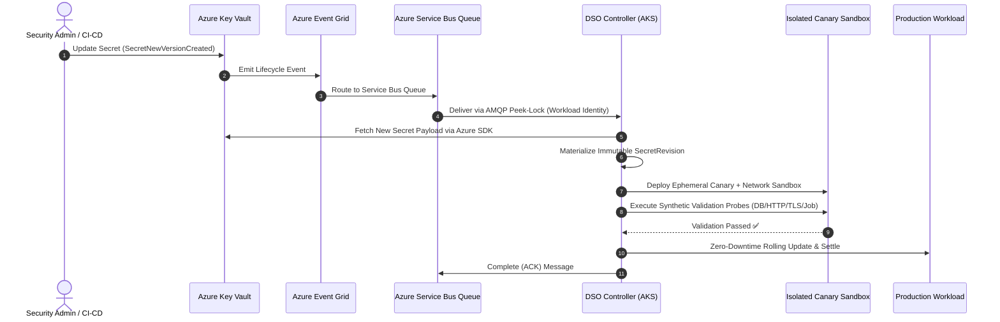

# Microsoft Azure Key Vault Provider

The **Dynamic Secret Operator (DSO)** delivers production-ready, event-driven secret rotation for **Microsoft Azure Key Vault**. By integrating directly with Azure Event Grid and Azure Service Bus queues, DSO achieves real-time (< 500ms) secret rotation without continuous API polling, and enforces strict zero-trust security via passwordless Azure Workload Identity.

> **Status:** 🟢 **Production Ready** (Fully supported in DSO v0.1.0+)

---

## 🧭 Provider Documentation Navigation

| Document | Description |
| :--- | :--- |
| 📖 **[Getting Started Guide](getting-started.md)** | Step-by-step setup: AKS Workload Identity, Key Vault, Service Bus, Helm installation, and real-world `DynamicSecretPolicy` patterns. |
| 🔧 **[Troubleshooting Guide](troubleshooting.md)** | Diagnostic playbooks, common error messages (Entra ID OIDC, RBAC, Service Bus DLQ), log inspection, and health verification. |

---

## 🏗️ Architectural Model

DSO avoids high-frequency polling against Azure Key Vault, eliminating API throttling risk and reducing latency from minutes to milliseconds:

---

## ⚡ Key Highlights & Capabilities

* **Real-Time Push Ingestion:** Azure Event Grid detects `Microsoft.KeyVault.SecretNewVersionCreated` events instantly and routes them to a dedicated Azure Service Bus queue.
* **Peek-Lock Reliability:** DSO locks incoming messages during canary validation. If validation succeeds, the message is marked `Complete` (ACK). If validation fails or transient network errors occur, the message is released (`NACK`) with backoff or routed to a Dead-Letter Queue (DLQ).
* **Passwordless Azure Workload Identity:** Eliminates long-lived service principal client secrets or certificates. Kubernetes projects short-lived OIDC federated tokens exchanged dynamically with Microsoft Entra ID.
* **Native Certificate Management:** Automatically ingests Key Vault Certificates (`objectType: "Certificate"`), splits the payload into `tls.crt` and `tls.key`, and validates live TLS handshakes via synthetic probes.
* **Zero Production Downtime:** Rotated secrets are verified in isolated canary pods before production workloads receive the update.

---

## 📂 Real-World Production Examples

Check out our production-grade reference implementations for Azure:

- [Automated TLS Certificate Rotation with Azure DNS & Circuit Breaker](../../../examples/azure/tls-certificate-rotation/README.md)
- [Fullstack Database Rotation with Azure Key Vault](../../../examples/azure/fullstack-db-rotation/README.md)
- [NGINX Dynamic Color Rotation on AKS](../../../examples/azure/nginx-color-rotation/README.md)
- [Job-Based Redis Probe with Azure Cache for Redis](../../../examples/azure/job-based-redis-probe/README.md)
