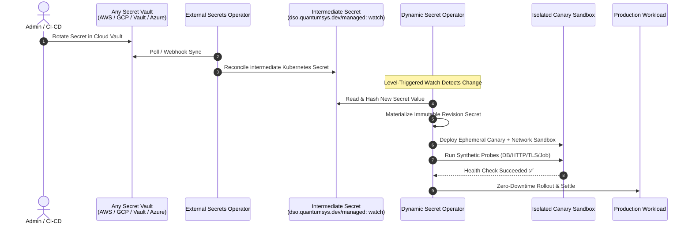

# Universal Multi-Cloud Provider via External Secrets Operator (ESO)

The **Dynamic Secret Operator (DSO)** pairs seamlessly with [External Secrets Operator (ESO)](https://external-secrets.io/) to provide a **universal, provider-agnostic secret rotation architecture** across all cloud providers (AWS, GCP, Azure, Oracle, Alibaba), on-premises data centers, and specialized vaults (HashiCorp Vault, Akeyless, 1Password, CyberArk).

> **Status:** 🟢 **Production Ready** (Fully supported in DSO v0.2.0+)

---

## 1. Architectural Model



---

## 2. Why Choose ESO Mode?

- **Zero Cloud IAM Credentials in DSO:** DSO operates purely against native Kubernetes APIs without needing cloud IAM permissions, Managed Identities, IRSA, or service account keys.
- **Universal Multi-Cloud Synergy:** A single operational model manages secrets from AWS Secrets Manager, GCP Secret Manager, HashiCorp Vault, Azure Key Vault, and CyberArk.
- **Strict Separation of Concerns:** ESO focuses entirely on *external vault synchronization*, while DSO handles *progressive canary validation, synthetic health probes, automated rollback, and zero-downtime workload promotions*.

---

## 3. The Watch Label Contract

To allow DSO's optimized cache to detect changes in the intermediate secret without scanning every secret in the cluster, the secret generated by ESO must include the label:

```yaml
dso.quantumsys.dev/managed: "watch"
```

In your `ExternalSecret` manifest, specify this in `spec.target.template.metadata.labels`:

```yaml
apiVersion: external-secrets.io/v1beta1
kind: ExternalSecret
metadata:
  name: app-db-secret
  namespace: production
spec:
  refreshInterval: 1m
  secretStoreRef:
    name: vault-backend
    kind: SecretStore
  target:
    name: app-synced-db-pass
    template:
      metadata:
        labels:
          dso.quantumsys.dev/managed: "watch"
  data:
    - secretKey: password
      remoteRef:
        key: production/db-password
```

---

## 4. Helm Installation

### Step 1: Install External Secrets Operator (ESO)
```bash
helm repo add external-secrets https://charts.external-secrets.io
helm repo update

helm install external-secrets \
  external-secrets/external-secrets \
  --namespace external-secrets \
  --create-namespace \
  --set installCRDs=true \
  --wait
```

### Step 2: Install Dynamic Secret Operator (DSO)
Deploy DSO in decoupled ESO mode simply by passing `--set mode=eso` (which automatically disables cloud IAM dependencies inside DSO):

#### PowerShell (Windows)
```powershell
helm install dso oci://ghcr.io/quantumsys-dev/charts/dynamic-secret-operator `
  --namespace dso-system `
  --create-namespace `
  --set mode=eso `
  --wait
```

#### Bash (Linux / macOS)
```bash
helm install dso oci://ghcr.io/quantumsys-dev/charts/dynamic-secret-operator \
  --namespace dso-system \
  --create-namespace \
  --set mode=eso \
  --wait
```

---

## 5. Configuring a DynamicSecretPolicy

Create a `DynamicSecretPolicy` pointing to the intermediate Kubernetes secret via `source.type: K8sSecret`:

```yaml
apiVersion: dso.quantumsys.dev/v1alpha1
kind: DynamicSecretPolicy
metadata:
  name: orders-db-policy
  namespace: production
spec:
  source:
    type: "K8sSecret"
    k8sSecret:
      name: "app-synced-db-pass"
  workloadSelector:
    kind: "Deployment"
    name: "orders-api"
  targetRef:
    volumeName: "db-secret-volume"
  validationProbes:
    - type: "PostgreSQL"
      endpoint: "postgres.internal.svc.cluster.local:5432/orders"
      queryTimeout: 5
  rollbackConfig:
    autoRollback: true
    circuitBreakerThreshold: 3
```

---

## 6. Real-World ESO Examples

Explore complete production scenarios using ESO Mode in the repository:
- [Fullstack Database Rotation with ESO](../examples/eso/fullstack-db-rotation/README.md)
- [Circuit Breaker & Automated Rollback](../examples/eso/circuit-breaker-rollback/README.md)
- [Cilium eBPF & Hubble Observability](../examples/eso/cilium-hubble-observability/README.md)
- [Argo Rollouts Blue/Green Progressive Delivery](../examples/eso/argo-rollouts-blue-green/README.md)
- [Multi-Secret Concurrent Rotation](../examples/eso/multi-secret-rotation/README.md)
- [TLS Certificate Live Ingestion](../examples/eso/tls-certificate-rotation/README.md)
