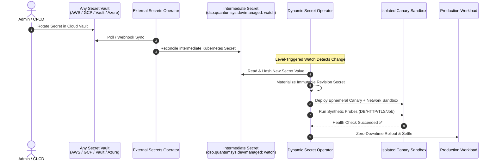

# Universal Multi-Cloud Provider via External Secrets Operator (ESO)

The **Dynamic Secret Operator (DSO)** pairs with the CNCF [External Secrets Operator (ESO)](https://external-secrets.io/) to provide a **universal, provider-agnostic secret rotation architecture** across all major cloud providers (AWS, GCP, Azure, Oracle, Alibaba), on-premises environments, and specialized vaults (HashiCorp Vault, Akeyless, 1Password, CyberArk).

> **Status:** 🟢 **Production Ready** (Fully supported in DSO v0.2.0+)

---

## 🧭 Provider Documentation Navigation

| Document | Description |
| :--- | :--- |
| 📖 **[Getting Started Guide](getting-started.md)** | Step-by-step setup: Installing ESO and DSO, configuring `SecretStore` and `ExternalSecret` with the watch label, and declaring `DynamicSecretPolicy`. |
| 🔧 **[Troubleshooting Guide](troubleshooting.md)** | Diagnostic playbooks, missing watch label detection, ESO sync error resolution, canary probe failures, and log inspection. |

---

## 🏗️ Architectural Model

By embracing [**ADR-003: Decoupling Secret Ingestion**](../../adr/003-decoupling-secret-ingestion-eso.md), DSO strictly decouples vault ingestion from progressive validation delivery:

---

## ⚡ Key Highlights & Capabilities

* **Zero Cloud Credentials in DSO:** DSO operates purely against native Kubernetes APIs without needing cloud IAM permissions, Managed Identities, IRSA, or service account keys.
* **Universal Multi-Cloud Synergy:** A single operational model manages secrets from AWS Secrets Manager, GCP Secret Manager, HashiCorp Vault, Azure Key Vault, and CyberArk.
* **Strict Separation of Concerns:** 
  - **ESO** focuses entirely on *external vault synchronization, authentication, and secret formatting*.
  - **DSO** focuses entirely on *progressive canary validation, synthetic health probes, automated rollback, circuit breaking, and zero-downtime promotions*.
* **Minimal Resource Overhead:** DSO's controller-runtime cache monitors only secrets bearing `dso.quantumsys.dev/managed: "watch"`, preventing memory bloat across large clusters.

---

## 📂 Real-World Multi-Cloud Examples

Check out our production-grade reference implementations built on ESO:

- [Multi-Secret Rotation (MySQL + Redis simultaneously)](../../../examples/eso/multi-secret-rotation/README.md)
- [Job-Based Redis Probe (Python redis-py)](../../../examples/eso/job-based-redis-probe/README.md)
- [Fullstack Database Rotation with Go Microservice](../../../examples/eso/fullstack-db-rotation/README.md)
- [NGINX Dynamic Color Rotation](../../../examples/eso/nginx-color-rotation/README.md)
- [Automated TLS Certificate Rotation with ESO](../../../examples/eso/tls-certificate-rotation/README.md)
- [Argo Rollouts Blue/Green Progressive Delivery](../../../examples/eso/argo-rollouts-blue-green/README.md)
