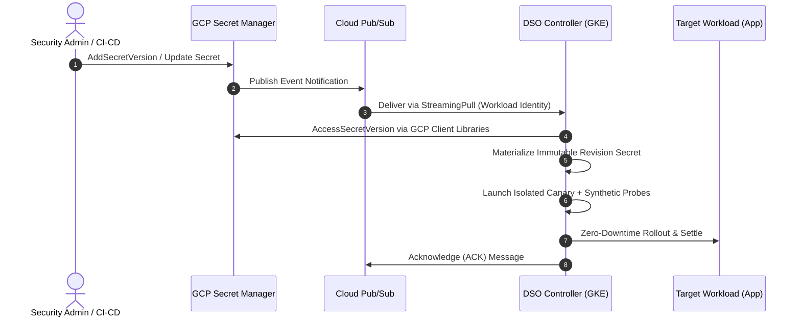

# Google Cloud Platform (GCP) Secret Manager Provider Guide

> [!WARNING]
> **Status: 🟡 Under Active Development (Roadmap v0.3.0)**
>
> Native direct event-driven ingestion for Google Cloud Secret Manager (via Cloud Pub/Sub) is currently being developed.
> 
> **For production GCP workloads today:** You can achieve automated canary rollout, probe validation, and rollback right now by using the **[Universal Multi-Cloud Provider via External Secrets Operator (ESO)](eso.md)**. See the [ESO GCP Secret Manager integration](#recommended-production-alternative-today-eso-mode) section below.

---

## 1. Architectural Model (Target v0.3.0)

Once released, DSO's native GCP provider will deliver real-time, event-driven secret rotation without polling:



---

## 2. Planned Infrastructure Prerequisites (v0.3.0)

When native GCP support lands, the setup will require:
1. **Google Kubernetes Engine (GKE) Cluster** with Workload Identity enabled.
2. **Google Cloud Secret Manager Secret** configured with event notifications publishing to a Cloud Pub/Sub topic:
   ```bash
   gcloud secrets update <SECRET_NAME> \
     --add-topics="projects/<PROJECT_ID>/topics/<TOPIC_NAME>"
   ```
3. **Cloud Pub/Sub Subscription** (e.g., `projects/<PROJECT_ID>/subscriptions/dso-vault-events-sub`).
4. **Google Service Account (GSA)** bound to DSO's Kubernetes Service Account (`dso-system:dso-dynamic-secret-operator`) with roles:
   - `roles/secretmanager.secretAccessor`
   - `roles/pubsub.subscriber`

---

## 3. Planned Helm Installation (v0.3.0 Preview)

*(Note: Target syntax for the upcoming v0.3.0 release)*

### PowerShell (Windows)
```powershell
# Note: Native GCP provider is currently under development (Roadmap v0.3.0)
helm install dso oci://ghcr.io/quantumsys-dev/charts/dynamic-secret-operator `
  --namespace dso-system `
  --create-namespace `
  --set mode=event-driven `
  --set provider=gcp `
  --set gcp.enabled=true `
  --set gcp.workloadIdentity.serviceAccount="dso-sa@<PROJECT_ID>.iam.gserviceaccount.com" `
  --set gcp.pubsub.subscription="projects/<PROJECT_ID>/subscriptions/dso-vault-events-sub" `
  --wait
```

### Bash (Linux / macOS)
```bash
# Note: Native GCP provider is currently under development (Roadmap v0.3.0)
helm install dso oci://ghcr.io/quantumsys-dev/charts/dynamic-secret-operator \
  --namespace dso-system \
  --create-namespace \
  --set mode=event-driven \
  --set provider=gcp \
  --set gcp.enabled=true \
  --set gcp.workloadIdentity.serviceAccount="dso-sa@<PROJECT_ID>.iam.gserviceaccount.com" \
  --set gcp.pubsub.subscription="projects/<PROJECT_ID>/subscriptions/dso-vault-events-sub" \
  --wait
```

---

## 4. Planned DynamicSecretPolicy CRD (v0.3.0)

```yaml
apiVersion: dso.quantumsys.dev/v1alpha1
kind: DynamicSecretPolicy
metadata:
  name: gcp-payment-policy
  namespace: production
spec:
  source:
    type: "GCPSecretManager"
    gcpSecretManager:
      secretId: "projects/my-project/secrets/payment-db-password"
  workloadSelector:
    kind: "Deployment"
    name: "payment-api"
  targetRef:
    volumeName: "db-secret-volume"
  validationProbes:
    - type: "PostgreSQL"
      endpoint: "postgres.production.svc.cluster.local:5432"
      queryTimeout: 5
  rollbackConfig:
    autoRollback: true
    circuitBreakerThreshold: 3
```

---

## 5. Recommended Production Alternative Today: ESO Mode

To run dynamic secret rotation on GCP **today in production**, use DSO's **External Secrets Operator (ESO)** integration:

1. Deploy ESO on your GKE cluster:
   ```bash
   helm repo add external-secrets https://charts.external-secrets.io
   helm repo update
   helm install external-secrets external-secrets/external-secrets \
     --namespace external-secrets \
     --create-namespace \
     --set installCRDs=true
   ```

2. Deploy DSO in decoupled ESO mode (requiring **no cloud credentials** inside DSO):
   ```bash
   helm install dso oci://ghcr.io/quantumsys-dev/charts/dynamic-secret-operator \
     --namespace dso-system \
     --create-namespace \
     --set mode=eso
   ```

3. Configure an ESO `SecretStore` authenticating to GCP Secret Manager via Workload Identity and an `ExternalSecret` with the watch label `dso.quantumsys.dev/managed: "watch"`:
   ```yaml
   apiVersion: external-secrets.io/v1beta1
   kind: ExternalSecret
   metadata:
     name: gcp-db-secret
     namespace: production
   spec:
     refreshInterval: 1m
     secretStoreRef:
       name: gcp-secret-store
       kind: SecretStore
     target:
       name: gcp-synced-db-pass
       template:
         metadata:
           labels:
             dso.quantumsys.dev/managed: "watch"
     data:
       - secretKey: password
         remoteRef:
           key: payment-db-password
   ```

4. Create a `DynamicSecretPolicy` pointing to `k8sSecret.name: "gcp-synced-db-pass"`.

For complete details, see the [ESO Provider Guide](eso.md) and [Operating Modes Guide](../operating-modes.md).
