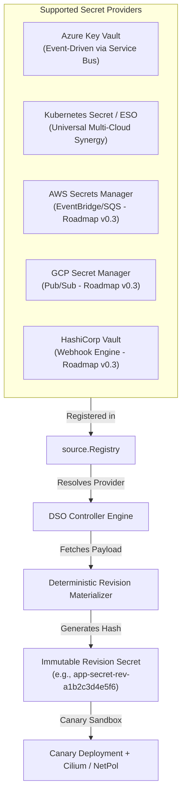

# Pluggable Secret Providers & Multi-Cloud Ingestion Architecture

The **Dynamic Secret Operator (DSO)** features an extensible, provider-agnostic ingestion architecture designed to decouple secret storage and synchronization backends from progressive canary delivery, synthetic validation probes, and rollback automation.

---

## 1. Architectural Model



---

## 2. Supported Provider Backends

### 2.1 Azure Key Vault (`AzureKeyVault`)
Provides real-time, event-driven secret ingestion directly from Azure Key Vault using Azure Event Grid and Azure Service Bus without polling.

```yaml
apiVersion: dso.quantumsys.dev/v1alpha1
kind: DynamicSecretPolicy
metadata:
  name: payment-policy
  namespace: production
spec:
  source:
    type: "AzureKeyVault"
    azureKeyVault:
      keyVaultURI: "https://my-vault.vault.azure.net"
      objectName: "payment-db-password"
      objectType: "Secret"
  workloadSelector:
    kind: "Deployment"
    name: "payment-api"
```

### 2.2 Universal Multi-Cloud via External Secrets Operator (`K8sSecret`)
Leverages **External Secrets Operator (ESO)** to synchronize credentials from AWS Secrets Manager, GCP Secret Manager, HashiCorp Vault, or Akeyless into intermediate Kubernetes secrets, which DSO monitors to trigger progressive delivery.

```yaml
apiVersion: dso.quantumsys.dev/v1alpha1
kind: DynamicSecretPolicy
metadata:
  name: orders-db-policy
  namespace: production
spec:
  source:
    type: "K8sSecret"
    k8sSecret:
      name: "orders-db-password-synced"
  workloadSelector:
    kind: "Deployment"
    name: "orders-api"
  targetRef:
    volumeName: "db-secret-volume"
  validationProbes:
    - type: "PostgreSQL"
      endpoint: "postgres.internal.svc.cluster.local:5432/orders"
```

---

## 3. Native Provider Roadmap

| Provider | Mechanism | Status | Target Release |
| :--- | :--- | :--- | :--- |
| **Azure Key Vault** | Event Grid $\to$ Service Bus Event-Driven Ingestion | Production Ready | v0.1.0 |
| **K8s Secret / ESO** | Universal Multi-Cloud Synergy | Production Ready | v0.2.0 |
| **AWS Secrets Manager** | Amazon EventBridge $\to$ Amazon SQS Watcher | In Development | v0.3.0 |
| **GCP Secret Manager** | Cloud Pub/Sub Push/Pull Ingestion | In Development | v0.3.0 |
| **HashiCorp Vault** | Vault Audit Engine / Webhook Receiver | In Development | v0.3.0 |

---

## 4. Go Developer Abstraction Interface

Providers implement the `source.Provider` interface:

```go
package source

import (
    "context"
    secretv1alpha1 "github.com/quantumsys-dev/dynamic-secret-operator/api/v1alpha1"
)

type SecretPayload struct {
    Data    map[string][]byte
    Version string
}

type Provider interface {
    FetchSecret(ctx context.Context, policy *secretv1alpha1.DynamicSecretPolicy) (*SecretPayload, error)
}
```
