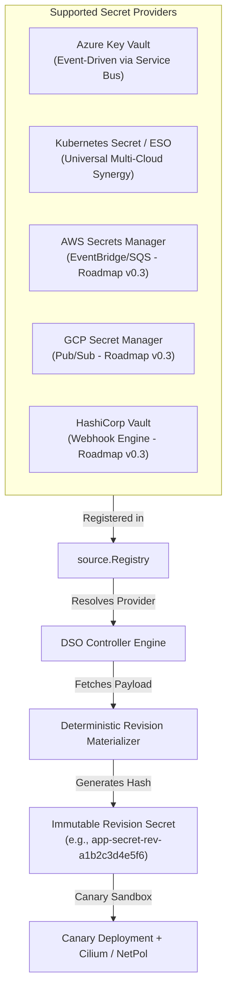

# Pluggable Secret Providers & Multi-Cloud Ingestion Architecture

The **Dynamic Secret Operator (DSO)** features an extensible, provider-agnostic ingestion architecture designed to decouple secret storage and synchronization backends from progressive canary delivery, synthetic validation probes, and rollback automation.

---

## 1. Architectural Model



---

## 2. Supported Provider Backends & Dedicated Guides

DSO provides dedicated modular documentation suites ([README](azure/README.md), [Getting Started](azure/getting-started.md), and [Troubleshooting](azure/troubleshooting.md)) for each supported and upcoming provider:

- 🟢 **[Microsoft Azure Key Vault Guide](azure/README.md)** – *Production Ready* (Direct event-driven via Event Grid & Service Bus)
- 🟢 **[Universal Multi-Cloud via External Secrets Operator (ESO) Guide](eso/README.md)** – *Production Ready* (Decoupled intermediate secrets)
- 🟡 **[Amazon Web Services (AWS) Secrets Manager Guide](aws/README.md)** – *In Development (Roadmap v0.3)*
- 🟡 **[Google Cloud Platform (GCP) Secret Manager Guide](gcp/README.md)** – *In Development (Roadmap v0.3)*

---

### 2.1 Event-Driven Cloud Providers (AWS, GCP, Azure)

DSO provides direct event-driven ingestion across major cloud platforms without polling delays:

#### Microsoft Azure (`AzureKeyVault`) — 🟢 Production Ready
Ingests real-time rotation events from Azure Key Vault via Azure Event Grid and Azure Service Bus (`Peek-Lock` queue) authenticated with Azure Workload Identity. See full setup instructions in the [Azure Key Vault Provider Guide](azure/README.md).

```yaml
apiVersion: dso.quantumsys.dev/v1alpha1
kind: DynamicSecretPolicy
metadata:
  name: payment-policy
  namespace: production
spec:
  source:
    type: "AzureKeyVault"
    azureKeyVault:
      keyVaultURI: "https://my-vault.vault.azure.net"
      objectName: "payment-db-password"
      objectType: "Secret"
  workloadSelector:
    kind: "Deployment"
    name: "payment-api"
```

#### Amazon Web Services (`AWSSecretsManager`) — 🟡 In Development
> [!NOTE]
> Native AWS ingestion is under development for Roadmap v0.3. For production AWS workloads today, use the [External Secrets Operator (ESO) Guide](eso/README.md).

Ingests rotation events from AWS Secrets Manager via Amazon EventBridge and Amazon SQS queues authenticated using AWS IAM Roles for Service Accounts (IRSA) or EKS Pod Identity. See the [AWS Secrets Manager Provider Guide](aws/README.md).

```yaml
apiVersion: dso.quantumsys.dev/v1alpha1
kind: DynamicSecretPolicy
metadata:
  name: aws-payment-policy
  namespace: production
spec:
  source:
    type: "AWSSecretsManager"
    awsSecretsManager:
      secretArn: "arn:aws:secretsmanager:us-east-1:123456789012:secret:payment-db-cred"
  workloadSelector:
    kind: "Deployment"
    name: "payment-api"
```

#### Google Cloud Platform (`GCPSecretManager`) — 🟡 In Development
> [!NOTE]
> Native GCP ingestion is under development for Roadmap v0.3. For production GCP workloads today, use the [External Secrets Operator (ESO) Guide](eso/README.md).

Ingests rotation events from Google Cloud Secret Manager via Cloud Pub/Sub topics and subscriptions authenticated using GCP Workload Identity Federation. See the [Google Cloud Secret Manager Provider Guide](gcp/README.md).

```yaml
apiVersion: dso.quantumsys.dev/v1alpha1
kind: DynamicSecretPolicy
metadata:
  name: gcp-payment-policy
  namespace: production
spec:
  source:
    type: "GCPSecretManager"
    gcpSecretManager:
      secretId: "projects/my-project/secrets/payment-db-password"
  workloadSelector:
    kind: "Deployment"
    name: "payment-api"
```

### 2.2 Universal Multi-Cloud via External Secrets Operator (`K8sSecret`) — 🟢 Production Ready
Leverages **External Secrets Operator (ESO)** to synchronize credentials from AWS Secrets Manager, GCP Secret Manager, HashiCorp Vault, or Akeyless into intermediate Kubernetes secrets, which DSO monitors to trigger progressive delivery. See full details in the [ESO Universal Provider Guide](eso/README.md).

> **Required label:** the intermediate secret named in `k8sSecret.name` must carry the label
> `dso.quantumsys.dev/managed: "watch"` (for example via `target.template.metadata.labels` on
> the `ExternalSecret`), or DSO's cache will never observe its changes and rotations will not
> be detected. See [ADR-003](../adr/003-decoupling-secret-ingestion-eso.md) and the
> `examples/eso/` manifests for working examples.

```yaml
apiVersion: dso.quantumsys.dev/v1alpha1
kind: DynamicSecretPolicy
metadata:
  name: orders-db-policy
  namespace: production
spec:
  source:
    type: "K8sSecret"
    k8sSecret:
      name: "orders-db-password-synced"
  workloadSelector:
    kind: "Deployment"
    name: "orders-api"
  targetRef:
    volumeName: "db-secret-volume"
  validationProbes:
    - type: "HTTP" # Also supports "TLS", "PostgreSQL", "MySQL", "Job"
      endpoint: "http://orders-api.production.svc.cluster.local:8080/healthz"
      path: "/healthz"
      expectedStatus: 200
      queryTimeout: 5
```

---

## 3. Native Provider Roadmap & Status

| Provider | Guide Suite | Mechanism | Status | Target Release |
| :--- | :--- | :--- | :--- | :--- |
| **Microsoft Azure** | [Azure Key Vault Guide](azure/README.md) | Event Grid $\to$ Service Bus Event-Driven Ingestion | 🟢 Production Ready | v0.1.0 |
| **Universal Multi-Cloud (ESO)** | [ESO Universal Guide](eso/README.md) | Decoupled Intermediate Secret Watch | 🟢 Production Ready | v0.2.0 |
| **AWS Secrets Manager** | [AWS Guide](aws/README.md) | Amazon EventBridge $\to$ Amazon SQS Watcher | 🟡 In Development | v0.3.0 |
| **GCP Secret Manager** | [GCP Guide](gcp/README.md) | Cloud Pub/Sub Push/Pull Ingestion | 🟡 In Development | v0.3.0 |
| **HashiCorp Vault** | [Roadmap Guide](overview.md) | Vault Audit Engine / Webhook Receiver | 🟡 In Development | v0.3.0 |

---

## 4. Go Developer Abstraction Interface

Providers implement the `source.Provider` interface:

```go
package source

import (
    "context"
    secretv1alpha1 "github.com/quantumsys-dev/dynamic-secret-operator/api/v1alpha1"
)

type SecretPayload struct {
    Data    map[string][]byte
    Version string
}

type Provider interface {
    FetchSecret(ctx context.Context, policy *secretv1alpha1.DynamicSecretPolicy) (*SecretPayload, error)
}
```
