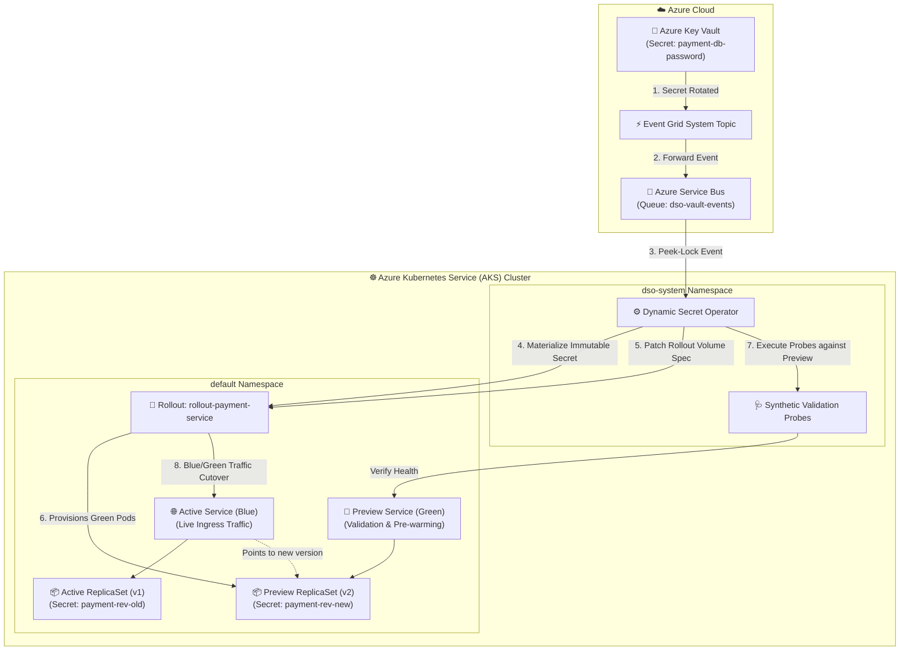

# AKS Production Example: Argo Rollouts Blue/Green Secret Rotation

This enterprise example demonstrates integrating the **Dynamic Secret Operator (DSO)** with [**Argo Rollouts**](https://argoproj.github.io/argo-rollouts/) on **Azure Kubernetes Service (AKS)** using a **Blue/Green Progressive Promotion Strategy**.

This pattern strictly adheres to [**ADR-002: Immutable Secret Revisions**](../../../docs/architecture/002-immutable-revisions-vs-mutable.md):
- Every rotation in Azure Key Vault triggers DSO to materialize an immutable Secret (`<rollout>-rev-<hash>`).
- DSO mutates the `Rollout` spec's secret volume reference, causing Argo Rollouts to deploy the new secret version into an isolated **Preview (Green) ReplicaSet**.
- Synthetic validation probes test the preview environment before switching live traffic on the **Active (Blue) Service**.

---

## 🏗️ Architecture on AKS



---

## 💡 How It Works on AKS

1. **Secret Materialization:** When credentials rotate in Azure Key Vault, DSO creates a new immutable Secret (`rollout-payment-service-payment-db-password-rev-<hash>`).
2. **Rollout Specification Update:** DSO updates the `Rollout` object's `spec.template.spec.volumes` with the new revision hash.
3. **Green Environment Deployment:** Argo Rollouts creates a new preview ReplicaSet referencing the new secret revision and routes internal validation traffic to the `previewService`.
4. **Validation & Promotion:** DSO's validation probes test the preview service. Once healthy, Argo Rollouts performs an instantaneous cutover of the `activeService` to the new ReplicaSet, draining the old blue pods gracefully.

---

## 🛠️ Prerequisites

- Provisioned Azure infrastructure (Run `setup-azure-resources.ps1` at repository root).
- `kubectl` authenticated to your AKS cluster (`az aks get-credentials --resource-group <RG> --name <CLUSTER_NAME>`).
- `kubectl-argo-rollouts` CLI plugin installed ([guide](https://argoproj.github.io/argo-rollouts/features/kubectl-plugin/)).

---

## 🚀 Quickstart Deployment

### Step 1: Deploy Argo Rollouts & Example Manifests on AKS
Execute the deployment script providing your Azure Key Vault name:

**PowerShell (Windows):**
```powershell
.\deploy-aks.ps1 -KeyVaultName "kv-dso-dev"
```

**Bash (Linux / WSL / macOS):**
```bash
chmod +x deploy-aks.sh
./deploy-aks.sh -k kv-dso-dev
```

### Step 2: Monitor Blue/Green Rollout Progress
Watch the live cutover using the Argo Rollouts CLI:

```bash
kubectl argo rollouts get rollout rollout-payment-service --watch
```

### Step 3: Trigger a Rotation in Key Vault
```bash
az keyvault secret set \
  --vault-name kv-dso-dev \
  --name "payment-db-password" \
  --value "NewPaymentPassword2026_Secure!"
```
