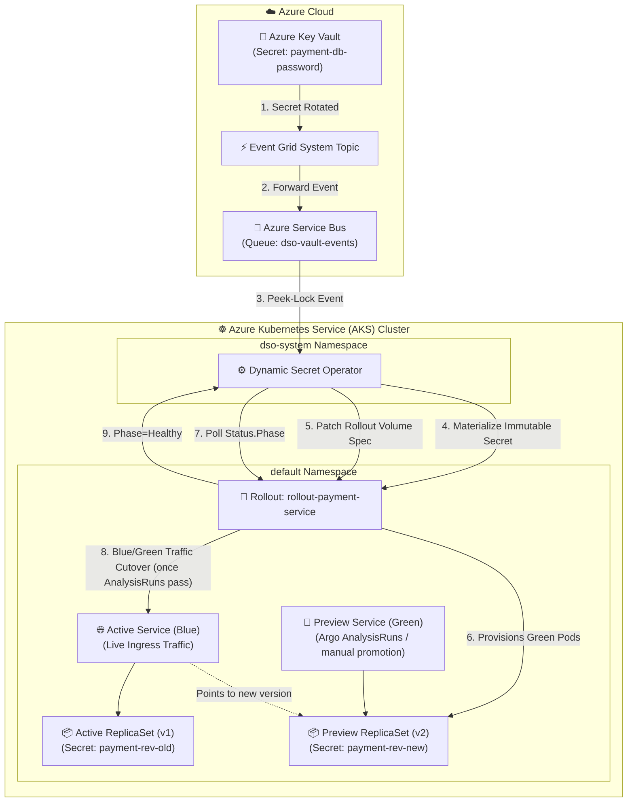

# AKS Production Example: Argo Rollouts Blue/Green Secret Rotation

This enterprise example demonstrates integrating the **Dynamic Secret Operator (DSO)** with [**Argo Rollouts**](https://argoproj.github.io/argo-rollouts/) on **Azure Kubernetes Service (AKS)** using a **Blue/Green Progressive Promotion Strategy**.

This pattern strictly adheres to [**ADR-002: Immutable Secret Revisions**](../../../docs/architecture/002-immutable-revisions-vs-mutable.md):
- Every rotation in Azure Key Vault triggers DSO to materialize an immutable Secret (`<rollout>-rev-<hash>`).
- DSO mutates the `Rollout` spec's secret volume reference, causing Argo Rollouts to deploy the new secret version into an isolated **Preview (Green) ReplicaSet**.
- DSO does **not** run its own synthetic canary against Rollout targets: patching the spec is
  already what triggers Argo Rollouts' own progressive delivery, so DSO defers entirely to
  Argo's own blue/green strategy (`autoPromotionEnabled` here, or any configured `AnalysisRun`s)
  for validation, and simply watches `Rollout.Status.Phase` until it reports `Healthy` before
  finalizing the promotion (garbage collecting the old secret revision).

---

## 🏗️ Architecture on AKS



---

## 💡 How It Works on AKS

1. **Secret Materialization:** When credentials rotate in Azure Key Vault, DSO creates a new immutable Secret (`rollout-payment-service-payment-db-password-rev-<hash>`).
2. **Rollout Specification Update:** DSO updates the `Rollout` object's `spec.template.spec.volumes` with the new revision hash. DSO does not create its own canary Deployment for Rollout targets - patching the spec is what triggers Argo's own progressive delivery, so running a second, independent canary mechanism alongside it would just fight the GitOps controller.
3. **Green Environment Deployment:** Argo Rollouts creates a new preview ReplicaSet referencing the new secret revision and routes internal validation traffic to the `previewService`, running any configured `prePromotionAnalysis`/`postPromotionAnalysis` `AnalysisRun`s itself.
4. **Validation & Promotion:** DSO polls `Rollout.Status.Phase` rather than probing the preview service directly. This example uses `autoPromotionEnabled: true`, so Argo cuts traffic over automatically once the preview ReplicaSet is ready (a `prePromotionAnalysis`/`postPromotionAnalysis` `AnalysisRun` could be added for stricter gating). Once Argo reports the rollout `Healthy` (traffic has cut over to the `activeService`), DSO finalizes the promotion by recording the new `CurrentRevision` and garbage collecting the old secret revision. If Argo instead reports the rollout `Degraded`, DSO counts it as a failed validation attempt against the circuit breaker and leaves the old secret revision in place.

---

## 🛠️ Prerequisites

- Provisioned Azure infrastructure (Run `setup-azure-resources.ps1` at repository root).
- `kubectl` authenticated to your AKS cluster (`az aks get-credentials --resource-group <RG> --name <CLUSTER_NAME>`).
- `kubectl-argo-rollouts` CLI plugin installed ([guide](https://argoproj.github.io/argo-rollouts/features/kubectl-plugin/)).

---

## 🚀 Quickstart Deployment

### Step 1: Deploy Argo Rollouts & Example Manifests on AKS
Execute the deployment script providing your Azure Key Vault name:

**PowerShell (Windows):**
```powershell
.\deploy-aks.ps1 -KeyVaultName "kv-dso-dev"
```

**Bash (Linux / WSL / macOS):**
```bash
chmod +x deploy-aks.sh
./deploy-aks.sh -k kv-dso-dev
```

### Step 2: Monitor Blue/Green Rollout Progress
Watch the live cutover using the Argo Rollouts CLI:

```bash
kubectl argo rollouts get rollout rollout-payment-service --watch
```

### Step 3: Trigger a Rotation in Key Vault
```bash
az keyvault secret set \
  --vault-name kv-dso-dev \
  --name "payment-db-password" \
  --value "NewPaymentPassword2026_Secure!"
```
