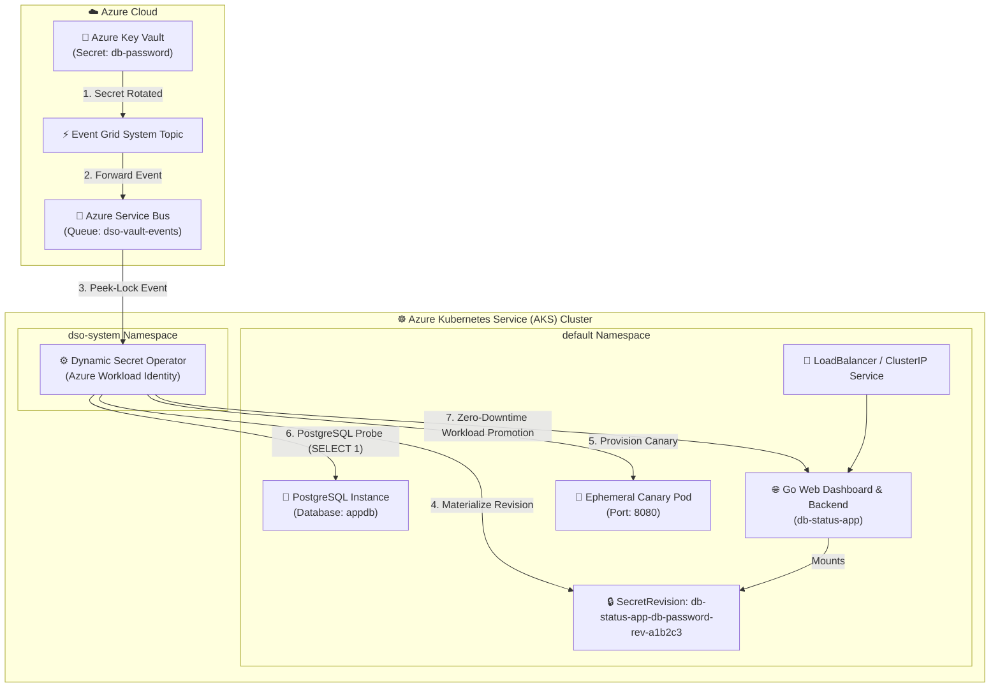

# AKS Production Example: Fullstack Database Password Auto-Rotation

This example demonstrates automated, zero-downtime **Database Password Rotation** directly inside a live **Azure Kubernetes Service (AKS)** cluster integrated with **Azure Key Vault**, **Azure Service Bus**, and **Azure Workload Identity**.

---

## 🏗️ Architecture



---

## 💡 How It Works on AKS

1. **Azure Event Ingestion:** A developer or automated pipeline updates `db-password` in Azure Key Vault (`az keyvault secret set`).
2. **Event Delivery:** Event Grid immediately publishes a `SecretNewVersionCreated` notification into the Azure Service Bus queue.
3. **Operator Reconciliation:** DSO retrieves the event via Azure Workload Identity and materializes a new immutable Kubernetes Secret (`db-status-app-db-password-rev-<hash>`).
4. **Synthetic Canary Testing:** DSO creates an isolated canary pod and executes a synthetic database probe (`SELECT NOW(), current_database(), current_user`).
5. **Zero-Downtime Promotion:** Once verified, DSO promotes the production `db-status-app` deployment with Kubernetes rolling updates and Argo CD drift protection.

---

## 🛠️ Prerequisites

- Provisioned Azure infrastructure (Run `setup-azure-resources.ps1` at repository root).
- `kubectl` authenticated to your AKS cluster (`az aks get-credentials --resource-group <RG> --name <CLUSTER_NAME>`).
- `helm` v3+ (for installing the DSO operator).
- Azure CLI (`az`) logged in.

---

## 🚀 Quickstart Deployment

### Step 1: Ensure DSO is Installed on AKS
If not already installed, deploy DSO to your AKS cluster via Helm:

```bash
helm install dso ./deploy/helm/dso \
  --namespace dso-system \
  --create-namespace \
  --set azure.workloadIdentity.clientId="<MANAGED_IDENTITY_CLIENT_ID>" \
  --set azure.workloadIdentity.tenantId="<AZURE_TENANT_ID>" \
  --set azure.serviceBus.namespace="<SERVICEBUS_NAMESPACE_FQDN>" \
  --set azure.serviceBus.queueName="dso-vault-events"
```

### Step 2: Deploy the Fullstack Demo on AKS
Execute the deployment script providing your Azure Key Vault name:

**PowerShell (Windows):**
```powershell
.\deploy-aks.ps1 -KeyVaultName "kv-dso-dev"
```

**Bash (Linux / WSL / macOS):**
```bash
chmod +x deploy-aks.sh
./deploy-aks.sh -k kv-dso-dev
```

### Step 3: Access the Web Dashboard
Forward the dashboard port locally:

```bash
kubectl port-forward svc/db-status-app 8080:80
```

Open [http://localhost:8080](http://localhost:8080) to observe live database connectivity and latency.

### Step 4: Trigger a Live Secret Rotation Test

> [!NOTE]
> **Understanding Database Secret Rotation Architecture:**
> In enterprise architectures, an automation engine (such as an Azure Function or HashiCorp Vault DB Engine) executes `ALTER USER ... WITH PASSWORD ...` on the database engine and simultaneously stores the new password in Azure Key Vault. DSO operates on the Kubernetes consumer side: it catches the Key Vault event, executes canary health probes against PostgreSQL port 5432, and rotates all client workloads with zero downtime.

To simulate the complete rotation workflow in this test environment:

#### 4.1 Update the User Password in PostgreSQL
Simulate the database backend password update:

**PowerShell (Windows):**
```powershell
kubectl exec -i deployment/postgres -- psql -U postgres -d appdb -c "ALTER USER postgres WITH PASSWORD 'NewSecret2026_Rotated!';"
```

**Bash (Linux / WSL / macOS):**
```bash
kubectl exec -i deployment/postgres -- psql -U postgres -d appdb -c "ALTER USER postgres WITH PASSWORD 'NewSecret2026_Rotated!';"
```

#### 4.2 Update the Secret in Azure Key Vault
Simulate the Secret Manager update triggering the Event Grid / Service Bus notification:

**PowerShell (Windows):**
```powershell
az keyvault secret set --vault-name kv-dso-dev --name "db-password" --value "NewSecret2026_Rotated!"
```

**Bash (Linux / WSL / macOS):**
```bash
az keyvault secret set \
  --vault-name kv-dso-dev \
  --name "db-password" \
  --value "NewSecret2026_Rotated!"
```

#### 4.3 Observe Zero-Downtime Secret Rotation
Watch the operator logs and your browser dashboard update in real time:

**Follow Operator Logs:**
```powershell
kubectl logs -n dso-system -l app.kubernetes.io/name=dynamic-secret-operator -f
```

**Browser Dashboard ([http://localhost:8080](http://localhost:8080)):**
- The **Active Secret Hint** transitions seamlessly to the new secret hash.
- The **Live Health Audit Stream** records the secret revision upgrade with **0 dropped queries and 0 ms interruption**.

