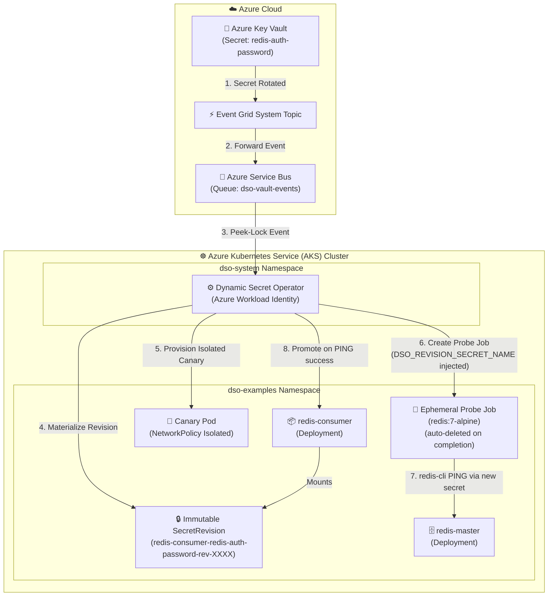

# AKS Production Example: Job-Based Redis AUTH Rotation (BYOC Probe)

This example demonstrates **zero-downtime Redis AUTH password rotation** on **Azure Kubernetes Service (AKS)** using DSO's extensible **Job-based validation probe** (`type: Job`).

Instead of a built-in driver, DSO spins up an ephemeral `redis:alpine` Kubernetes **Job** in the target namespace to validate the new credentials with `redis-cli PING` — with zero driver code compiled into the operator binary.

---

## 🏗️ Architecture on AKS



---

## 💡 How It Works

1. **Event Ingestion:** Azure Key Vault notifies Azure Service Bus via Event Grid when `redis-auth-password` is rotated.
2. **Secret Materialization:** DSO fetches the new password and materializes an immutable `Secret` in the `dso-examples` namespace (e.g., `redis-consumer-redis-auth-password-rev-a1b2c3`).
3. **Canary Provisioning:** DSO spins up an isolated 1-replica canary pod with strict `NetworkPolicy`.
4. **Job Probe:** DSO creates an ephemeral `batch/v1.Job` using the `redis:7-alpine` image. The operator automatically injects the `DSO_REVISION_SECRET_NAME` environment variable into container environments with the actual new secret name. The probe container references `$(DSO_REVISION_SECRET_NAME)` or its materialized secret to run `redis-cli PING` and validate connectivity.
5. **Pass / Fail:** If `PING` returns `PONG`, DSO promotes `redis-consumer` to use the new secret (zero downtime rolling update). If it fails, DSO captures the container logs, surfaces them as a `Condition` on the `DynamicSecretPolicy`, and (if configured) rolls back.
6. **Cleanup:** The probe Job is **always deleted** immediately after completion — success or failure — preventing resource accumulation.

---

## 🛠️ Prerequisites

- Provisioned Azure infrastructure (run `setup-azure-resources.ps1` at repository root).
- `kubectl` authenticated to your AKS cluster (`az aks get-credentials --resource-group <RG> --name <CLUSTER_NAME>`).
- Azure CLI (`az`) logged in with access to the Key Vault.
- DSO operator deployed in the cluster (`dso-system` namespace).

---

## 🚀 Quickstart Deployment

### Step 1: Deploy the Redis Example on AKS

**PowerShell (Windows):**
```powershell
.\deploy-aks.ps1 -KeyVaultName "kv-dso-dev"
```

**Bash (Linux / WSL / macOS):**
```bash
chmod +x deploy-aks.sh
./deploy-aks.sh -k kv-dso-dev
```

Both scripts will:
- Create the `dso-examples` namespace
- Seed the initial `redis-auth-password` secret in Key Vault
- Create bootstrap secrets so pods start before DSO's first rotation
- Apply `manifests.yaml` (Redis Deployment, Consumer Deployment, Service, DynamicSecretPolicy)
- Wait for both deployments to reach `Ready`

### Step 2: Observe the Consumer App

Tail the redis-consumer logs to see live PING results:

```bash
kubectl logs -n dso-examples -l app=redis-consumer -f
```

### Step 3: Trigger a Redis AUTH Password Rotation

Update the secret in Azure Key Vault to simulate a rotation:

```bash
az keyvault secret set \
  --vault-name kv-dso-dev \
  --name "redis-auth-password" \
  --value "RotatedRedisPassword456!"
```

### Step 4: Watch DSO in Action

```bash
# Watch the DynamicSecretPolicy conditions in real-time
kubectl get dynamicsecretpolicy redis-cache-rotation -n dso-examples -w

# Watch the ephemeral probe Job appear and disappear
kubectl get jobs -n dso-examples -w

# Inspect policy conditions in detail (includes probe Job failure logs if any)
kubectl describe dynamicsecretpolicy redis-cache-rotation -n dso-examples
```

---

## 📁 Files

| File | Description |
|---|---|
| `manifests.yaml` | Redis master + consumer Deployments, Service, and DynamicSecretPolicy with Job probe |
| `deploy-aks.ps1` | PowerShell deployment script (Windows / Azure Cloud Shell) |
| `deploy-aks.sh`  | Bash deployment script (Linux / WSL / macOS) |
| `README.md`      | This guide |

---

## 🔐 Security Notes

- The probe Job runs as `runAsNonRoot: true`, `runAsUser: 65534` (nobody), with all Linux capabilities dropped.
- `readOnlyRootFilesystem: true` prevents any writes inside the validation container.
- `backoffLimit: 0` ensures the Job fails fast without retrying.
- The probe Job is **always deleted** after execution via a deferred cleanup in the operator, leaving no orphaned resources in the cluster.
- No Redis driver is compiled into the operator binary — the entire validation is containerized and ephemeral.
