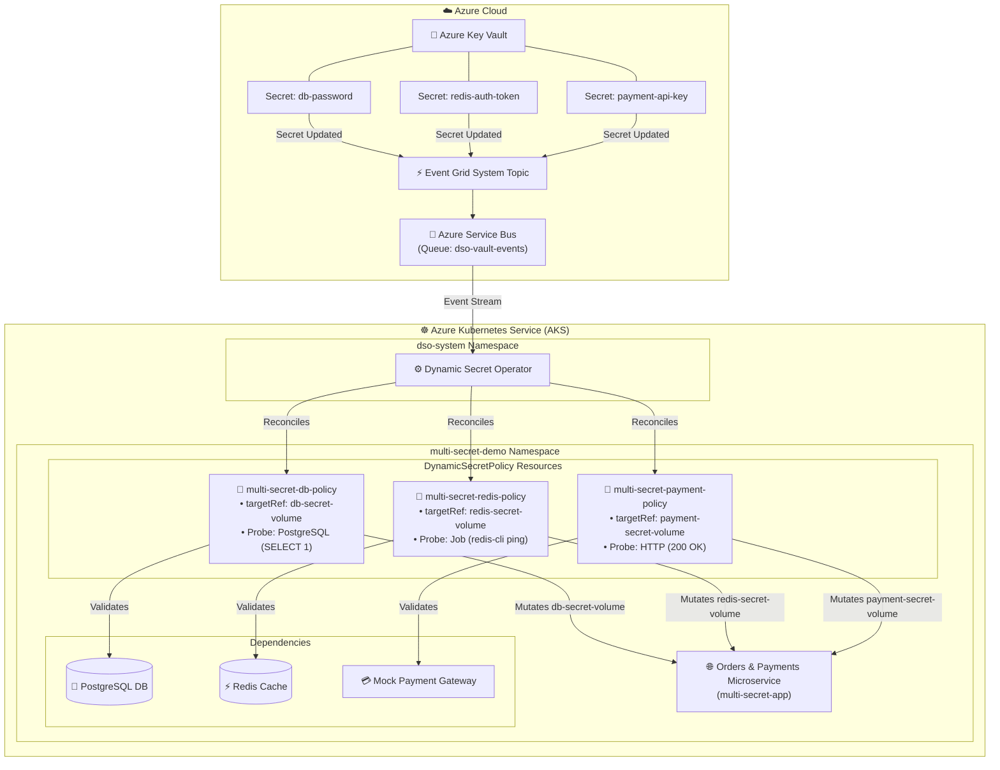

# AKS Production Example: Multi-Secret Microservice with Dedicated Probes

This example demonstrates how the **Dynamic Secret Operator (DSO)** safely manages **multiple distinct secrets** consumed simultaneously by a single Kubernetes workload on **Azure Kubernetes Service (AKS)**, using **independent `DynamicSecretPolicy` resources** and **specialized validation probes** for each secret.

---

## 🏗️ Architecture



---

## 💡 How Multi-Secret Rotation Works

In microservices architectures, an application frequently depends on multiple external resources (databases, cache layers, payment gateways, API keys). DSO allows each secret to be rotated independently with zero downtime and strict isolation:

| Secret Name | Key Vault Object | Volume Mount | Validation Probe Type | Probe Target |
| :--- | :--- | :--- | :--- | :--- |
| **Database Password** | `db-password` | `/mnt/secrets/db` | `PostgreSQL` | `postgres:5432/appdb` |
| **Cache Token** | `redis-auth-token` | `/mnt/secrets/redis` | `Job` (ephemeral) | `redis:6379` |
| **Payment API Key** | `payment-api-key` | `/mnt/secrets/payment` | `HTTP` | `payment-gateway:8080/v1/health` |

### 🎯 Key Advantages of DSO's Multi-Secret Design
1. **Target Isolation (`targetRef.volumeName`)**: When `db-password` changes, DSO generates a new revision secret only for the database, updating `db-secret-volume` in the Pod template while keeping `redis-secret-volume` and `payment-secret-volume` completely untouched.
2. **Dedicated Validation Probes**: Each secret is validated using the exact protocol it uses in production (PostgreSQL TCP ping, Redis AUTH Job, HTTP health check).
3. **Independent Rollbacks**: If a rotated secret fails validation (e.g., an invalid Redis password), only the Redis rollout is aborted and rolled back. The database and payment integrations continue operating normally.

---

## 🚀 Quickstart Deployment

### Prerequisites
- Running AKS cluster connected via `kubectl`
- Azure Key Vault provisioned (e.g., via `./setup-azure-resources.ps1`)
- Dynamic Secret Operator installed in `dso-system` namespace

### Step 1: Deploy the Multi-Secret Example

**PowerShell (Windows):**
```powershell
cd examples/aks/multi-secret-rotation
.\deploy-aks.ps1 -KeyVaultName "kv-dso-dev-jc"
```

**Bash (Linux / WSL / macOS):**
```bash
cd examples/aks/multi-secret-rotation
chmod +x deploy-aks.sh
./deploy-aks.sh -k kv-dso-dev-jc
```

---

## 📊 Step 2: Access the Multi-Secret Dashboard

Forward the application port to your local machine:
```bash
kubectl port-forward svc/multi-secret-app 8080:80 -n multi-secret-demo
```

Open [http://localhost:8080](http://localhost:8080) in your browser. You will see a live dashboard displaying the health, active secret mask, probe latency, and status for all three dependencies simultaneously.

---

## 🔄 Step 3: Test Independent Secret Rotations

### Scenario A: Rotate the PostgreSQL Database Password Only
Update the database secret in Azure Key Vault:
```bash
az keyvault secret set --vault-name "kv-dso-dev-jc" --name "db-password" --value "RotatedPostgresPass789!"
```

**Observe DSO in action:**
1. Event Grid notifies Service Bus; DSO creates a canary pod.
2. The `PostgreSQL` probe executes `SELECT count(*) FROM orders`.
3. DSO performs a rolling update of `multi-secret-app`, modifying **only** `db-secret-volume`.
4. Refresh the dashboard at [http://localhost:8080](http://localhost:8080) to observe the updated DB credential mask while Redis and Payment secrets remain unchanged.

---

### Scenario B: Rotate the Redis Cache Token Only
Update the Redis secret in Azure Key Vault:
```bash
az keyvault secret set --vault-name "kv-dso-dev-jc" --name "redis-auth-token" --value "RotatedRedisToken999!"
```

**Observe DSO in action:**
1. DSO launches an ephemeral `Job` pod executing `redis-cli ping` with the new credential.
2. Upon job success, DSO rolls out the new `redis-secret-volume`.

---

### Scenario C: Rotate the Payment Gateway API Key
Update the payment API key in Azure Key Vault:
```bash
az keyvault secret set --vault-name "kv-dso-dev-jc" --name "payment-api-key" --value "sk_live_pay_updated_456"
```

**Observe DSO in action:**
1. DSO executes the `HTTP` validation probe against `http://payment-gateway:8080/v1/health`.
2. DSO promotes the deployment safely.

---

## 🛡️ Step 4: Verify Circuit Breaker & Automatic Rollback

Test DSO's safety by injecting an invalid secret into Key Vault:
```bash
az keyvault secret set --vault-name "kv-dso-dev-jc" --name "db-password" --value "WrongInvalidPassword!"
```

1. DSO creates a canary pod and runs the `PostgreSQL` probe.
2. The probe fails (`FATAL: password authentication failed`).
3. DSO triggers **Auto-Rollback**, preventing the invalid secret from reaching production pods.
4. The production pods remain `HEALTHY` and zero user traffic is disrupted!

Check policy status:
```bash
kubectl get dynamicsecretpolicies -n multi-secret-demo
kubectl describe dynamicsecretpolicy multi-secret-db-policy -n multi-secret-demo
```
