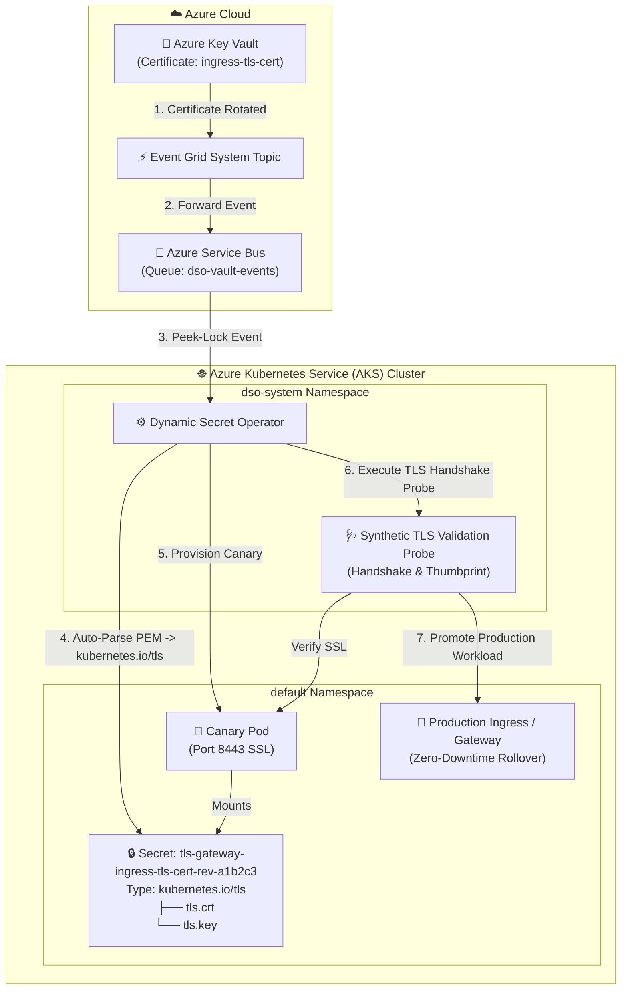

# AKS Production Example: Automated TLS Certificate Rotation for Ingress & Gateways

This enterprise example demonstrates end-to-end automated **TLS Certificate Rotation** directly inside an **Azure Kubernetes Service (AKS)** cluster with **Azure Key Vault** and **Native Kubernetes TLS Secret (`kubernetes.io/tls`) Mapping**.

---

## 🏗️ Architecture on AKS



---

## 💡 How It Works on AKS

1. **Auto-Parsing PEM Chains:** When certificates rotate in Azure Key Vault, DSO automatically partitions the certificate chain and private key into `tls.crt` and `tls.key` with `Type: kubernetes.io/tls`.
2. **Native Ingress Compatibility:** Natively compatible with Nginx Ingress, Traefik, Contour, Envoy, and Gateway API without custom secret reformatting scripts.
3. **Synthetic Validation:** DSO spins up an isolated 1-replica canary pod and verifies TLS handshakes, validity period, and leaf certificate thumbprints before touching production workloads.
4. **GitOps Harmony:** Automatically updates Argo CD `ignoreDifferences` to prevent self-heal drift loops.

---

## 🛠️ Prerequisites

- Provisioned Azure infrastructure (Run `setup-azure-resources.ps1` at repository root).
- `kubectl` authenticated to your AKS cluster (`az aks get-credentials --resource-group <RG> --name <CLUSTER_NAME>`).
- Azure CLI (`az`) logged in.

---

## 🚀 Quickstart Deployment

### Step 1: Deploy the TLS Certificate Example on AKS
Execute the deployment script providing your Azure Key Vault name:

**PowerShell (Windows):**
```powershell
.\deploy-aks.ps1 -KeyVaultName "kv-dso-dev"
```

**Bash (Linux / WSL / macOS):**
```bash
chmod +x deploy-aks.sh
./deploy-aks.sh -k kv-dso-dev
```

### Step 2: Test HTTPS Endpoint on AKS
Forward the TLS gateway port:

```bash
kubectl port-forward svc/tls-gateway 8443:8443
```

Query the HTTPS endpoint:

```bash
curl -k https://localhost:8443
```

You should receive a secure `200 OK` response.

### Step 3: Trigger a Live Certificate Rotation in Key Vault
Rotate or create a new version of the certificate in Azure Key Vault:

```bash
az keyvault certificate create \
  --vault-name kv-dso-dev \
  --name "ingress-tls-cert" \
  --policy "$(az keyvault certificate get-default-policy)"
```

Observe DSO automatically parse the new certificate, validate the handshake on a canary, and perform a zero-downtime rolling update on the production gateway.
