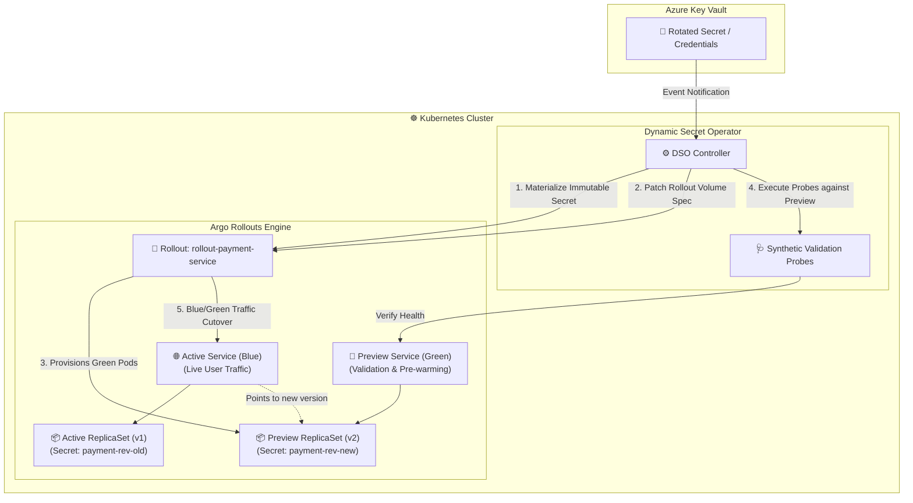

# Enterprise Example: Argo Rollouts Blue/Green Secret Rotation

This enterprise example demonstrates integrating the **Dynamic Secret Operator (DSO)** with [**Argo Rollouts**](https://argoproj.github.io/argo-rollouts/) using a **Blue/Green Progressive Promotion Strategy**.

This pattern strictly adheres to [**ADR-002: Immutable Secret Revisions**](../../docs/architecture/002-immutable-revisions-vs-mutable.md):
- In-place mutable file modifications are avoided to prevent race conditions and partial read states.
- Every rotation in Azure Key Vault creates a cryptographically hashed, immutable Kubernetes Secret (`<rollout>-rev-<hash>`).
- DSO mutates the `Rollout` spec's secret volume reference, causing Argo Rollouts to deploy the new secret version into a isolated **Preview (Green) ReplicaSet**.
- Synthetic validation probes verify the preview environment before switching live traffic on the **Active (Blue) Service**.

---

## 🏗️ Architecture



---

## 💡 How It Works

1. **Secret Materialization:** When credentials rotate in Azure Key Vault, DSO creates a new immutable Secret (`rollout-payment-service-db-password-rev-<hash>`).
2. **Rollout Specification Update:** DSO updates the `Rollout` object's `spec.template.spec.volumes` with the new revision hash.
3. **Green Environment Deployment:** Argo Rollouts creates a new preview ReplicaSet referencing the new secret revision and routes internal validation traffic to the `previewService`.
4. **Validation & Promotion:** DSO's validation probes test the preview service. Once healthy, Argo Rollouts performs an instantaneous cutover of the `activeService` to the new ReplicaSet, draining the old blue pods gracefully.

---

## 🛠️ Prerequisites

- **kind**: `kind v0.20.0+` ([installation guide](https://kind.sigs.k8s.io/))
- **kubectl**: Kubernetes CLI ([installation guide](https://kubernetes.io/docs/tasks/tools/))
- **kubectl-argo-rollouts**: Argo Rollouts CLI plugin ([installation guide](https://argoproj.github.io/argo-rollouts/features/kubectl-plugin/))

---

## 🚀 Quickstart

### Step 1: Bootstrap the Local Cluster & Argo Rollouts
Execute the setup script to create a kind cluster, install Argo Rollouts (`v1.7.2`), install DSO CRDs, and deploy the manifests:

```bash
chmod +x setup-kind.sh
./setup-kind.sh
```

### Step 2: Inspect the Rollout & DynamicSecretPolicy Manifests
The `Rollout` defines the Blue/Green delivery strategy:

```yaml
apiVersion: argoproj.io/v1alpha1
kind: Rollout
metadata:
  name: rollout-payment-service
  namespace: default
spec:
  replicas: 3
  strategy:
    blueGreen:
      activeService: payment-service-active
      previewService: payment-service-preview
      autoPromotionEnabled: true
  template:
    spec:
      containers:
        - name: payment-api
          image: hashicorp/http-echo:latest
          args: ["-text=Payment API v1 active\n"]
          volumeMounts:
            - name: db-secret-volume
              mountPath: /etc/secrets
              readOnly: true
      volumes:
        - name: db-secret-volume
          secret:
            secretName: rollout-payment-service-db-password-initial
---
apiVersion: dso.quantumsys.dev/v1alpha1
kind: DynamicSecretPolicy
metadata:
  name: rollout-payment-policy
  namespace: default
spec:
  vaultRef:
    keyVaultURI: "https://my-enterprise-vault.vault.azure.net"
    objectName: "db-password"
    objectType: "Secret"
  workloadSelector:
    kind: "Rollout"
    name: "rollout-payment-service"
  targetRef:
    volumeName: "db-secret-volume"
  validationProbes:
    - type: "HTTP"
      endpoint: "http://payment-service-preview.default.svc:80/"
      expectedStatus: 200
      queryTimeout: 5
  rollbackConfig:
    autoRollback: true
    circuitBreakerThreshold: 3
```

### Step 3: Monitor Blue/Green Rollout Progress
Watch the live cutover using the Argo Rollouts CLI:

```bash
kubectl argo rollouts get rollout rollout-payment-service --watch
```
