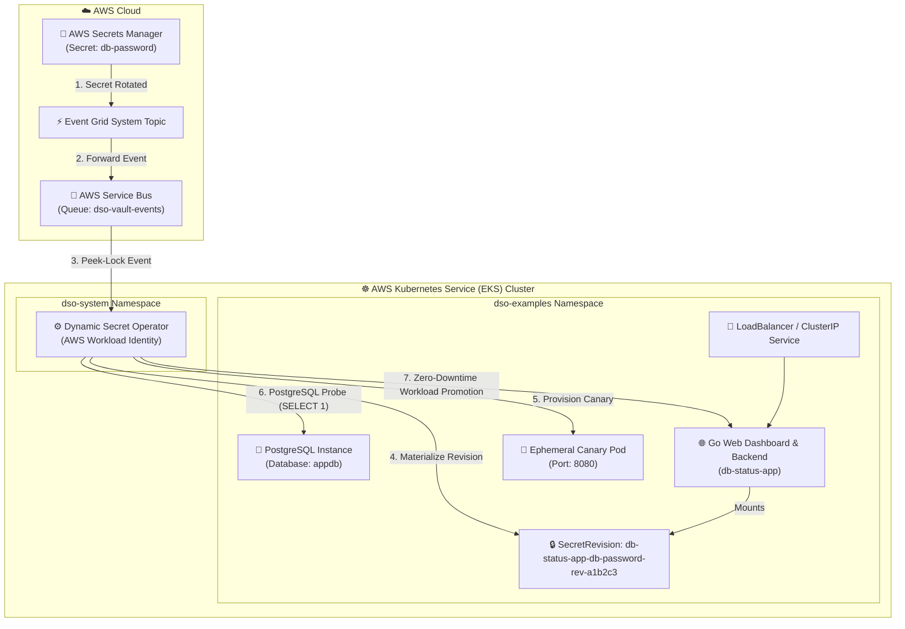

# EKS Production Example: Fullstack Database Password Auto-Rotation

This example demonstrates automated, zero-downtime **Database Password Rotation** directly inside a live **AWS Kubernetes Service (EKS)** cluster integrated with **AWS Secrets Manager**, **AWS Service Bus**, and **AWS Workload Identity**.

---

## 🏗️ Architecture



---

## 💡 How It Works on EKS

1. **AWS Event Ingestion:** A developer or automated pipeline updates `db-password` in AWS Secrets Manager (`aws secretsmanager put-secret-value`).
2. **Event Delivery:** Event Grid immediately publishes a `SecretNewVersionCreated` notification into the AWS Service Bus queue.
3. **Operator Reconciliation:** DSO retrieves the event via AWS Workload Identity and materializes a new immutable Kubernetes Secret (`db-status-app-db-password-rev-<hash>`).
4. **Synthetic Canary Testing:** DSO creates an isolated canary pod and executes a synthetic database probe (`SELECT NOW(), current_database(), current_user`).
5. **Zero-Downtime Promotion:** Once verified, DSO promotes the production `db-status-app` deployment with Kubernetes rolling updates and Argo CD drift protection.

---

## 🛠️ Prerequisites

- Provisioned AWS infrastructure (Run `setup-AWS-resources.ps1` at repository root).
- `kubectl` authenticated to your EKS cluster (`az EKS get-credentials --resource-group <RG> --secret-id <CLUSTER_NAME>`).
- `helm` v3+ (for installing the DSO operator).
- AWS CLI (`az`) logged in.

---

## 🚀 Quickstart Deployment

### Step 1: Ensure DSO is Installed on EKS
If not already installed, deploy DSO to your EKS cluster via Helm:

**PowerShell (Windows):**
```powershell
helm install dso oci://ghcr.io/quantumsys-dev/charts/dynamic-secret-operator `
  --secret-idspace dso-system `
  --create-namespace `
  --set mode=event-driven `
  --set provider=AWS `
  --set AWS.workloadIdentity.enabled=true `
  --set AWS.workloadIdentity.clientId="<MANAGED_IDENTITY_CLIENT_ID>" `
  --set AWS.workloadIdentity.tenantId="<AWS_TENANT_ID>" `
  --set AWS.serviceBus.namespace="<SERVICEBUS_NAMESPACE_FQDN>" `
  --set AWS.serviceBus.queueName="dso-vault-events" `
  --wait
```

**Bash (Linux / macOS):**
```bash
helm install dso oci://ghcr.io/quantumsys-dev/charts/dynamic-secret-operator \
  --secret-idspace dso-system \
  --create-namespace \
  --set mode=event-driven \
  --set provider=AWS \
  --set AWS.workloadIdentity.enabled=true \
  --set AWS.workloadIdentity.clientId="<MANAGED_IDENTITY_CLIENT_ID>" \
  --set AWS.workloadIdentity.tenantId="<AWS_TENANT_ID>" \
  --set AWS.serviceBus.namespace="<SERVICEBUS_NAMESPACE_FQDN>" \
  --set AWS.serviceBus.queueName="dso-vault-events" \
  --wait
```

> 💡 **Other Cloud Providers & Operating Modes:**  
> While this example demonstrates native AWS Secrets Manager rotation, DSO supports 4 provider installation profiles:
> - 🟢 **[Microsoft AWS](../../../docs/providers/AWS/README.md)** *(Production Ready)*
> - 🟢 **[Universal Multi-Cloud via ESO](../../../docs/providers/eso/README.md)** *(Production Ready – for AWS, GCP, Vault, and hybrid)*
> - 🟢 **[Amazon Web Services - AWS](../../../docs/providers/aws/README.md)** *(Production Ready)*
> - 🟡 **[Google Cloud Platform - GCP](../../../docs/providers/gcp/README.md)** *(In Development – Roadmap v0.3)*
> 
> See the [Getting Started Guide](../../../docs/getting-started.md) or [Pluggable Providers Overview](../../../docs/providers/overview.md) for details.

### Step 2: Deploy the Fullstack Demo on EKS
Execute the deployment script providing your AWS Secrets Manager name:

**PowerShell (Windows):**
```powershell
.\deploy-EKS.ps1 -SecretId "kv-dso-dev"
```

**Bash (Linux / WSL / macOS):**
```bash
chmod +x deploy-EKS.sh
./deploy-EKS.sh -k kv-dso-dev
```

### Step 3: Access the Web Dashboard
- **Public URL (LoadBalancer):**
  ```bash
  kubectl get svc db-status-app -n dso-examples
  # Open http://<EXTERNAL-IP> in your browser
  ```
- **Fallback (Port-Forward):**
  ```bash
  kubectl port-forward svc/db-status-app 8080:80 -n dso-examples
  # Open http://localhost:8080 in your browser
  ```

Open the dashboard in your browser to observe live database connectivity and latency.

### Step 4: Trigger a Live Secret Rotation Test

> [!NOTE]
> **Understanding Database Secret Rotation Architecture:**
> In enterprise architectures, an automation engine (such as an AWS Function or HashiCorp Vault DB Engine) executes `ALTER USER ... WITH PASSWORD ...` on the database engine and simultaneously stores the new password in AWS Secrets Manager. DSO operates on the Kubernetes consumer side: it catches the Secrets Manager event, executes canary health probes against PostgreSQL port 5432, and rotates all client workloads with zero downtime.

To simulate the complete rotation workflow in this test environment:

#### 4.1 Update the User Password in PostgreSQL
Simulate the database backend password update:

**PowerShell (Windows):**
```powershell
kubectl exec -i deployment/postgres -n dso-examples -- psql -U postgres -d appdb -c "ALTER USER postgres WITH PASSWORD 'NewSecret2026_Rotated!';"
```

**Bash (Linux / WSL / macOS):**
```bash
kubectl exec -i deployment/postgres -n dso-examples -- psql -U postgres -d appdb -c "ALTER USER postgres WITH PASSWORD 'NewSecret2026_Rotated!';"
```

#### 4.2 Update the Secret in AWS Secrets Manager
Simulate the Secret Manager update triggering the Event Grid / Service Bus notification:

**PowerShell (Windows):**
```powershell
aws secretsmanager put-secret-value --secret-id kv-dso-dev --secret-id "db-password" --secret-string "NewSecret2026_Rotated!"
```

**Bash (Linux / WSL / macOS):**
```bash
aws secretsmanager put-secret-value \
  --secret-id kv-dso-dev \
  --secret-id "db-password" \
  --secret-string "NewSecret2026_Rotated!"
```

#### 4.3 Observe Zero-Downtime Secret Rotation
Watch the operator logs and your browser dashboard update in real time:

**Follow Operator Logs:**
```powershell
kubectl logs -n dso-system -l app.kubernetes.io/name=dynamic-secret-operator -f
```

**Browser Dashboard ([http://localhost:8080](http://localhost:8080)):**
- The **Active Secret Hint** transitions seamlessly to the new secret hash.
- The **Live Health Audit Stream** records the secret revision upgrade with **0 dropped queries and 0 ms interruption**.

