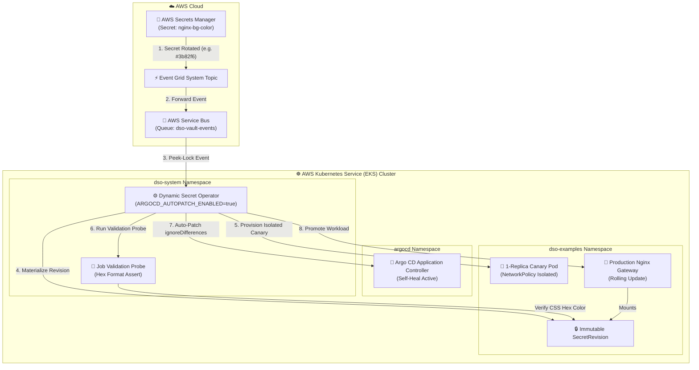

# EKS Production Example: Nginx Color Canary Rotation & Argo CD GitOps Integration

This example demonstrates end-to-end automated secret rotation on **AWS Kubernetes Service (EKS)** with **Canary Rollouts** and **Argo CD GitOps Drift Protection**.

---

## 🏗️ Architecture on EKS



---

## 💡 How It Works on EKS

1. **Event Ingestion:** AWS Secrets Manager notifies AWS Service Bus via Event Grid when `nginx-bg-color` updates.
2. **Canary Verification:** DSO provisions an isolated 1-replica canary deployment with strict `NetworkPolicy` to validate the secret before touching live workloads.
3. **Argo CD Drift Reconciliation:** When `ARGOCD_AUTOPATCH_ENABLED="true"` is set, DSO automatically patches `spec.ignoreDifferences` on the parent Argo CD `Application`, preventing Argo CD Self-Heal from rolling back the in-cluster secret mutation.
4. **Production Promotion:** Once validated, DSO promotes the production Nginx deployment with zero downtime.

---

## 🛠️ Prerequisites

- Provisioned AWS infrastructure (Run `setup-AWS-resources.ps1` at repository root).
- `kubectl` authenticated to your EKS cluster (`az EKS get-credentials --resource-group <RG> --secret-id <CLUSTER_NAME>`).
- AWS CLI (`az`) logged in.

---

## 🚀 Quickstart Deployment

### Step 1: Deploy Nginx Color Rotation Example on EKS
Execute the deployment script providing your AWS Secrets Manager name:

**PowerShell (Windows):**
```powershell
.\deploy-EKS.ps1 -SecretId "kv-dso-dev"
```

**Bash (Linux / WSL / macOS):**
```bash
chmod +x deploy-EKS.sh
./deploy-EKS.sh -k kv-dso-dev
```

### Step 2: Access the Nginx Gateway
- **Public URL (LoadBalancer):**
  ```bash
  kubectl get svc nginx-color-app -n dso-examples
  # Open http://<EXTERNAL-IP> in your browser
  ```
- **Fallback (Port-Forward):**
  ```bash
  kubectl port-forward svc/nginx-color-app 8080:80 -n dso-examples
  # Open http://localhost:8080 in your browser
  ```

Open the application in your browser to observe the active background color.

### Step 3: Trigger a Secret Rotation in Secrets Manager
Update the background color secret in AWS Secrets Manager:

```bash
aws secretsmanager put-secret-value \
  --secret-id kv-dso-dev \
  --secret-id "nginx-bg-color" \
  --secret-string "#10b981"
```

Refresh your browser to see the new color active without application downtime or Argo CD drift conflicts.

### Step 4: Test Circuit Breaker & Safety Abort
Simulate human error or misconfiguration by injecting an invalid color value:

```bash
aws secretsmanager put-secret-value \
  --secret-id kv-dso-dev \
  --secret-id "nginx-bg-color" \
  --secret-string "INVALID_COLOR"
```

1. **Observe DSO Safety Gate:** DSO receives the event and runs the synthetic validation probe.
2. **Probe Failure:** The probe detects that `INVALID_COLOR` is not a valid CSS hex color and fails immediately with exit code 1.
3. **Production Isolation:** Production pods (`nginx-color-app`) are **not** touched and remain 100% online on the previous stable color.
4. **Circuit Breaker Tripped:** After reaching the failure threshold (3 attempts), DSO trips the Circuit Breaker (`CircuitBreakerTripped: True`) to protect cluster stability and halt reconciliation loops:
   ```bash
   kubectl get dynamicsecretpolicy EKS-nginx-color-policy -n dso-examples
   ```
5. **Recovery:** Fix the secret in Secrets Manager with a valid hex color:
   ```bash
   aws secretsmanager put-secret-value --secret-id kv-dso-dev --secret-id "nginx-bg-color" --secret-string "#10b981"
   ```
   DSO automatically resets the Circuit Breaker, re-runs validation, and safely promotes production!

