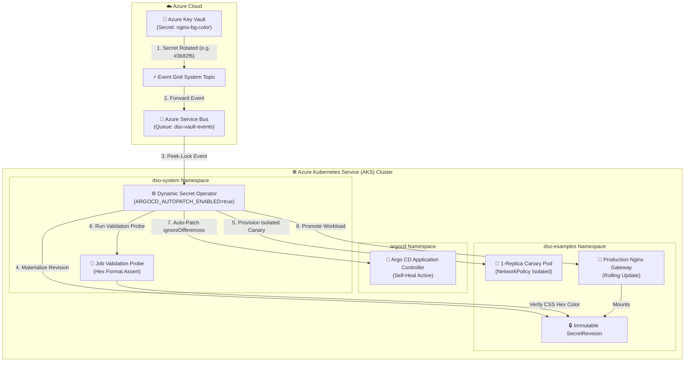

# AKS Production Example: Nginx Color Canary Rotation & Argo CD GitOps Integration

This example demonstrates end-to-end automated secret rotation on **Azure Kubernetes Service (AKS)** with **Canary Rollouts** and **Argo CD GitOps Drift Protection**.

---

## 🏗️ Architecture on AKS



---

## 💡 How It Works on AKS

1. **Event Ingestion:** Azure Key Vault notifies Azure Service Bus via Event Grid when `nginx-bg-color` updates.
2. **Canary Verification:** DSO provisions an isolated 1-replica canary deployment with strict `NetworkPolicy` to validate the secret before touching live workloads.
3. **Argo CD Drift Reconciliation:** When `ARGOCD_AUTOPATCH_ENABLED="true"` is set, DSO automatically patches `spec.ignoreDifferences` on the parent Argo CD `Application`, preventing Argo CD Self-Heal from rolling back the in-cluster secret mutation.
4. **Production Promotion:** Once validated, DSO promotes the production Nginx deployment with zero downtime.

---

## 🛠️ Prerequisites

- Provisioned Azure infrastructure (Run `setup-azure-resources.ps1` at repository root).
- `kubectl` authenticated to your AKS cluster (`az aks get-credentials --resource-group <RG> --name <CLUSTER_NAME>`).
- Azure CLI (`az`) logged in.

---

## 🚀 Quickstart Deployment

### Step 1: Deploy Nginx Color Rotation Example on AKS
Execute the deployment script providing your Azure Key Vault name:

**PowerShell (Windows):**
```powershell
.\deploy-aks.ps1 -KeyVaultName "kv-dso-dev"
```

**Bash (Linux / WSL / macOS):**
```bash
chmod +x deploy-aks.sh
./deploy-aks.sh -k kv-dso-dev
```

### Step 2: Access the Nginx Gateway
- **Public URL (LoadBalancer):**
  ```bash
  kubectl get svc nginx-color-app -n dso-examples
  # Open http://<EXTERNAL-IP> in your browser
  ```
- **Fallback (Port-Forward):**
  ```bash
  kubectl port-forward svc/nginx-color-app 8080:80 -n dso-examples
  # Open http://localhost:8080 in your browser
  ```

Open the application in your browser to observe the active background color.

### Step 3: Trigger a Secret Rotation in Key Vault
Update the background color secret in Azure Key Vault:

```bash
az keyvault secret set \
  --vault-name kv-dso-dev \
  --name "nginx-bg-color" \
  --value "#10b981"
```

Refresh your browser to see the new color active without application downtime or Argo CD drift conflicts.

### Step 4: Test Circuit Breaker & Safety Abort
Simulate human error or misconfiguration by injecting an invalid color value:

```bash
az keyvault secret set \
  --vault-name kv-dso-dev \
  --name "nginx-bg-color" \
  --value "INVALID_COLOR"
```

1. **Observe DSO Safety Gate:** DSO receives the event and runs the synthetic validation probe.
2. **Probe Failure:** The probe detects that `INVALID_COLOR` is not a valid CSS hex color and fails immediately with exit code 1.
3. **Production Isolation:** Production pods (`nginx-color-app`) are **not** touched and remain 100% online on the previous stable color.
4. **Circuit Breaker Tripped:** After reaching the failure threshold (3 attempts), DSO trips the Circuit Breaker (`CircuitBreakerTripped: True`) to protect cluster stability and halt reconciliation loops:
   ```bash
   kubectl get dynamicsecretpolicy aks-nginx-color-policy -n dso-examples
   ```
5. **Recovery:** Fix the secret in Key Vault with a valid hex color:
   ```bash
   az keyvault secret set --vault-name kv-dso-dev --name "nginx-bg-color" --value "#10b981"
   ```
   DSO automatically resets the Circuit Breaker, re-runs validation, and safely promotes production!

