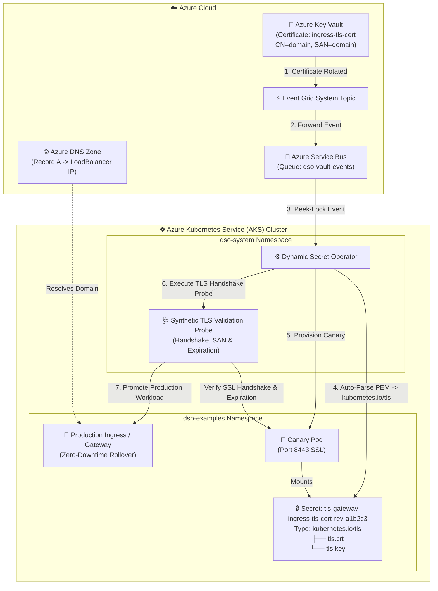

# AKS Production Example: Automated TLS Certificate Rotation with Azure DNS & Circuit Breaker

This enterprise example demonstrates end-to-end automated **TLS Certificate Rotation** directly inside an **Azure Kubernetes Service (AKS)** cluster with **Azure Key Vault**, **Azure DNS Zone mapping**, and **Native Kubernetes TLS Secret (`kubernetes.io/tls`) Parsing**.

It includes testing scenarios for both **Valid Zero-Downtime Canary Rollout** and **Deterministic Circuit Breaking** against invalid or expired certificates.

---

## 🏗️ Architecture on AKS



---

## 💡 How It Works on AKS

1. **Custom Domain & Azure DNS:** The deployment script takes your custom domain, provisions the Azure DNS Zone if missing, and creates an `A` record pointing to the public AKS LoadBalancer IP.
2. **Auto-Parsing PEM Chains:** When certificates are created or rotated in Azure Key Vault, DSO automatically partitions the certificate chain and private key into `tls.crt` and `tls.key` with `Type: kubernetes.io/tls`.
3. **Synthetic Validation:** DSO spins up an isolated canary pod and validates TLS handshakes, validity period (expiration), and leaf certificate thumbprints before touching production workloads.
4. **Circuit Breaker Protection:** If an expired or corrupted certificate is published to Key Vault, the canary fails the TLS validation probe. After reaching the consecutive failure threshold (3), the **Circuit Breaker trips**, destroys the canary, and keeps the production gateway untouched on the healthy revision.

---

## 🛠️ Prerequisites

- Azure CLI (`az`) logged in (`az login`).
- `kubectl` authenticated to your AKS cluster (`az aks get-credentials --resource-group <RG> --name <CLUSTER_NAME>`).
- Azure infrastructure provisioned (via `local/setup-azure-resources.ps1` or existing).

---

## 🚀 Step 1: Deploy with Custom Domain

Run the deployment script passing your domain and Key Vault name:

### PowerShell (Windows):
```powershell
.\deploy-aks.ps1 -Domain "myapp.contoso.com" -KeyVaultName "kv-dso-dev-jc"
```

### Bash (Linux / WSL / macOS):
```bash
chmod +x deploy-aks.sh rotate-cert.sh simulate-invalid-cert.sh
./deploy-aks.sh -d "myapp.contoso.com" -k "kv-dso-dev-jc"
```

**What the script does:**
1. Verifies Key Vault access and resolves the Resource Group.
2. Creates the **Azure DNS Zone** for `myapp.contoso.com` if not already present.
3. Generates the initial certificate in Azure Key Vault with `CN=myapp.contoso.com` and SAN `myapp.contoso.com`.
4. Creates a bootstrap Kubernetes TLS secret and applies the `DynamicSecretPolicy` CRD.
5. Deploys the Nginx HTTPS Gateway (`tls-gateway`) and DSO policy.
6. Waits for Azure to allocate the LoadBalancer Public IP and adds the `@` `A` record in Azure DNS.

---

## 🔍 Step 2: Test HTTPS Endpoint

### Using your Domain:
```bash
curl -kv https://myapp.contoso.com:8443
```
*(If external DNS propagation is pending, test with `--resolve`:)*
```bash
curl -kv --resolve "myapp.contoso.com:8443:<LOADBALANCER-IP>" https://myapp.contoso.com:8443
```

### Local Fallback via Port-Forward:
```bash
kubectl port-forward svc/tls-gateway 8443:8443 -n dso-examples
curl -kv --resolve "myapp.contoso.com:8443:127.0.0.1" https://myapp.contoso.com:8443
```

You should receive:
```json
{"status":"ok","tls":"active","domain":"myapp.contoso.com","message":"Secure TLS gateway on AKS running with DSO managed certificate"}
```

---

## 🔄 Step 3: Test VALID Certificate Rotation (Canary Rollout)

Trigger a legitimate certificate rotation in Azure Key Vault:

### PowerShell:
```powershell
.\rotate-cert.ps1 -Domain "myapp.contoso.com" -KeyVaultName "kv-dso-dev-jc"
```

### Bash:
```bash
./rotate-cert.sh -d "myapp.contoso.com" -k "kv-dso-dev-jc"
```

**Observed behavior:**
1. Key Vault issues a new certificate version with a fresh thumbprint.
2. Event Grid routes `SecretNewVersionCreated` to Azure Service Bus.
3. DSO ingests the event via AMQP Peek-Lock and materializes a new revision secret.
4. DSO launches `tls-gateway-canary` and executes the synthetic TLS probe.
5. The probe succeeds, canary is cleaned up, and production `tls-gateway` is promoted with zero downtime!

---

## ⚡ Step 4: Test INVALID Certificate Rotation (Circuit Breaker)

Simulate a compromised or expired certificate update to verify that DSO protects production:

### PowerShell:
```powershell
.\simulate-invalid-cert.ps1 -Domain "myapp.contoso.com" -KeyVaultName "kv-dso-dev-jc"
```

### Bash:
```bash
./simulate-invalid-cert.sh -d "myapp.contoso.com" -k "kv-dso-dev-jc"
```

**Observed behavior:**
1. An expired / invalid certificate bundle is published to Azure Key Vault.
2. DSO ingests the secret and spins up an isolated ephemeral canary pod.
3. The DSO synthetic TLS probe connects and detects `certificate expired` (or handshake failure).
4. After 3 consecutive probe failures, DSO **trips the Circuit Breaker**:
   ```
   Conditions:
     Type:    CircuitBreakerTripped
     Status:  True
     Reason:  ValidationThresholdExceeded
   ```
5. DSO cleanly destroys the ephemeral canary pod.
6. **Zero Impact on Production:** The production `tls-gateway` deployment continues serving live traffic on the previous valid revision without downtime or restart loops!

---

## 🩹 Step 5: Heal & Recover

To heal the policy after tripping the circuit breaker, simply run the valid rotation script again:

```powershell
.\rotate-cert.ps1 -Domain "myapp.contoso.com" -KeyVaultName "kv-dso-dev-jc"
```

DSO automatically detects the valid certificate revision, resets the circuit breaker counters, validates the canary TLS handshake, and completes promotion!
