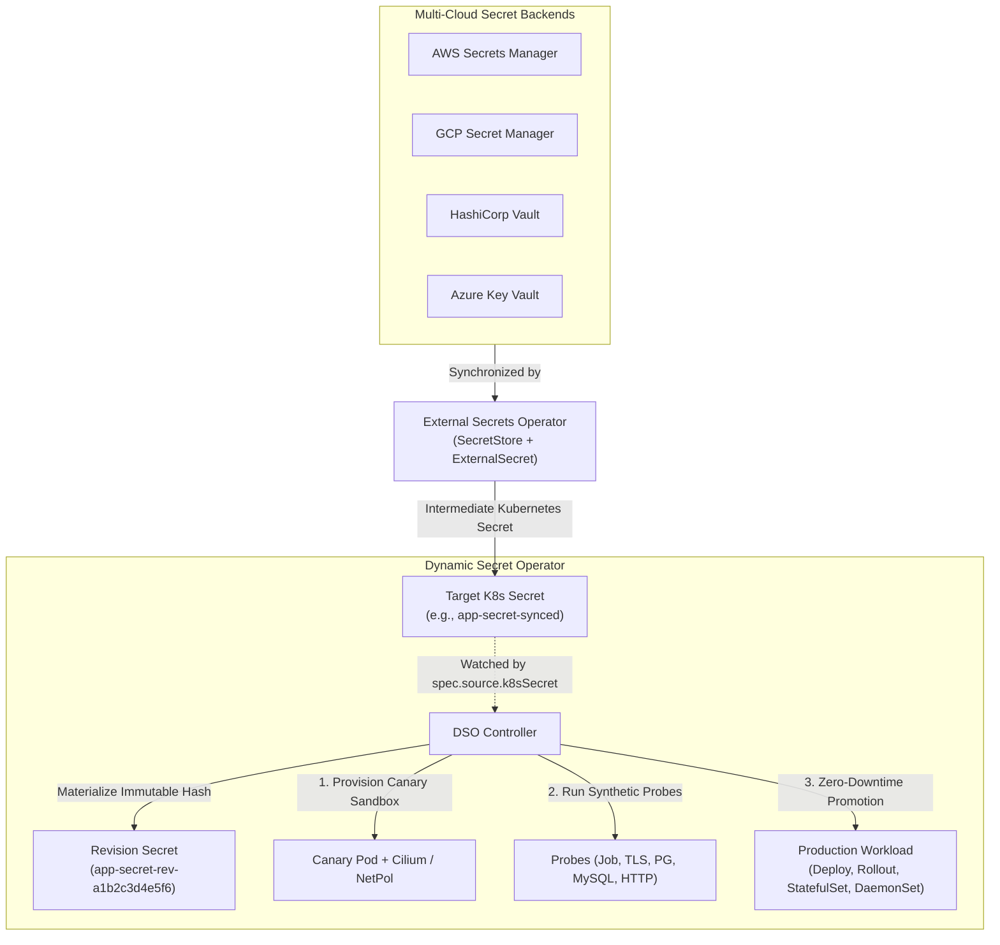

# External Secrets Operator (ESO) + Dynamic Secret Operator (DSO) Suite

This directory contains production-ready examples combining **External Secrets Operator (ESO)** for universal multi-cloud secret ingestion (AWS Secrets Manager, GCP Secret Manager, HashiCorp Vault, Azure Key Vault) with **Dynamic Secret Operator (DSO)** for progressive delivery, synthetic canary validation, and automated rollbacks.

---

## Example Scenarios

| Directory | Target Workload | Probe Strategy | Protocol Tested |
| :--- | :--- | :--- | :--- |
| [`argo-rollouts-blue-green/`](./argo-rollouts-blue-green) | Argo Rollouts (Blue/Green) | HTTP Probe | HTTP Endpoint Validation |
| [`cilium-hubble-observability/`](./cilium-hubble-observability) | Payment Processor + MySQL | Native MySQL Probe + eBPF Cilium Sandbox | L3/L4/L7 Egress & Hubble Flows |
| [`circuit-breaker-rollback/`](./circuit-breaker-rollback) | Production Orders API + Postgres | Native PostgreSQL Probe | Bad Secret Rollback & Production Protection |
| [`fullstack-db-rotation/`](./fullstack-db-rotation) | Fullstack Go Backend + Postgres | Native PostgreSQL Probe | Real DB Query & Connection Pool |
| [`job-based-redis-probe/`](./job-based-redis-probe) | Redis Cache + Consumer | Ephemeral Job Probe (`redis:alpine`) | Redis AUTH & PING |
| [`multi-secret-rotation/`](./multi-secret-rotation) | Microservice with 3 Secrets | Multi-Probe (PG + Job + HTTP) | DB, Cache, and API Gateway Keys |
| [`nginx-color-rotation/`](./nginx-color-rotation) | NGINX Web Application | HTTP Probe | Dynamic UI Configuration |
| [`tls-certificate-rotation/`](./tls-certificate-rotation) | HTTPS Gateway | Native TLS Probe | TLS 1.2/1.3 Handshake & Thumbprint |

---

## Architectural Synergy

