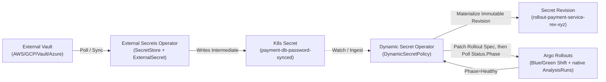

# ESO + Argo Rollouts: Blue/Green Progressive Secret Delivery

This example demonstrates how **Dynamic Secret Operator (DSO)** pairs seamlessly with **External Secrets Operator (ESO)** to drive automated zero-downtime Blue/Green deployments in **Argo Rollouts**.

---

## Architecture Flow



DSO does not provision its own canary sandbox for Rollout targets: patching the Rollout's pod
template is what triggers Argo's own progressive delivery, so DSO instead relies entirely on
Argo's own blue/green strategy (`autoPromotionEnabled` here, or any configured `AnalysisRun`s)
for validation, polling `Rollout.Status.Phase` until it reports `Healthy` before finalizing the
promotion.

---

## Deploying

```bash
chmod +x deploy.sh
./deploy.sh
```
