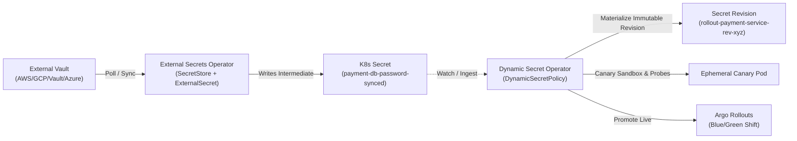

# ESO + Argo Rollouts: Blue/Green Progressive Secret Delivery

This example demonstrates how **Dynamic Secret Operator (DSO)** pairs seamlessly with **External Secrets Operator (ESO)** to drive automated zero-downtime Blue/Green deployments in **Argo Rollouts**.

---

## Architecture Flow



---

## Deploying

```bash
chmod +x deploy.sh
./deploy.sh
```
