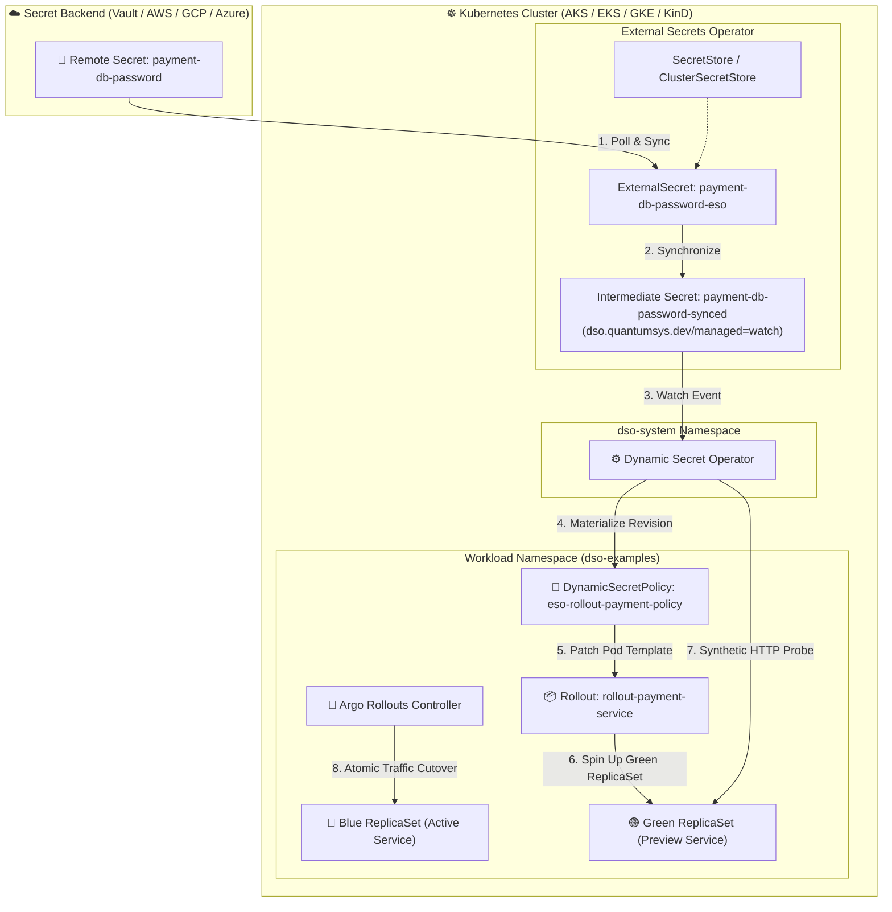

# ESO + Argo Rollouts: Blue/Green Progressive Secret Delivery (Universal Multi-Cloud)

This example demonstrates how **Dynamic Secret Operator (DSO)** pairs seamlessly with **External Secrets Operator (ESO)** to drive automated, zero-downtime Blue/Green deployments in **Argo Rollouts**.

DSO updates the Rollout pod template with the candidate secret revision, triggering Argo Rollout's native Blue/Green engine (`autoPromotionEnabled: true` or `AnalysisRun` gates) and validating preview traffic before atomically shifting production traffic.

---

## 🏗️ Architecture Flow



---

## 💡 How It Works

1. **Decoupled Ingestion:** ESO synchronizes the candidate secret from any vault into `payment-db-password-synced`.
2. **Rollout Spec Mutation:** DSO materializes the immutable secret revision and updates the `Rollout` pod template.
3. **Argo Blue/Green Orchestration:** Argo Rollouts detects the spec change and provisions a new **Green (Preview)** ReplicaSet while keeping the **Blue (Active)** ReplicaSet serving 100% of live traffic.
4. **Validation:** DSO runs configured validation probes (`type: HTTP`) against the service.
5. **Atomic Traffic Shift:** When probes pass and Argo Rollouts reaches `Phase: Healthy`, traffic shifts instantly to Green via `payment-service-active`. The old Blue ReplicaSet is gracefully scaled down after `scaleDownDelaySeconds`.

---

## 🚀 Deployment

### PowerShell (Windows)

```powershell
cd examples\eso\argo-rollouts-blue-green

# Using a ClusterSecretStore (e.g. azure-keyvault-cluster-store, vault-cluster-store):
.\deploy.ps1 -SecretStoreName "azure-keyvault-cluster-store" -SecretStoreKind "ClusterSecretStore"

# Or using a namespaced SecretStore:
.\deploy.ps1 -SecretStoreName "my-vault-store" -SecretStoreKind "SecretStore"
```

### Bash (Linux / macOS / WSL)

```bash
cd examples/eso/argo-rollouts-blue-green
chmod +x deploy.sh

# Using a ClusterSecretStore:
./deploy.sh -s azure-keyvault-cluster-store -k ClusterSecretStore

# Or using a namespaced SecretStore:
./deploy.sh -s my-vault-store -k SecretStore
```

### Configuration Parameters

| Parameter (PowerShell) | Flag (Bash) | Required | Default | Description |
|---|---|---|---|---|
| `-SecretStoreName` (`-s`) | `-s` | **Yes** | — | Name of the `SecretStore` or `ClusterSecretStore` |
| `-SecretStoreKind` (`-k`) | `-k` | **Yes** | — | Kind of store (`ClusterSecretStore` or `SecretStore`) |
| `-RemoteSecretName` (`-r`) | `-r` | No | `payment-db-password` | Remote secret name / key in your secret backend |
| `-Namespace` (`-n`) | `-n` | No | `dso-examples` | Kubernetes namespace for workloads |
| `-ArgoRolloutsVersion` | `-v` | No | `v1.7.2` | Argo Rollouts controller release version |

---

## 🌐 Accessing the Active Payment Service

### Option A: Port-Forward (Immediate)
```bash
kubectl port-forward svc/payment-service-active 8080:80 -n dso-examples
```
Open your browser or test with curl:
```bash
curl http://localhost:8080
```

### Option B: LoadBalancer External IP
```bash
kubectl get svc payment-service-active -n dso-examples -w
```
Once assigned, query `http://<EXTERNAL-IP>`.

---

## 🔍 Step-by-Step Verification & Rotation Guide

### 1. Monitor Argo Rollouts & DSO in Real Time
In separate terminal windows:
```bash
# Watch Argo Rollouts Blue/Green Progression
kubectl argo rollouts get rollout rollout-payment-service -n dso-examples --watch
# (or standard kubectl)
kubectl get pods -n dso-examples -l app=payment-service -w

# Watch DynamicSecretPolicy State Machine
kubectl get dynamicsecretpolicy eso-rollout-payment-policy -n dso-examples -w

# Watch ESO Secret Synchronization
kubectl get externalsecrets -n dso-examples -w
```

### 2. Execute a Safe Blue/Green Rotation

1. **Update secret in your Secret Provider** (Vault / AWS / GCP / Azure Key Vault):
   Set `payment-db-password` to `NewPaymentPassword2026_Rotated!`.

2. **Observe Progressive Blue/Green Shift:**
   - ESO synchronizes `payment-db-password-synced`.
   - DSO materializes the secret revision and updates the Rollout template.
   - Argo Rollouts creates the Green preview ReplicaSet.
   - DSO triggers synthetic HTTP probes against the preview pod.
   - Once validated, Argo Rollouts performs an atomic cutover of active traffic from Blue to Green.
   - The old Blue ReplicaSet is scaled down safely with zero dropped connections!

---

### 3. Test Invalid Secret & Protection

1. **Update secret with an invalid value in your Secret Provider.**
2. **Observe Protection:**
   - ESO synchronizes the intermediate secret.
   - DSO evaluates the candidate revision.
   - If the candidate revision fails probe validation, promotion is aborted!
   - Active traffic remains securely pointed to the healthy Blue ReplicaSet with 100% uptime.
