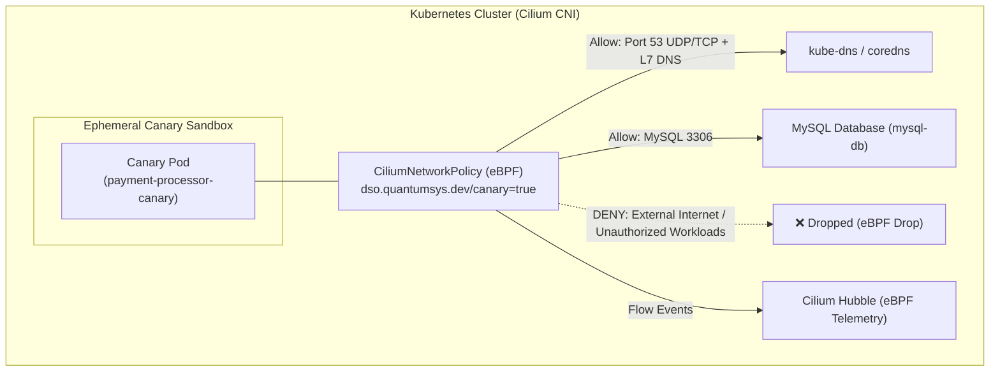

# Cilium eBPF & Hubble Observability PoC

This scenario demonstrates **Dynamic Secret Operator (DSO)** leveraging [Cilium](https://cilium.io/) eBPF network security policies (`cilium.io/v2.CiliumNetworkPolicy`) to create **zero-trust canary sandboxes** with deep L3/L4/L7 flow observability and packet inspection via **Hubble**.

---

## Why Cilium eBPF for Canary Sandboxing?

Standard Kubernetes `NetworkPolicy` operates with basic iptables/IPSet primitives and cannot inspect Layer 7 protocol flows or enforce dynamic FQDN filtering.

When `spec.networkPolicy.provider: Cilium` is enabled in a `DynamicSecretPolicy`, DSO dynamically provisions an eBPF-powered `CiliumNetworkPolicy`:
- **Default-Deny Ingress:** Completely isolates the ephemeral canary from all ingress traffic.
- **Strict Least-Privilege Egress:** Allows egress *strictly* to CoreDNS (port 53 UDP/TCP) with L7 DNS visibility and the explicit probe endpoint IP/CIDR/Port (e.g. MySQL port 3306).
- **Deep Packet Inspection & Flow Logging:** Every network flow generated during synthetic secret validation is streamed directly to Hubble for real-time security telemetry and SIEM ingestion.

---

## Architecture



---

## Deployment & Verification

### 1. Deploy the Manifests

```bash
chmod +x deploy.sh
./deploy.sh
```

---

### 2. Observe Hubble Flow Telemetry

If you have Cilium and the [Hubble CLI](https://docs.cilium.io/en/stable/gettingstarted/hubble_cli/) installed, stream live network flow telemetry:

```bash
hubble observe --namespace dso-cilium-demo --follow
```

---

### 3. Trigger a Secret Rotation

Update the ESO synchronized secret:

```bash
kubectl patch secret eso-synced-payment-db-pass -n dso-cilium-demo \
  -p '{"stringData":{"password":"demo-mysql-root-password-123"}}'
```

---

### 4. Inspect the Generated CiliumNetworkPolicy

While the canary is validating, inspect the dynamic `CiliumNetworkPolicy` generated by DSO:

```bash
kubectl get ciliumnetworkpolicies -n dso-cilium-demo
kubectl describe ciliumnetworkpolicy payment-processor-canary-cilium-netpol -n dso-cilium-demo
```

Notice:
- `toEndpoints` restricts DNS traffic to pods matching `k8s:k8s-app In [kube-dns, coredns]` with L7 DNS rules.
- `toPorts` restricts egress strictly to port 3306 TCP.
- All other cluster egress and external internet connections are immediately dropped at the Linux kernel level via eBPF.
