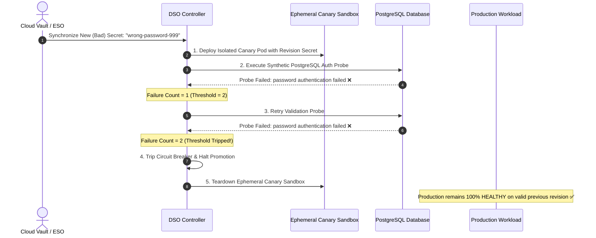

# Circuit Breaker & Automated Rollback PoC

This scenario demonstrates how **Dynamic Secret Operator (DSO)** protects production workloads from invalid, corrupt, or misconfigured secret rotations using **Synthetic Validation Probes**, **Automated Sandbox Canary Isolation**, and **Deterministic Circuit Breaking**.

---

## The Problem

When a developer or automated process updates a database secret in a cloud vault (AWS Secrets Manager, Azure Key Vault, HashiCorp Vault, GCP Secret Manager) with an incorrect password:
1. Conventional tools (e.g. Reloader, Stakater) immediately trigger a rolling restart of all production pods.
2. The new pods fail authentication against the database and crash (`CrashLoopBackOff`).
3. Production goes completely dark until human intervention occurs.

---

## How DSO Solves It



---

## Quickstart & Verification

### 1. Deploy the Demo Environment

```bash
chmod +x deploy.sh
./deploy.sh
```

Inspect the initial healthy status:

```bash
kubectl get dynamicsecretpolicies -n dso-circuit-breaker-demo
```

---

### 2. Simulate a Bad Secret Rotation

Update the ESO-synchronized secret with an **invalid database password**:

```bash
kubectl patch secret eso-synced-orders-db-pass -n dso-circuit-breaker-demo \
  -p '{"stringData":{"password":"corrupted-wrong-password-999"}}'
```

---

### 3. Observe the Circuit Breaker in Action

Watch the policy state in real-time:

```bash
kubectl get dynamicsecretpolicy orders-api-policy -n dso-circuit-breaker-demo -w
```

**What happens:**
1. DSO ingests the new secret version and provisions an ephemeral canary pod.
2. The PostgreSQL validation probe attempts to authenticate against `postgres-db:5432/orders`.
3. The probe fails authentication.
4. After hitting `consecutiveFailureThreshold: 2`, the policy state transitions to `CircuitBreakerTripped`.
5. The ephemeral canary pod and network sandbox are cleanly destroyed.
6. **Zero Impact on Production:** Check the production `orders-api` deployment:

```bash
kubectl get pods -l app=orders-api -n dso-circuit-breaker-demo
```

All production pods remain 100% healthy, serving traffic on the previous valid revision without downtime or restart loops!

---

### 4. Recovery & Healing

Patch the secret with the **correct database password**:

```bash
kubectl patch secret eso-synced-orders-db-pass -n dso-circuit-breaker-demo \
  -p '{"stringData":{"password":"valid-production-password-123"}}'
```

DSO automatically detects the new revision hash, resets the circuit breaker counters, executes the validation probe, verifies successful authentication, and completes promotion smoothly.
