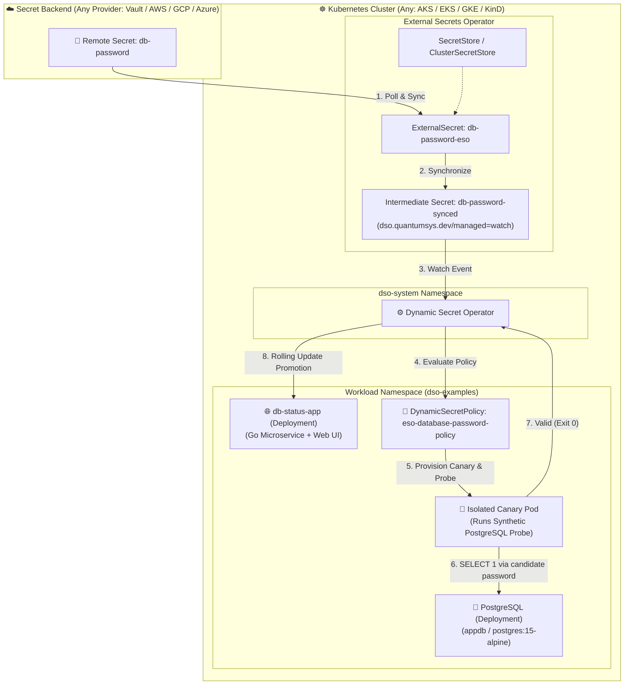

# ESO + Fullstack Database Password Rotation PoC (Universal Multi-Cloud)

This demonstration showcases **zero-downtime PostgreSQL database password rotation** using **External Secrets Operator (ESO)** for multi-cloud vault ingestion and **Dynamic Secret Operator (DSO)** for progressive canary delivery and synthetic database health probing.

A live Go web dashboard continuously queries PostgreSQL every 2 seconds, displaying real-time connection status, server timestamp, query latency in milliseconds, and the active credential hint. When secrets rotate, DSO validates candidate credentials with a synthetic PostgreSQL probe prior to performing a zero-downtime rolling update.

---

## 🏗️ Architecture Overview



---

## 💡 How It Works

1. **Secret Synchronization:** ESO continuously polls your secret store and synchronizes the secret into `db-password-synced`.
2. **Detection:** DSO detects updates via the label `dso.quantumsys.dev/managed: "watch"`.
3. **Canary & Native Database Probe:** DSO spins up an isolated canary pod and executes a synthetic query against PostgreSQL (`postgres.dso-examples.svc.cluster.local:5432/appdb`).
4. **Autonomous Promotion or Circuit Breaker:**
   - **Pass:** DSO performs a rolling update of `db-status-app` with zero dropped queries.
   - **Fail:** DSO rejects the candidate secret, logs the failure condition, and trips the circuit breaker to prevent application downtime.
5. **Real-Time UI:** The web dashboard displays live connection status and latency updates every 2 seconds without requiring manual browser reloads.

---

## 🚀 Deployment

### PowerShell (Windows)

```powershell
cd examples\eso\fullstack-db-rotation

# Using a ClusterSecretStore (e.g. azure-keyvault-cluster-store, vault-cluster-store):
.\deploy.ps1 -SecretStoreName "azure-keyvault-cluster-store" -SecretStoreKind "ClusterSecretStore"

# Or using a namespaced SecretStore:
.\deploy.ps1 -SecretStoreName "my-db-store" -SecretStoreKind "SecretStore"
```

### Bash (Linux / macOS / WSL)

```bash
cd examples/eso/fullstack-db-rotation
chmod +x deploy.sh

# Using a ClusterSecretStore:
./deploy.sh -s azure-keyvault-cluster-store -k ClusterSecretStore

# Or using a namespaced SecretStore:
./deploy.sh -s my-db-store -k SecretStore
```

### Configuration Parameters

| Parameter (PowerShell) | Flag (Bash) | Required | Default | Description |
|---|---|---|---|---|
| `-SecretStoreName` (`-s`) | `-s` | **Yes** | — | Name of the `SecretStore` or `ClusterSecretStore` |
| `-SecretStoreKind` (`-k`) | `-k` | **Yes** | — | Kind of store (`ClusterSecretStore` or `SecretStore`) |
| `-RemoteSecretName` (`-r`) | `-r` | No | `db-password` | Remote secret name / key in your secret backend |
| `-Namespace` (`-n`) | `-n` | No | `dso-examples` | Kubernetes namespace for workloads |

---

## 🌐 Viewing the Live Dashboard

### Option A: Port-Forward (Immediate)
```bash
kubectl port-forward svc/db-status-app 8080:80 -n dso-examples
```
Open your browser at [http://localhost:8080](http://localhost:8080) to access the live connection dashboard.

### Option B: LoadBalancer External IP
```bash
kubectl get svc db-status-app -n dso-examples -w
```
Once assigned, open `http://<EXTERNAL-IP>` in your browser.

---

## 🔍 Step-by-Step Verification & Rotation Guide

### 1. Monitor Policy State and Rollouts
In separate terminal windows:
```bash
# Watch DynamicSecretPolicy state machine
kubectl get dynamicsecretpolicy eso-database-password-policy -n dso-examples -w

# Watch Pod Rollout
kubectl get pods -n dso-examples -l app=db-status-app -w

# Watch ESO Secret Synchronization
kubectl get externalsecrets -n dso-examples -w
```

### 2. Execute a Valid Database Password Rotation

1. **Update the user password directly inside PostgreSQL** (simulating DBA or Cloud rotation engine):
   ```bash
   kubectl exec deployment/postgres -n dso-examples -- psql -U postgres -d appdb -c "ALTER USER postgres WITH PASSWORD 'NewSecret2026_Rotated!';"
   ```

2. **Update the secret in your Secret Provider** (Vault / AWS / GCP / Azure Key Vault):
   Set `db-password` to `NewSecret2026_Rotated!`.

3. **Observe Zero-Downtime Autonomous Promotion:**
   - ESO synchronizes `db-password-synced` within its refresh interval (15s).
   - DSO detects the revision and triggers an isolated Canary pod.
   - DSO executes native PostgreSQL validation probe (`SELECT 1`).
   - Upon validation success, DSO safely rolls out `db-status-app`.
   - The live web dashboard reflects the new password hint seamlessly with **ZERO connection errors**!

---

### 3. Test Invalid Secret & Circuit Breaker Protection

1. **Update the secret in your Secret Provider with an invalid password** (e.g. `WrongPassword999!`) **WITHOUT** updating PostgreSQL.
2. **Observe Protection:**
   - ESO synchronizes the intermediate secret.
   - DSO launches the Canary and executes the PostgreSQL probe.
   - The probe fails authentication (`pq: password authentication failed for user "postgres"`).
   - DSO aborts the rollout, surfaces the failure condition, and increments the circuit breaker count.
   - The production dashboard remains untouched and connected with 100% uptime.
