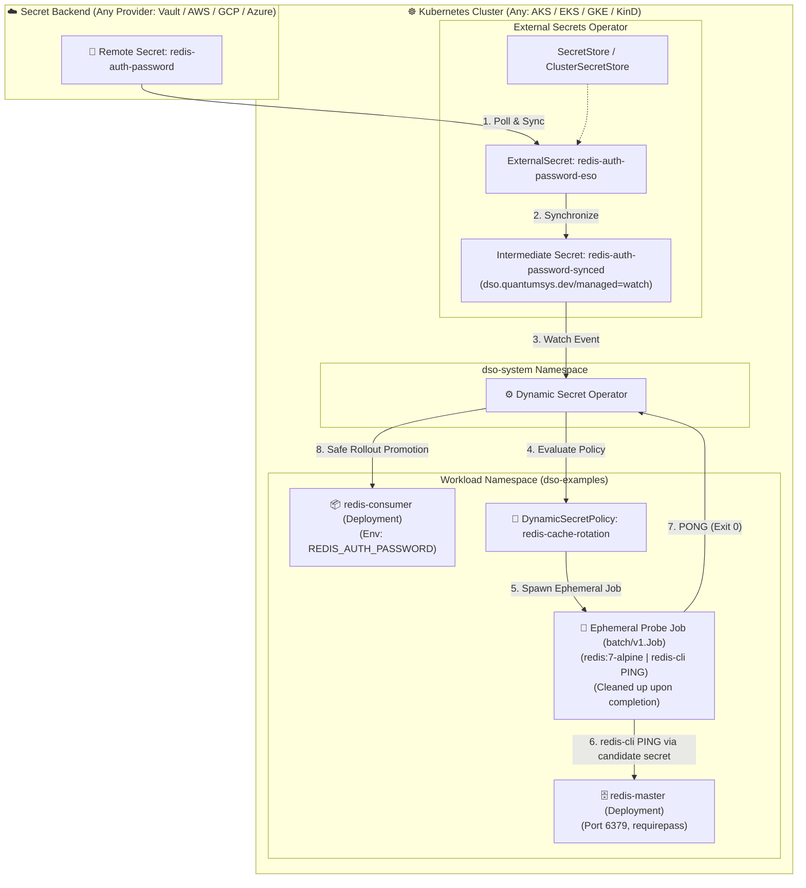

# ESO + Job-Based Redis Probe Validation (Universal Multi-Cloud)

This demonstration showcases **zero-downtime Redis AUTH password rotation** using **External Secrets Operator (ESO)** for cross-cloud secret synchronization and **Dynamic Secret Operator (DSO)** with an extensible **Job-based validation probe** (`type: Job`).

Instead of a hardcoded driver in the operator binary, DSO spins up an ephemeral `redis:7-alpine` Kubernetes **batch/v1.Job** in the namespace to validate candidate credentials via `redis-cli PING` prior to promoting the production consumer workload.

---

## 🏗️ Architecture Overview



---

## 💡 How It Works

1. **Secret Synchronization:** ESO continuously watches your secret store and synchronizes the candidate password into `redis-auth-password-synced`.
2. **Detection:** DSO detects the update through the label `dso.quantumsys.dev/managed: "watch"`.
3. **Ephemeral Job Probe:** DSO creates an ephemeral `batch/v1.Job` using `redis:7-alpine`. The candidate secret is injected into the container, and `redis-cli PING` executes against the Redis master service.
4. **Autonomous Promotion or Circuit Breaker:**
   - **Pass (`PONG`):** DSO performs a rolling update of `redis-consumer` with zero dropped connections.
   - **Fail:** DSO rejects the candidate secret, logs the failure condition, and trips the circuit breaker to prevent downtime.
5. **Garbage Collection:** The probe Job is automatically deleted upon completion.

---

## 🚀 Deployment

### PowerShell (Windows)

```powershell
cd examples\eso\job-based-redis-probe

# Using a ClusterSecretStore (e.g. azure-keyvault-cluster-store, vault-cluster-store):
.\deploy.ps1 -SecretStoreName "azure-keyvault-cluster-store" -SecretStoreKind "ClusterSecretStore"

# Or using a namespaced SecretStore:
.\deploy.ps1 -SecretStoreName "my-vault-store" -SecretStoreKind "SecretStore"
```

### Bash (Linux / macOS / WSL)

```bash
cd examples/eso/job-based-redis-probe
chmod +x deploy.sh

# Using a ClusterSecretStore:
./deploy.sh -s azure-keyvault-cluster-store -k ClusterSecretStore

# Or using a namespaced SecretStore:
./deploy.sh -s my-vault-store -k SecretStore
```

### Configuration Parameters

| Parameter (PowerShell) | Flag (Bash) | Required | Default | Description |
|---|---|---|---|---|
| `-SecretStoreName` (`-s`) | `-s` | **Yes** | — | Name of the `SecretStore` or `ClusterSecretStore` |
| `-SecretStoreKind` (`-k`) | `-k` | **Yes** | — | Kind of store (`ClusterSecretStore` or `SecretStore`) |
| `-RemoteSecretName` (`-r`) | `-r` | No | `redis-auth-password` | Remote secret name / key in your secret backend |
| `-Namespace` (`-n`) | `-n` | No | `dso-examples` | Kubernetes namespace for workloads |

---

## 🔍 Step-by-Step Verification & Rotation Guide

### 1. Monitor Consumer Heartbeats
In a dedicated terminal, watch the consumer querying Redis master every 15 seconds:
```bash
kubectl logs -l app=redis-consumer -n dso-examples -f
```
You should see steady heartbeat output:
```
2026-09-11T21:30:00Z: redis-ping=PONG
```

### 2. Watch Ephemeral Probe Jobs & Policy State
In separate terminal windows:
```bash
# Watch ephemeral Job probe creation and cleanup
kubectl get jobs -n dso-examples -w

# Watch DynamicSecretPolicy state machine
kubectl get dynamicsecretpolicy redis-cache-rotation -n dso-examples -w
```

### 3. Execute a Valid Password Rotation

1. **Update the live password in Redis Master:**
   ```bash
   kubectl exec deployment/redis-master -n dso-examples -- redis-cli -a InitialRedisPassword123! --no-auth-warning CONFIG SET requirepass "RotatedRedisPassword456!"
   ```

2. **Update the secret in your Secret Provider (Vault / AWS / GCP / Azure Key Vault):**
   Set `redis-auth-password` to `RotatedRedisPassword456!`.

3. **Observe Autonomous Probe Validation:**
   - ESO synchronizes `redis-auth-password-synced`.
   - DSO detects the revision and triggers an ephemeral Job probe.
   - The probe executes `redis-cli PING` against `redis-master`.
   - Upon receiving `PONG`, DSO safely triggers a zero-downtime rolling update of `redis-consumer`.
   - Consumer logs reflect uninterrupted `redis-ping=PONG` responses!

---

### 4. Test Invalid Secret & Circuit Breaker Protection

1. **Update the secret in your Secret Provider with an invalid password** (e.g. `BadPassword999!`).
2. **Observe Protection:**
   - ESO synchronizes the intermediate secret.
   - DSO creates the ephemeral validation Job probe.
   - The probe fails authentication against Redis master (`(error) WRONGPASS`) and exits with code 1.
   - DSO aborts the rollout, surfaces the failure condition, and increments the circuit breaker count.
   - The production consumer remains untouched and online with the active working credentials.
