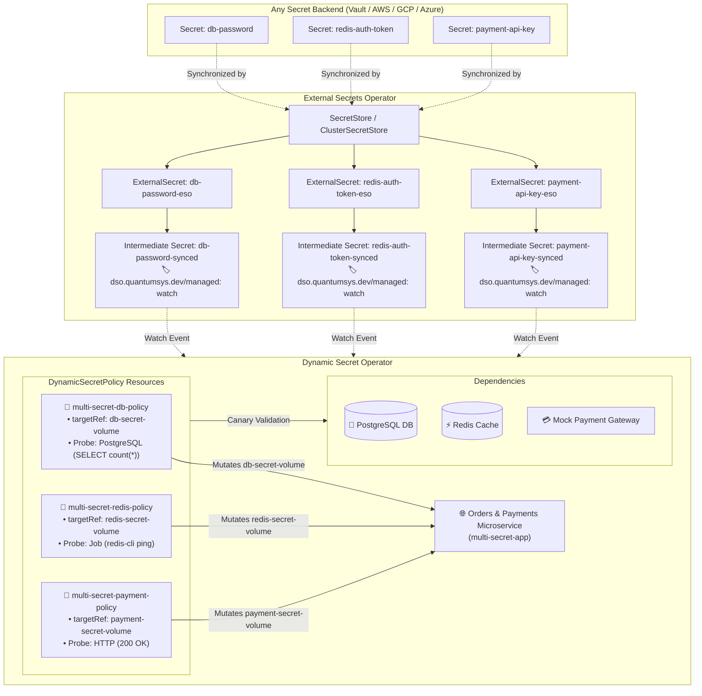

# ESO Multi-Secret Progressive Canary Rotation Example

This universal multi-cloud demonstration showcases real-time rotation of **multiple independent secrets** (PostgreSQL, Redis, and Payment API Gateway Key) driven by **External Secrets Operator (ESO)** and safely validated with zero downtime via **Dynamic Secret Operator (DSO)** across any Kubernetes cluster and secret provider (HashiCorp Vault, AWS Secrets Manager, GCP Secret Manager, Azure Key Vault, etc.).

---

## 🏗️ Architecture



---

## 💡 How Multi-Secret Rotation Works with ESO

In decoupled architectures, ESO handles synchronization from the external secret provider into intermediate Kubernetes secrets, while DSO observes changes and manages zero-downtime canary validation and progressive promotion:

| Secret | Intermediate K8s Secret | Volume Mount | Validation Probe Type | Probe Target |
| :--- | :--- | :--- | :--- | :--- |
| **Database Password** | `db-password-synced` | `/mnt/secrets/db` | `PostgreSQL` | `postgres:5432/appdb` |
| **Cache Token** | `redis-auth-token-synced` | `/mnt/secrets/redis` | `Job` (ephemeral) | `redis:6379` |
| **Payment API Key** | `payment-api-key-synced` | `/mnt/secrets/payment` | `HTTP` | `payment-gateway:8080/v1/health` |

### 🎯 Key Advantages
1. **Zero Cloud IAM Credentials in DSO**: DSO runs in decoupled mode (`--set mode=eso`), requiring zero cloud credentials. ESO connects to your chosen vault.
2. **Target Volume Isolation**: Rotating `db-password` mutates only `db-secret-volume`, leaving Redis and payment credentials completely untouched.
3. **Dedicated Validation Probes**: Each secret is validated using its native protocol before production workloads receive it.
4. **Independent Rollbacks & Circuit Breakers**: If an invalid secret is synced, only that specific subsystem's rollout is rejected. Other services remain fully operational.

---

## 🚀 Deployment

### Prerequisites
- Kubernetes cluster connected via `kubectl`
- External Secrets Operator (ESO) installed
- Dynamic Secret Operator (DSO) installed (in `dso-system` namespace)
- A configured `SecretStore` or `ClusterSecretStore` pointing to your secret backend

### PowerShell (Windows)
```powershell
cd examples\eso\multi-secret-rotation

# Using a namespaced SecretStore:
.\deploy.ps1 -SecretStoreName "<SECRET_STORE_NAME>" -SecretStoreKind "SecretStore"

# Or using a cluster-wide ClusterSecretStore:
.\deploy.ps1 -SecretStoreName "<CLUSTER_SECRET_STORE_NAME>" -SecretStoreKind "ClusterSecretStore"
```

### Bash (Linux / macOS)
```bash
cd examples/eso/multi-secret-rotation
chmod +x deploy.sh

# Using a namespaced SecretStore:
./deploy.sh -s <SECRET_STORE_NAME> -k SecretStore

# Or using a cluster-wide ClusterSecretStore:
./deploy.sh -s <CLUSTER_SECRET_STORE_NAME> -k ClusterSecretStore
```

### Configuration Parameters
| Parameter (PowerShell) | Flag (Bash) | Required | Default | Description |
|---|---|---|---|---|
| `-SecretStoreName` (`-s`) | `-s` | **Yes** | — | Name of the SecretStore or ClusterSecretStore |
| `-SecretStoreKind` (`-k`) | `-k` | **Yes** | — | Kind of store reference (`SecretStore` or `ClusterSecretStore`) |
| `-Namespace` (`-n`) | `-n` | No | `dso-examples` | Kubernetes namespace to deploy workloads into |
| `-RemoteDbSecretName` (`-dbSecret`) | `-d` | No | `db-password` | Secret key name in your remote vault for PostgreSQL |
| `-RemoteRedisSecretName` (`-redisSecret`) | `-r` | No | `redis-auth-token` | Secret key name in your remote vault for Redis |
| `-RemotePaymentSecretName` (`-paymentSecret`) | `-p` | No | `payment-api-key` | Secret key name in your remote vault for Payment API |

---

## 📊 Viewing the Live Application

### Option A: Port-Forward (Immediate)
```bash
kubectl port-forward svc/multi-secret-app 8080:80 -n dso-examples
```
Open your browser at [http://localhost:8080](http://localhost:8080).

### Option B: LoadBalancer External IP
```bash
kubectl get svc multi-secret-app -n dso-examples -w
```

---

## 🔄 External Secrets & Safe Rotation Walkthrough

### 1. Create Initial Secrets in your Secret Provider
Ensure your remote vault contains the 3 secrets referenced by the ExternalSecrets:
- `db-password`: `InitialPsqlPass123!`
- `redis-auth-token`: `InitialRedisToken456!`
- `payment-api-key`: `sk_live_pay_9876543210`

### 2. Monitor ExternalSecrets & DynamicSecretPolicies
```bash
# Watch ESO synchronization
kubectl get externalsecrets -n dso-examples -w

# Watch DSO canary validation and progressive promotion
kubectl get dynamicsecretpolicies -n dso-examples -w
kubectl get pods -n dso-examples -w
```

---

### 3. Test Independent Secret Rotations

#### A. Rotate PostgreSQL Database Password
1. Update Postgres user password in cluster:
   ```bash
   kubectl exec deployment/postgres -n dso-examples -- psql -U postgres -d appdb -c "ALTER USER postgres WITH PASSWORD 'NewRotatedPsqlPass999!';"
   ```
2. Update `db-password` in your remote secret provider to `NewRotatedPsqlPass999!`.
3. ESO syncs `db-password-synced`, DSO runs the PostgreSQL validation probe on the canary, and safely updates `db-secret-volume` with zero downtime.

#### B. Rotate Redis Auth Token
1. Update Redis password in cluster:
   ```bash
   kubectl exec deployment/redis -n dso-examples -- redis-cli -a InitialRedisToken456! CONFIG SET requirepass "NewRotatedRedisToken888!"
   ```
2. Update `redis-auth-token` in your remote secret provider to `NewRotatedRedisToken888!`.
3. ESO syncs `redis-auth-token-synced`, DSO triggers a batch `Job` probe (`redis-cli ping`), and updates `redis-secret-volume`.

#### C. Rotate Payment API Gateway Key
1. Update `payment-api-key` in your remote secret provider to `sk_live_pay_new_777777`.
2. ESO syncs `payment-api-key-synced`, DSO runs the HTTP health probe, and promotes `payment-secret-volume`.

---

### 4. Test Circuit Breaker Protection (Invalid Secret)
Update `payment-api-key` in your remote secret provider with an invalid value.
1. ESO syncs the secret to `payment-api-key-synced`.
2. DSO creates a canary pod and executes the HTTP probe.
3. The probe fails. DSO trips the circuit breaker and rejects the promotion.
4. The production microservice continues running on the last known valid secret without dropping any requests!
