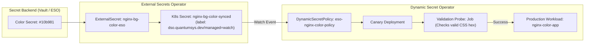

# ESO + NGINX Dynamic Color Rotation Example

This visual demonstration showcases real-time web application configuration changes (background color rotation) driven by **External Secrets Operator (ESO)** and safely validated with zero downtime via **Dynamic Secret Operator (DSO)**.

---

## Architecture Overview



---

## Deployment

### PowerShell (Windows)
```powershell
cd examples\eso\nginx-color-rotation

# Using a ClusterSecretStore:
.\deploy.ps1 -SecretStoreName "<CLUSTER_SECRET_STORE_NAME>" -SecretStoreKind "ClusterSecretStore"

# Or using a namespaced SecretStore:
.\deploy.ps1 -SecretStoreName "<SECRET_STORE_NAME>" -SecretStoreKind "SecretStore"
```

### Bash (Linux / macOS)
```bash
cd examples/eso/nginx-color-rotation
chmod +x deploy.sh

# Using a ClusterSecretStore:
./deploy.sh -s <CLUSTER_SECRET_STORE_NAME> -k ClusterSecretStore

# Or using a namespaced SecretStore:
./deploy.sh -s <SECRET_STORE_NAME> -k SecretStore
```

### Configuration Parameters
| Parameter (PowerShell) | Flag (Bash) | Required | Default | Description |
|---|---|---|---|---|
| `-SecretStoreName` (`-s`) | `-s` | **Yes** | — | Name of the SecretStore or ClusterSecretStore referenced by the ExternalSecret |
| `-SecretStoreKind` (`-k`) | `-k` | **Yes** | — | Kind of store reference (`ClusterSecretStore` or `SecretStore`) |
| `-RemoteSecretName` (`-r`) | `-r` | No | `nginx-bg-color` | Name / key of the secret in the remote secret backend |
| `-Namespace` (`-n`) | `-n` | No | `dso-examples` | Kubernetes namespace to deploy workloads into |

---

## Viewing the Live Application

### Option A: Port-Forward (Immediate)
```bash
kubectl port-forward svc/nginx-color-app 8080:80 -n dso-examples
```
Open your browser at [http://localhost:8080](http://localhost:8080) to view the rendered page displaying the active background color.

### Option B: LoadBalancer External IP
```bash
kubectl get svc nginx-color-app -n dso-examples -w
```

---

## Testing Live Color Rotations via Secret Provider

### 1. Initial Secret Creation & Polling
Create secret `nginx-bg-color` with an initial CSS hex color (e.g. `#3b82f6` - Blue) in your secret provider.

Wait for ESO to poll (refresh interval is 15s) and sync it to Kubernetes:
```bash
kubectl get externalsecret nginx-bg-color-eso -n dso-examples -w
```
Once `STATUS` is `SecretSynced` and `READY` is `True`, open [http://localhost:8080](http://localhost:8080) to confirm the initial Blue `#3b82f6` background.

---

### 2. Valid Canary Rotation (Emerald Green `#10b981`)
Update secret `nginx-bg-color` in your secret provider to a new CSS hex color (e.g. `#10b981` - Emerald Green).

Watch ESO poll the change and DSO validate the canary:
```bash
kubectl get dynamicsecretpolicy eso-nginx-color-policy -n dso-examples -w
kubectl get pods -n dso-examples -w
```
Refresh [http://localhost:8080](http://localhost:8080) — the background color transitions seamlessly to Green without dropping any HTTP requests!

---

### 3. Invalid Color & Circuit Breaker Test
Update secret `nginx-bg-color` in your secret provider with an invalid CSS color string (e.g. `invalid-color`).

ESO will sync the secret, and DSO will run the Job validation probe:
```bash
kubectl get dynamicsecretpolicy eso-nginx-color-policy -n dso-examples -w
kubectl get jobs -n dso-examples -w
```
The Job probe will fail the validation check (`FATAL: 'invalid-color' is not a valid CSS hex color!`), DSO will reject the canary, trip the Circuit Breaker, and preserve the healthy production workload.
Refresh [http://localhost:8080](http://localhost:8080) — the production application remains online and running smoothly on `#10b981`.
