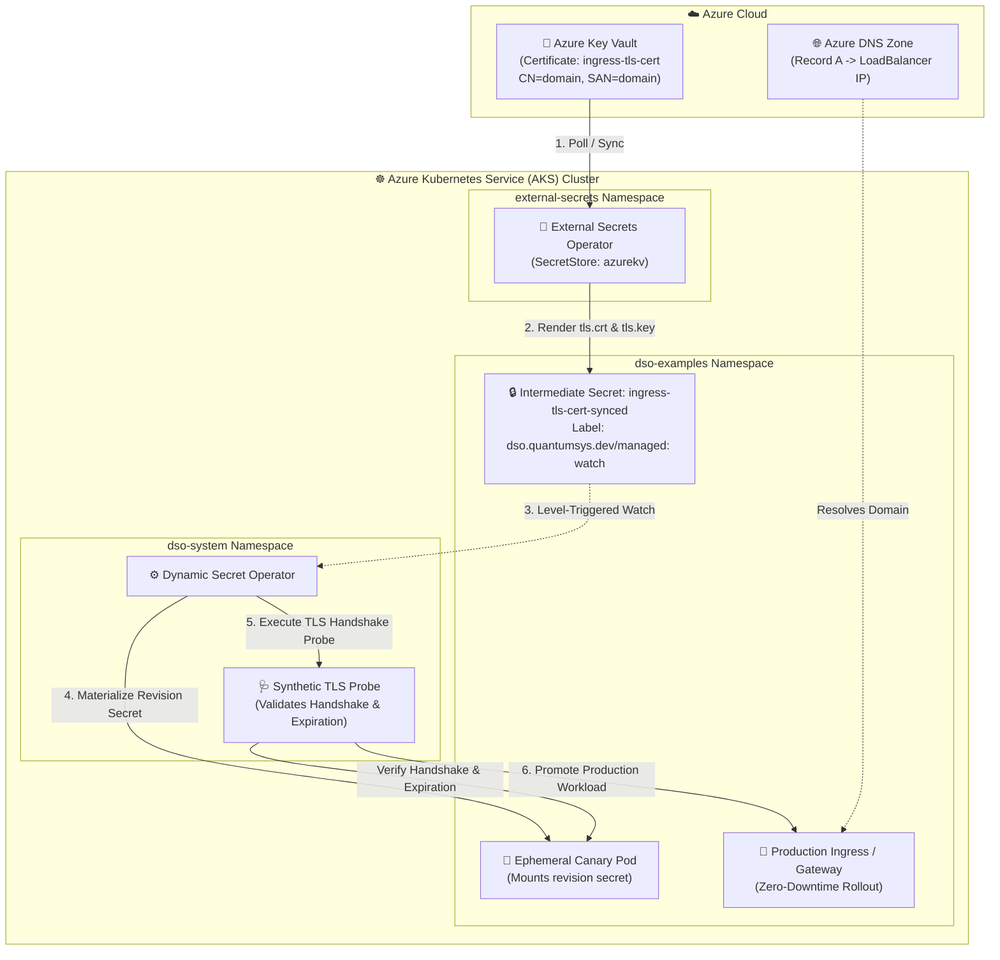

# ESO + DSO: Automated TLS Certificate Rotation with Azure DNS & Circuit Breaker

This enterprise scenario demonstrates universal multi-cloud **TLS Certificate Rotation** using **External Secrets Operator (ESO)** for Azure Key Vault synchronization combined with **Dynamic Secret Operator (DSO)** for progressive canary validation, synthetic TLS handshakes, and deterministic circuit breaking.

---

## 🏗️ Architecture: Decoupled Multi-Cloud Rotation



---

## 💡 Key Architectural Benefits

1. **Zero Cloud IAM Credentials in DSO:** DSO requires zero cloud credentials; it operates entirely against Kubernetes secrets. ESO handles external Azure Key Vault authentication via **Azure Workload Identity**.
2. **Azure DNS Integration:** Automatically provisions the Azure DNS Zone for your domain and configures the `A` record pointing to the public AKS LoadBalancer IP.
3. **Synthetic Validation:** An isolated ephemeral canary pod is spun up before production workloads are touched. DSO verifies TLS handshakes, validity period, and leaf certificate thumbprints against the canary.
4. **Deterministic Circuit Breaking:** If an expired, corrupted, or mismatched certificate is synced from Key Vault, the canary fails the TLS validation probe. After reaching the consecutive failure threshold (3), the **Circuit Breaker trips**, cleanly destroys the canary sandbox, and prevents corrupted certificates from ever reaching production.

---

## 🛠️ Prerequisites

- External Secrets Operator installed in your cluster (`helm install external-secrets external-secrets/external-secrets -n external-secrets --create-namespace`).
- Dynamic Secret Operator installed in ESO mode (`helm install dso ... --set mode=eso`).
- Azure CLI (`az`) logged in (`az login`).
- `kubectl` authenticated to your AKS cluster (`az aks get-credentials --resource-group <RG> --name <CLUSTER_NAME>`).

---

## 🚀 Step 1: Deploy with Custom Domain

Execute the deployment script providing your custom domain and Key Vault name:

### PowerShell (Windows):
```powershell
.\deploy.ps1 -Domain "myapp.contoso.com" -KeyVaultName "kv-dso-dev-jc"
```

### Bash (Linux / WSL / macOS):
```bash
chmod +x deploy.sh rotate-cert.sh simulate-invalid-cert.sh
./deploy.sh -d "myapp.contoso.com" -k "kv-dso-dev-jc"
```

**What the deployment script does:**
1. Resolves Azure Key Vault and the target Resource Group.
2. Creates the **Azure DNS Zone** for `myapp.contoso.com` if it does not already exist.
3. Generates the certificate in Azure Key Vault with `CN=myapp.contoso.com` and SAN `myapp.contoso.com`.
4. Establishes Azure Workload Identity federation for ESO ServiceAccount `eso-azure-sa`.
5. Creates the bootstrap TLS secret and applies the `DynamicSecretPolicy` CRD.
6. Applies the ESO `SecretStore` (provider: `azurekv`), `ExternalSecret` with `filterPEM`, Nginx Deployment, Service, and `DynamicSecretPolicy`.
7. Waits for the LoadBalancer Public IP and registers the `@` `A` record in Azure DNS.

---

## 🔍 Step 2: Test HTTPS Endpoint

### Using your Domain:
```bash
curl -kv https://myapp.contoso.com:8443
```
*(If external DNS propagation is pending, test with `--resolve`:)*
```bash
curl -kv --resolve "myapp.contoso.com:8443:<LOADBALANCER-IP>" https://myapp.contoso.com:8443
```

### Local Fallback via Port-Forward:
```bash
kubectl port-forward svc/tls-gateway 8443:8443 -n dso-examples
curl -kv --resolve "myapp.contoso.com:8443:127.0.0.1" https://myapp.contoso.com:8443
```

Expected response:
```json
{"status":"ok","tls":"active","domain":"myapp.contoso.com","mode":"eso","message":"Secure TLS gateway running with ESO + DSO managed certificate"}
```

---

## 🔄 Step 3: Test VALID Certificate Rotation (Canary Rollout)

Trigger a legitimate certificate rotation in Azure Key Vault:

### PowerShell:
```powershell
.\rotate-cert.ps1 -Domain "myapp.contoso.com" -KeyVaultName "kv-dso-dev-jc"
```

### Bash:
```bash
./rotate-cert.sh -d "myapp.contoso.com" -k "kv-dso-dev-jc"
```

**Observed behavior:**
1. Azure Key Vault generates a new certificate version.
2. ESO detects the update, pulls the certificate, partitions `tls.crt` and `tls.key` via `filterPEM`, and updates `ingress-tls-cert-synced`.
3. DSO detects the change via label `dso.quantumsys.dev/managed: watch` and creates canary pod `tls-gateway-canary`.
4. DSO executes the synthetic TLS handshake probe against the canary.
5. Succeeded! Canary is cleaned up and production `tls-gateway` is promoted with zero downtime.

---

## ⚡ Step 4: Test INVALID Certificate Rotation (Circuit Breaker)

Simulate a corrupted or expired certificate update to verify circuit breaker protection:

### PowerShell:
```powershell
.\simulate-invalid-cert.ps1 -Domain "myapp.contoso.com" -KeyVaultName "kv-dso-dev-jc"
```

### Bash:
```bash
./simulate-invalid-cert.sh -d "myapp.contoso.com" -k "kv-dso-dev-jc"
```

**Observed behavior:**
1. An expired or mismatched certificate bundle is set in Azure Key Vault.
2. ESO synchronizes the update to Kubernetes Secret `ingress-tls-cert-synced`.
3. DSO ingests the secret and deploys an ephemeral canary pod.
4. The synthetic TLS probe fails (expiration or container crash).
5. Consecutive failures reach the threshold (3), triggering **Circuit Breaker**:
   ```
   Conditions:
     Type:    CircuitBreakerTripped
     Status:  True
     Reason:  ValidationThresholdExceeded
   ```
6. Ephemeral canary resources are cleanly deleted.
7. **Zero Impact on Production:** Check production pods:
   ```bash
   kubectl get pods -l app=tls-gateway -n dso-examples
   ```
   All production pods remain 100% healthy, continuously serving traffic on the previous valid revision!

---

## 🩹 Step 5: Heal & Recover

To heal the policy and restore automatic rotation, run the valid rotation script again:

```powershell
.\rotate-cert.ps1 -Domain "myapp.contoso.com" -KeyVaultName "kv-dso-dev-jc"
```

DSO detects the valid certificate revision, resets the consecutive failure counters, verifies the canary handshake, and promotes the workload smoothly.
