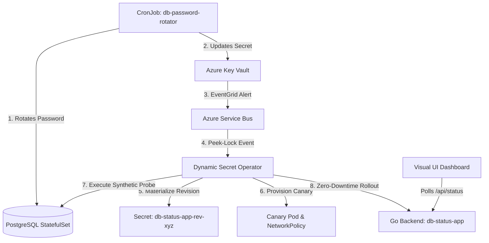

# Full-Stack Database Auto-Rotation Example (PostgreSQL + Go + DSO)

This Proof of Concept demonstrates an end-to-end, production-like scenario where a **PostgreSQL database password rotates every 5 minutes**, and the **Dynamic Secret Operator (DSO)** safely coordinates zero-downtime credential updates across a Go microservice.

---

## 🏛️ Architecture Overview



### Key Workflow Highlights
1. **Automated Rotation (Every 5 min):** A Kubernetes `CronJob` generates a new random password, updates the PostgreSQL database user, and synchronizes the value to Azure Key Vault.
2. **Instant Operator Trigger:** Azure EventGrid delivers the rotation event to Azure Service Bus.
3. **Canary Validation (`Postgres` Synthetic Probe):** Before mutating the live application, DSO spins up an isolated Canary pod and executes a real `SELECT 1;` query against the database using the new credentials.
4. **Zero-Downtime Promotion:** Upon probe success, DSO rolls out the updated Secret revision to the production backend deployment.
5. **Real-Time Visual Feedback:** The built-in web frontend polls `/api/status` every 2 seconds, displaying live connectivity, query latency, and state audit logs.

---

## 🛠️ Prerequisites

- **kind**: `kind v0.20.0+` ([installation guide](https://kind.sigs.k8s.io/docs/user/quick-start/#installation))
- **Docker**: Running and accessible (`docker ps`)
- **kubectl**: Kubernetes CLI ([installation guide](https://kubernetes.io/docs/tasks/tools/))
- **Go**: `go1.26+` ([installation guide](https://go.dev/doc/install))
- **Azure CLI**: `az` CLI ([installation guide](https://learn.microsoft.com/en-us/cli/azure/install-azure-cli))
- **Azure Service Principal**: With `Key Vault Secrets User` and `Azure Service Bus Data Receiver` permissions.

---

## 🚀 Quickstart

### Step 1: Configure Manifest Placeholders
Open `examples/fullstack-db-rotation/manifests.yaml` and update the placeholders:
- `<YOUR_KEYVAULT_NAME>`
- `<YOUR_AZURE_TENANT_ID>`
- `<YOUR_SERVICE_PRINCIPAL_CLIENT_ID>`
- `<YOUR_SERVICE_PRINCIPAL_CLIENT_SECRET>`

```yaml
apiVersion: dso.quantumsys.dev/v1alpha1
kind: DynamicSecretPolicy
metadata:
  name: db-status-policy
spec:
  vaultRef:
    keyVaultURI: "https://<YOUR_KEYVAULT_NAME>.vault.azure.net"
    objectName: "db-password"
    objectType: "Secret"
```

### Step 2: Bootstrap the Local Cluster
Execute the setup script to create the `kind` cluster, build the local Go backend image, and deploy PostgreSQL and the application:

```bash
chmod +x setup-kind.sh
./setup-kind.sh
```

### Step 3: Create Local `.env` File
Create a `.env` file at the root of the repository:

```bash
# Enable automatic Argo CD ignoreDifferences patching (optional)
export ARGOCD_AUTOPATCH_ENABLED="true"

# Azure Service Principal credentials
export AZURE_TENANT_ID="<YOUR_AZURE_TENANT_ID>"
export AZURE_CLIENT_ID="<YOUR_SERVICE_PRINCIPAL_CLIENT_ID>"
export AZURE_CLIENT_SECRET="<YOUR_SERVICE_PRINCIPAL_CLIENT_SECRET>"

# Azure Service Bus queue receiving Key Vault EventGrid events
export SERVICEBUS_NAMESPACE="<YOUR_SERVICEBUS_NAMESPACE>.servicebus.windows.net"
export SERVICEBUS_QUEUE_NAME="<YOUR_QUEUE_NAME>"
```

### Step 4: Run the Operator
Start the operator process locally in your terminal:

```bash
make install
source .env
make run
```

---

## 🧪 Testing Live Database Rotation

### 1. Open the Visual Dashboard
In a separate terminal, port-forward the backend service:

```bash
kubectl port-forward svc/db-status-app 8080:80
```
Navigate to **http://localhost:8080** in your browser. You will see:
- **Massive Connection Hero:** Indicating `DATABASE CONNECTED` with green glow.
- **Active Secret Hint & Latency:** Real-time query response times.
- **Audit Stream:** Chronological event logs of secret synchronizations.

### 2. Trigger an Immediate Rotation
You can wait for the 5-minute schedule or trigger an immediate test rotation:

```bash
kubectl create job --from=cronjob/db-password-rotator manual-rotation-01
```

### 3. Observe the Operator Logs
In your `make run` terminal, watch DSO execute the rollout sequence:
```text
INFO  event received from Azure Service Bus queue
INFO  materialized new secret revision: db-status-app-rev-a1b2c3d4
INFO  provisioning canary deployment and network policy
INFO  running validation probe: Postgres (SELECT 1;) -> SUCCESS
INFO  promoting production target workload: db-status-app
```

The browser UI at `http://localhost:8080` remains **100% online and connected without dropping a single query**.

---

## 🧹 Teardown

To stop and delete the local test cluster:

```bash
kind delete cluster --name dso-local
```
