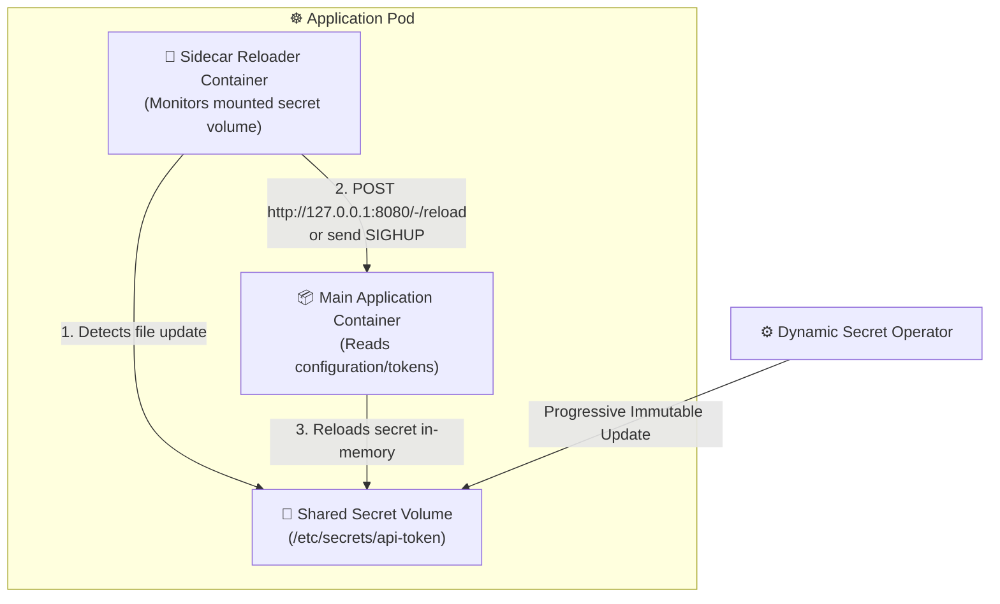

# Enterprise Example: Sidecar Proxy Secret Reloader Pattern

This enterprise example demonstrates integrating the **Dynamic Secret Operator (DSO)** with applications that do not natively support hot-reloading configurations or secrets from disk.

Using a **Sidecar Reloader Pattern**, a lightweight sidecar container monitors the volume-mounted secret managed by DSO and notifies the primary application container via an IPC signal (`SIGHUP`) or a local HTTP reload hook (`POST /reload`).

---

## 🏗️ Architecture



---

## 💡 How It Works

1. **DSO Materialization:** When a secret changes in Azure Key Vault, DSO creates a new immutable `SecretRevision` and progressively updates the Pod's volume reference.
2. **Kubelet Projection:** Kubernetes updates the projected volume symlinks pointing to the new secret data.
3. **Sidecar Detection:** The sidecar watcher notices the file change via polling or `inotify` and triggers the application's administrative reload endpoint.
4. **Zero Process Restarts:** The main application stays online with zero downtime and without needing full Pod restarts.

---

## 🛠️ Prerequisites

- **kind**: `kind v0.20.0+` ([installation guide](https://kind.sigs.k8s.io/))
- **kubectl**: Kubernetes CLI ([installation guide](https://kubernetes.io/docs/tasks/tools/))

---

## 🚀 Quickstart

### Step 1: Run the Local Setup Script
Execute the setup script to create a local test cluster and apply the sidecar reloader manifests:

```bash
chmod +x setup-kind.sh
./setup-kind.sh
```

### Step 2: Inspect the Manifests
The `Deployment` configures a shared volume between the main app and the sidecar reloader:

```yaml
spec:
  containers:
    # 1. Main Service Container
    - name: api-service
      image: hashicorp/http-echo:latest
      args: ["-text=Active API Service running with DSO sidecar sync"]
      ports:
        - containerPort: 5678
      volumeMounts:
        - name: app-secret-volume
          mountPath: /etc/secrets
          readOnly: true

    # 2. Secret Reloader Sidecar
    - name: secret-reloader
      image: alpine:latest
      command: ["/bin/sh", "-c"]
      args:
        - |
          echo "Starting sidecar secret watcher..."
          LAST_HASH=""
          while true; do
            if [ -f /etc/secrets/api-key ]; then
              CURRENT_HASH=$(sha256sum /etc/secrets/api-key | cut -d' ' -f1)
              if [ -n "$LAST_HASH" ] && [ "$CURRENT_HASH" != "$LAST_HASH" ]; then
                echo "Secret rotation detected! Sending reload signal..."
                # Option A: Trigger local HTTP reload endpoint
                # wget -q -O- --post-data="" http://127.0.0.1:5678/-/reload || true
                # Option B: Log rotation event for demonstration
                echo "Successfully triggered application configuration reload at $(date)"
              fi
              LAST_HASH="$CURRENT_HASH"
            fi
            sleep 2
          done
      volumeMounts:
        - name: app-secret-volume
          mountPath: /etc/secrets
          readOnly: true
```

### Step 3: Verify Sidecar Logs
Check the sidecar reloader logs to observe file tracking and reload notifications:

```bash
kubectl logs deployment/sidecar-api-service -c secret-reloader -f
```
