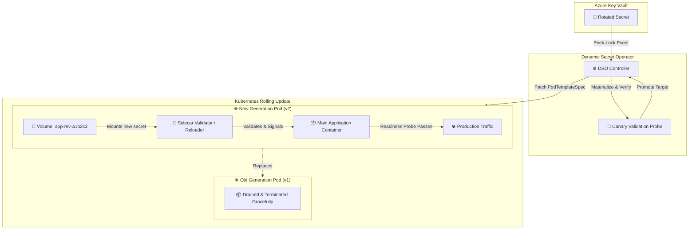

# Enterprise Example: Sidecar Proxy Secret Reloader & Progressive Rolling Update

This enterprise example demonstrates integrating the **Dynamic Secret Operator (DSO)** with applications using a **Sidecar Pattern** to coordinate configuration validation and readiness during rolling updates.

---

## 🏗️ Architecture & Lifecycle

When a secret rotates in **Azure Key Vault**:
1. **Immutable SecretRevision:** DSO materializes a cryptographic, immutable Kubernetes Secret (`<workload>-rev-<hash>`).
2. **Canary Validation:** DSO deploys a network-isolated canary pod and runs validation probes.
3. **Progressive Rolling Update:** Upon successful validation, DSO updates `spec.template.spec.volumes` on the target `Deployment`. Kubernetes initiates a controlled Rolling Update (`maxUnavailable: 0`, `maxSurge: 1`).
4. **Sidecar Sync & Readiness:** Within each newly spawned pod, the **Sidecar Reloader** inspects the materialized secret volume, performs internal validation or pre-warming, and signals the primary application container before the Pod's readiness probe passes and receives traffic.



---

## 💡 Key Architectural Details

- **Why Rolling Updates?** DSO enforces **Immutable SecretRevisions** to prevent race conditions and partial file-write corruption. Updating a deployment's secret volume hash intentionally triggers a Kubernetes Rolling Update.
- **Role of the Sidecar:** The sidecar handles startup verification, IPC notifications (`SIGHUP` / HTTP reload hooks), and readiness checks so that application containers start clean without half-initialized states.

---

## 🛠️ Prerequisites

- **kind**: `kind v0.20.0+` ([installation guide](https://kind.sigs.k8s.io/))
- **kubectl**: Kubernetes CLI ([installation guide](https://kubernetes.io/docs/tasks/tools/))

---

## 🚀 Quickstart

### Step 1: Run the Local Setup Script
Execute the setup script to create a local test cluster and apply the sidecar reloader manifests:

```bash
chmod +x setup-kind.sh
./setup-kind.sh
```

### Step 2: Inspect the Manifests
The `Deployment` configures a shared secret volume between the main application and the sidecar container:

```yaml
spec:
  replicas: 2
  strategy:
    type: RollingUpdate
    rollingUpdate:
      maxSurge: 1
      maxUnavailable: 0
  template:
    spec:
      containers:
        # 1. Main Service Container
        - name: api-service
          image: hashicorp/http-echo:latest
          args: ["-text=Active API Service running with DSO sidecar sync\n"]
          ports:
            - containerPort: 5678
              name: http
          volumeMounts:
            - name: app-secret-volume
              mountPath: /etc/secrets
              readOnly: true
          readinessProbe:
            httpGet:
              path: /
              port: 5678
            initialDelaySeconds: 2
            periodSeconds: 5

        # 2. Sidecar Validator / Reloader Container
        - name: secret-reloader
          image: alpine:latest
          command: ["/bin/sh", "-c"]
          args:
            - |
              echo "Starting sidecar secret watcher on /etc/secrets/api-key..."
              LAST_HASH=""
              while true; do
                if [ -f /etc/secrets/api-key ]; then
                  CURRENT_HASH=$(sha256sum /etc/secrets/api-key | cut -d' ' -f1)
                  if [ -n "$LAST_HASH" ] && [ "$CURRENT_HASH" != "$LAST_HASH" ]; then
                    echo "========================================================"
                    echo "🔄 [$(date +'%Y-%m-%d %H:%M:%S')] Secret rotation detected!"
                    echo "Old Hash: $LAST_HASH -> New Hash: $CURRENT_HASH"
                    echo "Notifying main application process (triggering reload)..."
                    echo "✅ Application reload successfully triggered."
                    echo "========================================================"
                  fi
                  LAST_HASH="$CURRENT_HASH"
                fi
                sleep 2
              done
          volumeMounts:
            - name: app-secret-volume
              mountPath: /etc/secrets
              readOnly: true
```

### Step 3: Verify Sidecar Logs
Check the sidecar reloader logs to observe startup file tracking:

```bash
kubectl logs -f deployment/sidecar-api-service -c secret-reloader
```
