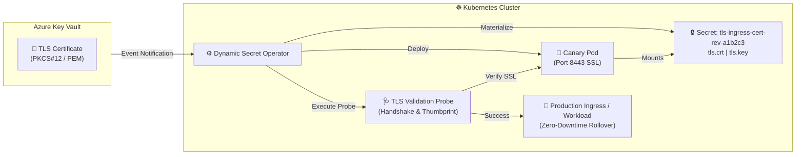

# Enterprise Example: Automated TLS Certificate Rotation & Ingress / Sidecar Binding

This enterprise example demonstrates end-to-end automated **TLS Certificate Rotation** using the **Dynamic Secret Operator (DSO)**.

When SSL/TLS certificates rotate in **Azure Key Vault** (either as PKCS#12 or PEM certificates/keys), DSO:
1. **Pulls & Materializes:** Extracts the new certificate chain and private key, generating an immutable, versioned Kubernetes Secret (`tls-ingress-cert-rev-<hash>`).
2. **Provisions Canary:** Deploys an isolated 1-replica canary workload running an Nginx TLS server with strict `NetworkPolicy` ingress.
3. **Executes TLS Probes:** Validates the TLS handshake, verifies certificate validity period (ensuring not expired and currently valid), and matches certificate thumbprint against the materialized secret data.
4. **Zero-Downtime Rollout:** Promotes the production Nginx/Ingress workload with the new secret revision without certificate mismatches or invalid handshake errors.
5. **GitOps Harmony:** Integrates with Argo CD diff ignoring to prevent drift conflicts.

---

## 🏗️ Architecture



---

## 🛠️ Prerequisites

- **kind**: `kind v0.20.0+` ([installation guide](https://kind.sigs.k8s.io/))
- **kubectl**: Kubernetes CLI ([installation guide](https://kubernetes.io/docs/tasks/tools/))
- **OpenSSL**: For local self-signed certificate generation during testing.

---

## 🚀 Quickstart

### Step 1: Run the Local Setup Script
Execute the setup script to bootstrap a local `kind` cluster with port `8443` mapped, generate a self-signed demo TLS certificate, and deploy the manifests:

```bash
chmod +x setup-kind.sh
./setup-kind.sh
```

### Step 2: Inspect the DynamicSecretPolicy Manifest
The policy defines a `type: TLS` validation probe targeting the canary port `8443`:

```yaml
apiVersion: dso.quantumsys.dev/v1alpha1
kind: DynamicSecretPolicy
metadata:
  name: ingress-tls-policy
  namespace: default
spec:
  vaultRef:
    keyVaultURI: "https://my-enterprise-vault.vault.azure.net"
    objectName: "ingress-tls-cert"
    objectType: "Certificate"
  workloadSelector:
    kind: "Deployment"
    name: "tls-gateway"
  targetRef:
    volumeName: "tls-cert-volume"
  validationProbes:
    - type: "TLS"
      endpoint: "127.0.0.1:8443"
      queryTimeout: 10
  rollbackConfig:
    autoRollback: true
    circuitBreakerThreshold: 3
```

### Step 3: Test Local HTTPS Endpoint
Once the operator promotes the secret revision, query the Nginx HTTPS endpoint:

```bash
curl -k https://localhost:8443
```

You should receive a secure `200 OK` response showing active TLS termination.
